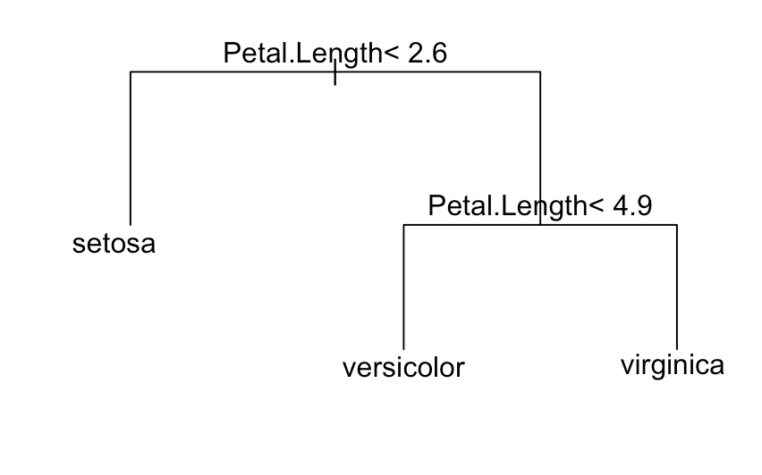

본 글은 본인이 '데이터 분석 준전문가' 필기 시험을 준비하면서 개인적으로 작성하는 글이라 일부 이해가 되지 않고 부정확할 수 있음을 밝힙니다. 모두 화이팅^^

# 데이터 마이닝

> 데이터 마이닝의 기초 개념들을 학습한다.
>
> 분석모형 구축과 테스트를 위한 데이터 분할에 대해 학습한다.

## 데이터 마이닝 개요

데이터마이닝(Data Mining)은 방대한 양의 데이터 속에서 숨겨진 규칙, 패턴 등을 찾아내어 예측하거나 의사결정에 활용하는 것을 목적으로 한다. 가설과 검정의 과정이 선택적이라는 점에서 통계분석과 구분된다.

### 데이터 마이닝의 종류

- 데이터 마이닝 방법에 따라... 지도학습 vs 비지도학습

  정답지가 주어지냐에 따라 나뉜다. 독립변수에 따라 종속변수가 있다면 지도학습으로 볼 수 있다.

  | 지도학습                                                     | 비지도학습                                                   |
  | ------------------------------------------------------------ | ------------------------------------------------------------ |
  | 회귀(연속형) : 선형회귀분석, 의사결정나무, SVR, 신경망 모형, 릿지, 라쏘 | 군집 : K-means, SOM, DBSCAN, 병합 군집, 계층 군집<br />연관 : Apriori |
  | 분류(범주형) : 로지스틱 회귀분석, 신경망 모형, 의사결정나무(분류트리모형), k-NN, 앙상블, SVM, 나이브 베이즈 분류 | 차원축소 : PCA, LDA, SVD, MDS                                |

- 데이터 마이닝 분석 목적에 따라... 분류분석 vs 군집분석 vs 연관분석

  - 분류(Classification) 분석 : 지도학습 중 하나로 데이터가 <u>어느 그룹에 속하는지</u> 판별하고자 하는 기법
  - 군집(Clustering) 분석 : 비지도 학습 중 하나로 데이터간 유사성을 측정하여 <u>하나의 그룹으로 묶는 기법</u>
  - 연관(Association) 분석 : 비지도학습 중 하나로 장바구니 분석. 데이터간 연관성을 파악하는 분석

### 데이터 마이닝의 프로세스

목적 정의 → 데이터준비 → 데이터가공 → 데이터 마이닝 기법 적용 → 검증

## 데이터 분할

데이터를 훈련(train), 검정(validation), 평가용(test) 등의 데이터로 분할한다.

### 과적합과 과소적합

데이터가 훈련용 데이터에 의해 너무 많이 설명되면 모델이 복잡해지고 설명이 어려워지며 예측이 힘들어짐→과적합

데이터 부족 문제 등으로 인하여 모델이 너무 단순하여 데이터를 충분히 설명하지 못하게 됨 → 과소적합

### 데이터 분할을 통한 검증(!)

1. 홀드아웃

   전체 데이터를 랜덤하게 추출해 학습 데이터와 테스트 데이터로 분리하는 방식.

   보통 학습 데이터는 80%, 테스트 데이터는 20% 혹은 학습 60, 검증 20, 테스트 20으로 분할한다. 검증세트에서 만족할 만한 성능이 나온 하이퍼파라미터를 이용하여 테스트 세트에서 모델의 일반화 성능을 추정한다.

2. k-Fold 교차검증

   전체 데이터셋을 k개의 집단으로 구분한 뒤 k-1개를 훈련용 데이터로, 나머지 1개를 평가용 데이터로 사용하여 이를 종합하여 최종 모델을 구축하는 방법이다. 

   **과소적합 방지**하나, k번의 모델 구축으로 많은 시간 소요

3. 붓스트랩(bootstrap)

   신뢰도를 높여 성능을 개선하기 위해 표본을 다시 추출하는 방법의 일종. 중복과 복원추출을 허용한다.

   데이터셋의 분포가 고르지 않은 경우에 사용되며 **과적합을 줄이는데** 도움이 됨

4. 계층별 k-겹 교차 검증(Stratified k-fold cross validation)

   불균형 데이터를 분류하는 문제에서 사용됨. k-fold와 비슷하지만, 각 폴드가 갖는 레이블의 분포가 유사하도록 폴드를 추출하여 교차검증을 실시한다.

# 분류분석

> 분류분석을 통한 예측모형을 수립하는 방법을 학습한다.
>
> 다양한 분류분석 방법을 익히고 예측력이 높은 모형으로 개선하는 방법을 학습한다.

## 로지스틱 회귀 분석

회귀분석을 분류에 이용한 방법으로, 독립변수의 선형결합을 이용해 사건의 발생 가능성을 예측하는 분석방법.

ex) 고객을 재구매 고객과 처음 구매한 고객으로 분류

종속변수가 범주형 변수(명목, 순위)일 때 사용한다. 종속변수가 보통 두가지의 경우만 되는 이항변수이다.

### 오즈(Odds)

성공할 확률을 P라고 했을 때, 성공할 확률이 실패할 확률의 몇배인지를 나타내는 값 :  `P/(1-P)`

### 로짓 변환

오즈를 로그 씌워서 <u>정규분포에 비슷한 모양으로 맞추는 변환</u>과정. 이를 통하여 확률 등의 분석이 용이해진다. 이를 종속변수로 하여 선형회귀모형을 만든 것이 로지스틱 회귀분석이다.

### 시그모이드 함수

로짓함수와 역함수 관계로, 로지스틱 회귀분석과 인공신경망 분석에서 활성화 함수로 활용된다. 

### 로지스틱 회귀분석 실습 : glm()함수

mtcars dataset을 이용하여 로지스틱 회귀분석을 해보자. 데이터의 열 중 `vs` 엔진의 종류를 의미하는 0(자동)과 1(수동)의 두가지로 이루어져 있는 범주형 변수이다. 따라서 vs를 종속변수로 하는 로지스틱 회귀분석을 해줄 수 있다. 독립변수는 mpg(연비), am(변속기)로 해주자.

```R
> glm_vs <- glm(data=mtcars, vs~mpg+am, family=binomial)	#binomial 해줘야 로지스틱 회귀분석
> summary(glm_vs)

Call:
glm(formula = vs ~ mpg + am, family = binomial, data = mtcars)

Deviance Residuals: 
     Min        1Q    Median        3Q       Max  
-2.05888  -0.44544  -0.08765   0.33335   1.68405  

Coefficients:
            Estimate Std. Error z value Pr(>|z|)   
(Intercept) -12.7051     4.6252  -2.747  0.00602 **
mpg           0.6809     0.2524   2.698  0.00697 **	#회귀계수 유의함 ->귀무가설(회귀계수가 0이다) 기각
am           -3.0073     1.5995  -1.880  0.06009 . 	#회귀계수 p값이 0.05내는 아님
---
Signif. codes:  0 ‘***’ 0.001 ‘**’ 0.01 ‘*’ 0.05 ‘.’ 0.1 ‘ ’ 1

(Dispersion parameter for binomial family taken to be 1)

    Null deviance: 43.860  on 31  degrees of freedom	#절편만 포함한 모형의 완전모형으로의 이탈도(작을수록 모형에 가깝다)
Residual deviance: 20.646  on 29  degrees of freedom	#독립변수들이 추가된 모형의 이탈도
AIC: 26.646

Number of Fisher Scoring iterations: 6
 
 > 1-pchisq(43.860, df= 31)	#절편만 있는 경우 -> 기각 불가. 완전모형에 가깝다.
[1] 0.06273542
> 1-pchisq(20.646, df=29)	#독립변수 포함된 경우 -> 기각 불가. 완전모형에 가깝다.
[1] 0.8717172
```

만약 독립변수에 의해 종속변수가 완전하게 분리가 가능하다면, 경고문구가 나올 것이다. 이는 분석이 무의미하므로 독립변수를 조정해주도록 하자.

mpg의 회귀계수가 0.6809이므로 mpg가 1 증가하면 vs가 0에서 1일 확률이  exp(0.6809) ≒1.98배(98%) 증가한다고 볼 수 있다. 마찬가지로 am의 회기계수를 통하여 am이 1 증가하면 vs=1일 오즈가 exp(-3.0073) ≒ 0.05배, 즉 95% 감소함(0일때에 비해 1이, 자동일때에 비해 수동이)을 확인할 수 있다.

<u>즉, 회귀계수를 통하여 범주형 종속변수가 변할 때 `exp(회기계수)`만큼 변한다는 것을 알 수 있다!!</u>

## 의사결정나무

자료에서 특정 분리 규칙을 찾아내고, 그에 따라 몇 개의 소집단으로 분류하는 분석방법이다.  올바른 분류를 위해서는 상위 노드에서 하위노드로 갈수록 집단 내에 동질성이 커지고, 집단 간 이질성이 커져야한다.

의사결정나무는 종속변수가 **연속형인 회귀트리**, 종속변수가 **이산형인 분류트리**로 구분된다.

### 의사결정나무 특징

| 장점                                                         | 단점                                                         |
| ------------------------------------------------------------ | ------------------------------------------------------------ |
| - 모델이 직관적이고 해석이 용이<br />- 데이터 정규화 및 단위 변환이 불필요<br />- 전처리 작업 용이<br />- 이산형, 연속형 변수 모두 적용 가능<br />- 데이터의 선형성, 정규성 등의 가정이 불필요<br />- 이상값에 민감하지 않음 | - 독립변수들 사이의 중요도 판단하기 어려움<br />- 분류 경계선 근처의 자료에 대해 오차가 큼<br />- 과적합 발생 가능성이 높음 |

### 분석 과정

1. 성장 : 분리기준과 정지 규칙을 설정하여 트리 성장

   - 분리기준 : 한 그룹 안에 범주가 얼마나 섞여 있는지 나타내는 측도인 불순도를 사용하여 데이터를 분류한다. 다양한 범주의 데이터로 구성되어 있을수록 불순도는 커진다.

   - 지니지수는 불순도를 나타내는 값, 엔트로피 지수는 순수도를 나타내는 값. 순수할수록 좋다.

     지니지수 : $1-\sum{_{i=1}^{n}{p_i}^2}$

     엔트로피지수 : $-\sum_i^c{p_ilog_2p_i}$

   - 정지규칙 : 너무 많은 분리 기준을 갖으면 해석상의 어려움이 발생하므로, 정지규칙을 정하여 더 이상 분리가 일어나지 않도록 정지시킨다.

   - 분리기준은 자료의 종류(범주, 연속)과 방법에 따라 달라진다.

2. 가지치기 : 모형 복잡하면 과적합하므로 적당히 제거함

3. 타당성 평가

   형성된 의사결정트리를 검증용 데이터 등으로 예측 정확도를 평가한다.

4. 해석 및 예측

### 의사결정나무 실습 : rpart()함수로 분류

iris 데이터셋에서 비율을 정한 복원추출을 하여 의사결정나무를 만든 다음, 이를 통하여 실제 데이터값과의 오차를 분석해보자.

train 데이터를 70%, test 데이터를 30%의 비율로 iris에서 추출하고, train 데이터로 의사결정나무를 만든다. 그리고 만들어진 의사결정나무로  test값을 넣어보면서 의사결정나무의 적합성을 평가해보자.

```R
> index <- sample(c(1,2), nrow(iris), replace=T, prob=c(0.7,0.3))
> index	#70%만큼 추출하여 train에 사용하고, 나머지는 검증할 때 사용할 test에 저장한다.
  [1] 2 2 1 1 1 1 1 1 1 2 1 1 1 1 1 1 1 2 1 2 2 1 1 2 1 1 1 1 1 1 2 2 1 1 1 2 1 2 1 1 2 1 1 1 1 1 2
 [48] 1 1 1 2 2 2 1 1 1 2 1 1 1 2 1 2 2 2 2 1 1 2 1 1 1 2 2 1 2 1 1 2 1 1 1 2 1 1 1 1 1 1 1 1 1 2 1
 [95] 1 1 2 1 2 1 1 2 2 1 1 1 2 2 1 2 1 1 2 1 2 2 1 2 1 2 2 2 1 2 1 1 2 2 1 1 1 1 1 1 2 1 1 1 1 1 1
[142] 1 1 1 2 2 2 1 2 2
> train <- iris[index==1,]
> test <- iris[index==2, ]
> result <- rpart(data=train, Species ~.)	#Species를 종속변수로 의사결정나무를 생성한다.
> plot(result, margin=0.3)
> text(result)

```



연습 데이터로 만들어진 의사결정트리는 위와 같이 나온다. 이제 미리 추출해놓은 test값으로 의사결정나무를 평가해보자.

```R
> pred <- predict(result, newdata=test, type='class')
> table(condition=test$Species, pred)
            pred
condition    setosa versicolor virginica
  setosa         13          0         0
  versicolor      0         16         2
  virginica       0          2        19
```

위의 의사결정트리로 예측하였을 때, 실제 virginica 종을 versicolor로 잘못 예측한 케이스가 2건 발생함을 알 수 있다.

```R
> result
n= 98 

node), split, n, loss, yval, (yprob)
      * denotes terminal node

1) root 98 61 setosa (0.37755102 0.32653061 0.29591837)  
  2) Petal.Length< 2.6 37  0 setosa (1.00000000 0.00000000 0.00000000) *
  3) Petal.Length>=2.6 61 29 versicolor (0.00000000 0.52459016 0.47540984)  
    6) Petal.Length< 4.9 31  1 versicolor (0.00000000 0.96774194 0.03225806) *
    7) Petal.Length>=4.9 30  2 virginica (0.00000000 0.06666667 0.93333333) *
```

98개(65%)의 train 데이터셋을 위의 기준 노드로 나눠지도록 만든 것을 확인할 수 있다. *가 있는 것은 leaf node라는 뜻이다. 2번 노드를 보면 37개 중 0개가 잘못 분류되었다라는 뜻이다. 3번은 61개중 29개의 versicolor가 잘못 들어왔다는 말이다. 괄호안의 숫자는 각 노드에 해당하는 종속변수(Species)의 비율을 나타낸다.

## 앙상블분석

*여러 개의 모형을 생성 및 조합*하여 예측력이 높은 모형을 만드는 것을 의미한다. 예측력을 높이기 위해 여러 번의 데이터 분할을 통하여 구축된 다수의 모형으로 새로운 모형을 만드는 방법이다. 

결과가 수치형 데이터인 경우에는 값들의 평균을 통해 결과를 예측하고, 범주형 데이터인 경우에는 다수결 방식으로 최종 결과를 예측한다.

### 앙상블분석 종류

1. 배깅(Bootstrap Aggregating)

   여러개의 부트스트랩(**원본 데이터와 같은 크기의 표본을 랜덤복원추출**한 훈련용 샘플 데이터)을 집계하는 알고리즘이다. `bagging()`함수를 이용한다.

2. 부스팅(Boosting)

   이전 모델을 구축한 뒤 다음 모델을 구축할 때 이전 분류기에 의해 잘못 분류된 데이터에 더 큰 가중치를 주어 붓스트랩을 구성한다. 여러개의 모델을 구축한다는 점에서 배깅과 유사하지만, 배깅은 각 모델이 독립적인데 반해 부스팅은 독립적이지 않다.

   붓스트랩을 재구성하는 과정에서 가중치를 다르게 주어 훈련오차를 빠르게 줄일 수 있어 성능이 배깅보다 뛰어나다고 볼 수 있다.

   `boosting()`함수를 이용한다.

3. 랜덤포레스트(Random Forest )

   서로 상관성이 없는 트리들의 선형결합으로 이루어진 `숲`을 의미한다. 배깅과 유사하나 배깅에 많은 무작위성을 주는 기법이다. 붓스트랩을 여러개 복원추출한 뒤, 트리의 모든 마디가 불순도가 제일 적어지는 최적의 분할을 실시한다. 큰 분산을 갖는 의사결정나무의 단점을 보완하여 분산을 감소하고 일반화의 성능을 향상시킬 수 있다. 의사결정나무의 장점인 이상값에 민감하지 않다는 장점도 있다.

   `randomForest()`함수를 이용한다.

## 인공신경망 분석

인간의 뇌를 모방하여 만들어진 학습 및 추론 모형이다.

|      | 내용                                                         |
| ---- | ------------------------------------------------------------ |
| 장점 | 잡음에 민감하게 반응하지 않는다<br />비선형적인 문제를 분석하는데 유용하다<br />패턴인식, 분류, 예측 등의 문제에 효과적이다<br />스스로 가중치를 학습하므로 다양하고 많은 데이터에 효과적이다 |
| 단점 | 모형이 복잡할 경우 학습에 오랜 시간이 소요된다<br />초기 가중치에 따라 전역해가 아닌 지역해로 수렴할 수 있다<br />추정한 가중치의 신뢰도가 낮다<br />결과에 대한 해석이 쉽지 않다<br />은닉층의 수와 은닉 노드의 수를 결정하기가 어렵다 |

### 인공신경망 알고리즘

1. 활성함수
2. 인경신경망의 계층 구조
3. 인공신경망 학습(역전파 알고리즘)

### 인공신경망 종류

1. 단층 퍼셉트론(단층 신경망)
2. 다층 퍼셉트론(다층 신경망)

## 나이브베이즈 분류


## k-NN 알고리즘


## SVM(Support Vector Machine, 서포트벡터머신)


## 분류 모형 성과 평가


# 군집분석

> 비지도학습인 군집분석에 대해 학습한다.
>
> 군집분석을 통해 인사이트를 얻는 과정을 학습한다.

## 군집분석

군집분석이란 여러 변수로 표현된 자료들 사이의 유사성을 측정하고 유사한 자료들끼리 몇 개의 군집(cluster)으로 묶고 다변량 분석(상관분석, 회귀분석, 주성분 분석 등)을 활용하여 각 군집에 대한 특징을 파악하는 기법이다. 생물학에서의 종의 분류, 마케팅에서의 시장 세분화, 금융에서 산업 분석 등에 활용되며 `협엽 필터링(Collaborative Filtering)`같은 추천 서비스가 등장하는 기반을 제공하였다.

### 거리측도

1. 변수가 연속형인 경우

   - 유클라디안 거리(Euclidean)

     두 점 사이의 가장 짧은 거리를 계산. 통계적이지 않고 수학적인 거리로 변수들의 산포정도를 감안하지 않는다. == 좌표계에서 점과 점 사이의 거리

   - 맨하튼 거리(Manhattan)

     길을 따라 갔을 때의 거리. 시가 거리라고도 함. 가로지르지 않는 **축들의 차이의 합**이라고 볼 수 있다. x의 이동거리, y의 이동거리, z의 이동거리를 더한다.

   - 체비셰프 거리(Chebychev)

     **변수 간 거리 차이 중 최댓값**을 데이터 간의 거리로 정의한다. x,y,z 축이 있을 때 각 축에서 최대와 최소값의 차이를 구하고, 그 중 최대를 의미한다.

   - 표준화 거리(Standardized)

     유클리드 거리에서 변수 간 단위의 차이로 생기는 문제를 표준편차로 나눔으로써 해결한 거리이다.

   - 마할라노비스 거리

     표준화 거리에서 변수 간 상관성까지 고려한 거리이다.

   - 민코프스키 거리

     유클리디안 거리와 맨하튼 거리를 한번에 표현한 거리로, m=1일때는 맨하튼 거리이며, m=2 일때는 유클리디안 거리가 된다.

   유클라디안 거리, 맨하튼 거리, 체비셰프 거리를 비교해보자.

   A(1,2,3), B(2,6,-1)라고 했을 때, 각각의 거리를 구하면

   1. 유클라디안 : $\sqrt{(1-2)^2+(2-6)^2+(3+1)^2} = \sqrt{33}$
   2. 맨하튼 : $\abs{1-2}+\abs{2-6}+\abs{3+1} = 9$
   3. 체비셰프 : $max((1-2), (2-6), (3+1)) = 4$

2. 변수가 범주형인 경우 : 얼마나 공통된 요소를 갖고 있는지 판단 가능

   - 단순 일치 계수(Simple Matching Coefficient, SMC) : 두 객체의 상이성을 불일치 비율로 계산한다. p는 총 변수의 개수, m은 일치한 수를 의미한다. 즉 전체 중에 일치하지 않은 비율을 의미.

     $d(i,j) = \frac{p-m}{p}$

   - 자카드 지수 : 두 집합 사이의 유사도를 측정하는 지표로서 두 집합이 같으면 1, 완전 다르면 0이 된다. cap/cup으로 계산.

     $J(X,Y) = \frac{n(A\cap B)}{n(A\cup B)}$

   - 자카드 거리 : 자카드 지수를 거리화하기 위해, 1에서 자카드 지수를 뺀 값(같으면 0, 다르면 1이 되도록)

   - 코사인 유사도 : 텍스트의 유사도를 측정하기 위한 지표로서 크기가 아닌 방향성을 측정하는 지표다. 완전 일치하면 1, 완전 다른 방향이면 -1의 값을 갖는다.

     $Cosine Similarity(X,Y) = \frac{\overrightarrow{X}\cdot\overrightarrow{Y}}{\abs{X}\abs{Y}}$ : 두 내적값을 두 벡터의 크기의 곱으로 나눈 값이다. (내적은 단순하게 같은 좌표계끼리 곱해주면 됨)

   - 코사인 거리 : 코사인 유사도를 거리화하기 위해, 1에서 코사인 유사도를 뺀 값

   - 순위 상관 계수 : 순서척도인 두 데이터의 거리를 비교하기 위해 `스피어만 상관계수`를 이용

## 계층적 군집분석

## 혼합 분포군집

## 자기조직화지도(SOM)


# 연관분석

> 마케팅에서 자주 사용되는 연관분석에 대해 학습한다.
>
> 연관분석의 다양한 알고리즘과 특징을 이해한다.