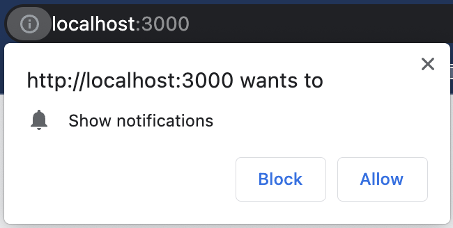

# web-push 이용하여 PWA 구현하기(ios 푸시 알림)

PWA(Progressive Web App)를 처음 접하고, 푸시 알람을 구현해보았는데 이를 정리해보려고 한다. 드디어 ios 16.4부터는 웹앱에서 아이폰으로 백그라운드 푸시 알림을 보낼 수 있게 되었다!! (안드로이드, window/mac도 가능) 아직 진동 등의 커스텀한 알림을 보내는 것은 제약이 있지만, 웹으로 이제 못하는게 점점 없어지고 있다. 웹을 통해서 할 수 있는 기능들은 [what web can do today](https://whatwebcando.today/) 페이지를 참고하면 좋을 것 같다. 앱스토어와 같이 배포도 할 수 있는 방법이 있는 걸로 알고 있지만, 오늘은 PWA를 간단하게 만들어보고 핵심 기능을 먼저 만들어보도록 하자!


## PWA로 만들 수 있는 것들

PWA란, 웹으로 어플리케이션 처럼 느끼게 하기 위해 제공하는 많은 기능들을 포함한 웹 어플리케이션이라고 보면 될 것 같다. 제공하는 핵심적인 몇가지 기능은 다음과 같다.

1. 앱 아이콘

   앱 아이콘, 스플래시 화면을 제공하여 앱과 유사하게 보이도록 할 수 있다. 

2. 오프라인 상태

   해당 웹앱을 설치하면, 오프라인 혹은 백그라운드 상태에서 앱이 특정한 일들을 수행하도록 설정할 수 있다. 웹에서는 네트워크가 연결되어있지 않다면 아무것도 보이지 않지만, 앱에서는 레이아웃 정도는 유지되도록 할 수 있지 않은가? 이와 비슷하다고 볼 수 있다. 또한, 백그라운드에서 알림을 수신할 수 있도록 등을 가능하게 한다.

3. 권한

   웹앱을 다운 받은 다양한 기기(pc, 랩탑, 스마트폰)에서 권한을 이용할 수 있다. 이러한 네이티브 디바이스의 접근 기능은 기기와 브라우저 마다 다를 수 있으니, 참고하도록 한다. google meet로 크롬으로 화상 회의를 진행할 수 있는 것도 이러한 권한을 통해서 가능해지는 것이다!

   

## Architecture

간단하게 아키텍쳐를 그리고 가보자.

필요한 것은 프론트 서버와 백엔드 서버! react js로 프론트를 구성하려고 한다.!


## 0. HTTPS

서비스 워커와 push 알람을 위해서 `https`로 배포해야한다. 하지만, 간단하게 테스트해보기 위해 `ngrok`이나, `localtunnel`을 이용해볼 수 있을 것이다.

## 1. manifest.json & index.html

리소스(아이콘, 스플래시 화면)를 접근할 수 있도록 해야한다. CRA의 경우, public 폴더에다가 넣어주고 다음과 같이 연결해줄 수 있다.

- index.html

  ```html
  <html lang="en">
    <head>
      <meta charset="utf-8" />
      <link rel="icon" href="%PUBLIC_URL%/aqm-icon.png" />
      <meta name="viewport" content="width=device-width, initial-scale=1" />
      <meta name="description" content="Air Quality Manager" />
      <link rel="apple-touch-icon" href="%PUBLIC_URL%/aqm-icon.png" />
      <meta name="mobile-web-app-capable" content="yes" />
      <meta name="apple-touch-fullscreen" content="yes" />
      <meta name="apple-mobile-web-app-title" content="AQM" />
      <meta name="apple-mobile-web-app-capable" content="yes" />
      <meta name="apple-mobile-web-app-status-bar-style" content="default" />
      <link rel="manifest" href="%PUBLIC_URL%/manifest.json" />
      <link
        href="%PUBLIC_URL%/iphonex_splash.png"
        media="(device-width: 375px) and (device-height: 812px) and (-webkit-device-pixel-ratio: 3)"
        rel="apple-touch-startup-image"
      />
      <title>AQM</title>
    </head>
    <body>
      <noscript>You need to enable JavaScript to run this app.</noscript>
      <div id="root"></div>
    </body>
  </html>
  ```

  아이콘, 스플래시 화면, manifest 파일을 index.html에서 연결해주었다. splash 화면은 기기의 크기에 따라 여러개를 설정해주어야 할 것이다. 스플래시 화면은 [여기서](https://appsco.pe/developer/splash-screens) 간단하게 만들었다.

- manifest.json

  ```json
  {
    "background_color": "#f2f3f5",
    "description": "Air Quality Manager(AQM) is a service that regularly compare air quality of indoor with outdoor and send alert to your Fitbit Charge 5",
    "dir": "ltr",
    "display": "standalone",
    "name": "Air Quality Manager",
    "orientation": "portrait",
    "scope": "/",
    "short_name": "AQM",
    "start_url": "/",
    "theme_color": "#f2f3f5",
    "categories": [],
    "screenshots": [],
    "icons": [
      {
        "src": "/aqm-icon.png",
        "type": "image/png"
      }
    ],
    "shortcuts": []
  }
  
  ```

  여기서는 `stanadalone` 옵션을 주어 브라우저처럼 url이 안나오도록 해줄 수 있다. ios safari에서 '홈화면에 추가'를 눌렀을 때, 위의 정보들을 기반으로 홈화면에 어플리케이션처럼 추가될 것이다.

## 2. service-worker.js

Service Worker는 브라우저와 별도로 실행되는 JavaScript 파일로, 웹 앱과 브라우저 사이에 중간 계층 역할을 한다고 한다. 따라서, 프론트 서버에서 service-worker.js를 서빙해서 메인에서 접근할 수 있도록 해야할 것이다.

서비스워커는 `https` 환경 혹은 `localhost` 환경에서만 동작한다고 함!! 

유효기간 등이 있기에, pushsubscriptionchange를 이용하여 주기적으로 설정해줘야한다고 함... https://stackoverflow.com/questions/61487043/why-are-my-pushsubscriptions-expiring-so-quickly

## 3. permission

[apple 공식 문서](https://developer.apple.com/documentation/usernotifications/sending_web_push_notifications_in_web_apps_safari_and_other_browsers)에 따르면 (Provide a method for the user to grant permission with a gesture, such as a click or tap on a button), **명시적으로 터치 이벤트** 등을 통하여 권한에 대한 창을 띄우도록 해야하는 것으로 추정된다. 왜냐하면 react useEffect나 onload로 했을때 안됐거든요... **onClick에서 `requestPermission`을 수행하도록** 해야한다!

## 서버 코드

여기서 서버는 `푸시 알림 서버`

- server.js

```javascript
import express from 'express';
import webpush from 'web-push';
import dotenv from 'dotenv';

dotenv.config();

const app = express();

app.use(express.json());

// let subscriptionData = null;
let subscriptions = []; // 배열로 푸쉬 알림 서버를 구독하고 있는 서비스 정보를 저장

webpush.setVapidDetails(
  `mailto:${process.env.VAPID_MAILTO}`,
  process.env.VAPID_PUBLIC_KEY,
  process.env.VAPID_PRIVATE_KEY
);

// 여기서는 알림을 보내는 시점을 GET 메소드 수신되었을 때로 함... 하지만 실제로는 '특정 조건' 이 만족되어야 할 것임!!!
app.get('/send-notification', (req, res) => {
  console.log(subscriptions);
  for (let i in subscriptions) {
    webpush.sendNotification(
      subscriptions[i],
      JSON.stringify({
        title: '창문을 열어주세요!',
        body: '환기를 통해 실내 공기질을 좋게 하세요',
      })
    );
  }
  res.sendStatus(200);
});

// front에서 구독 요청을 보내면 서버에서 이를 저장해놓고 있을 것임 (여기서는 memory에서 그냥 갖고 있음)
app.post('/save-subscription', async (req, res) => {
  subscriptions.push(req.body);
  console.log(req.body);
  res.sendStatus(200);
});

app.use(express.static('./build'));

app.listen(8000);

```

- 브라우저 코드

```javascript
const getPermission = async () => {
    // check permission
    const result = await window.Notification.requestPermission();
    // If the user rejects the permission result will be "denied"
    const registration = await navigator.serviceWorker.register('service-worker.js', {
      scope: './',
    });
    if (result === 'granted') {
      const subscription = await registration.pushManager.subscribe({
        applicationServerKey:
          'BCO9W9otJhwejN50_8h3xKTV1RSeivUo_6LdI5OuQ5WAAwlB227duTtkfgMCgAbwSt3ZiA5DWAPTvBQiGYTp7xM',
        userVisibleOnly: true,
      });

      await fetch('/save-subscription', {
        method: 'post',
        headers: {
          'Content-Type': 'application/json',
        },
        body: JSON.stringify(subscription),
      });
    }
  };
```


## 순서

1. 서버 디렉토리에서 

   `./node_modules/.bin/web-push generate-vapid-keys` 로 public key와 private key를 생성, 이를 .env 파일같은데에다가 저장해놓으면 좋을듯

2. 브라우저에서 permission을 받고, `/save-notification` endpoint로 서버로 구독 요청을 보낼 것임. 여기서 서버는 해당 기기의 정보를 subscriptions 배열에다가 저장해놓음

   기기의 정보는 이런식으로 도착할 것임

   ```json
   {
     endpoint: 'https://web.push.apple.com/QAOp3P_YYbIWdchn_KAVmR8xoTmxbFl4w6GNYwFo_AiJ96OItEP9CqaYH2rTfcYtshqWSs2o0mQ0eTWeFPXFMr1est5iwEVi8cAFsVapm5DqMz0whDT2WXF9acC1RCRlGQfXEWreoZN7K8u1_GlCwzilw0dfYBFUi7jijYCcLBQ',
     keys: {
       p256dh: 'BIoy9n07QzB7Zd-3WDCvESgUfi-jdwiciUmx7c8w4Ck8wg91IBkjv2L0-utNsfxNG84deYUl58UsUnG-J2WHdmU',
       auth: '6eLlEaztrWT0PXZNY0qosQ'
     }
   }
   ```

3. 알림을 보내야 하는 특정 시점이 오면(여기서는 임의로 `/send-notification` 요청을 받았을 때로 함) 

save-subscription을 받으면 subscriptions 배열에 있는 구독중인 기기에게 `webpush.sendNotification` 함수를 통해서 보낼 수 있는 것이다 ~


- `.env` file

  ```
  VAPID_PUBLIC_KEY=BCO9W9otJhwejN50_8h3xKTV1RSeivUo_6LdI5OuQ5WAAwlB227duTtkfgMCgAbwSt3ZiA5DWAPTvBQiGYTp7xM
  VAPID_PRIVATE_KEY=zOreNMYM5b21gma4ujgv57w1-u7DDr4aQAPOQK8Lh1I
  VAPID_MAILTO=thinkinghae@gmail.com
  ```

  

references 

https://www.npmjs.com/package/web-push

https://web-push-codelab.glitch.me/


[참고한 깃허브 링크](https://github.com/adamjberg/ios-push-notifications)

https://devtails.xyz/@adam/how-to-setup-web-push-notifications-in-ios-safari