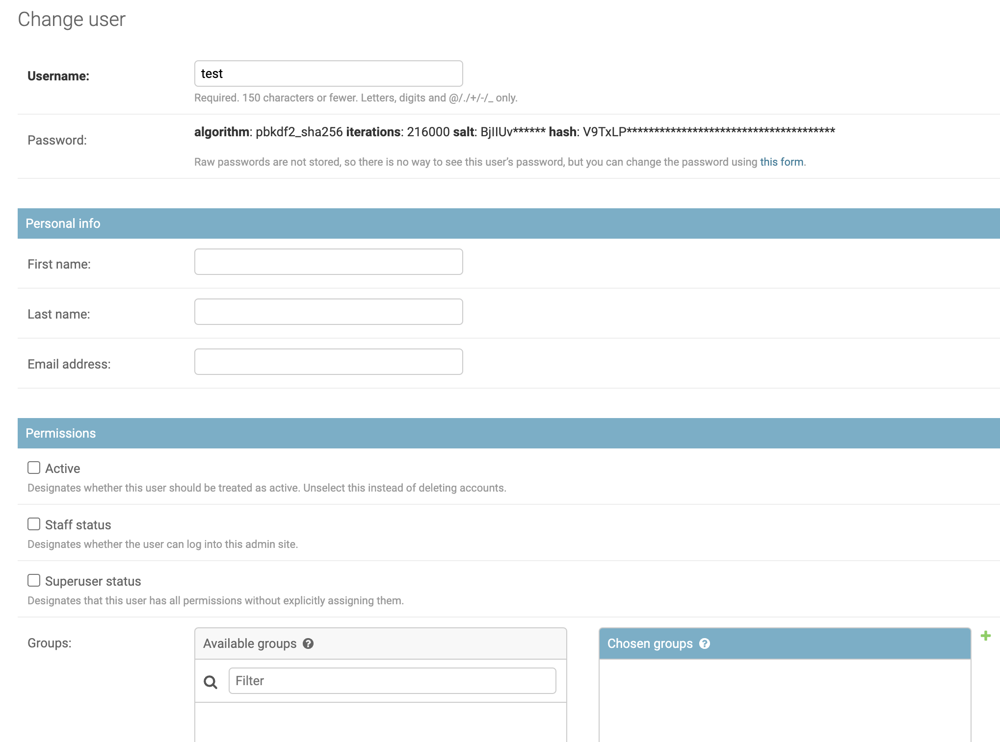
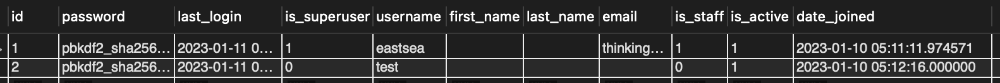

# DRF의 컨셉 이해

html 템플릿까지 구성하는 Django와 다르게 DRF는 분리된 api server를 위한 많은 기능들이 제공된다. 그 기능들을 사용하기 위해  `rest_framework`가 INSTALLED_APPS에 추가되어야한다.

DRF는 프레임워크로 매우 많은 기능들과 기본 인증과 관련된 model이 제공되지만, view가 통합되어 있어 리액트와 같은 SPA와 분리된 상태로 구현하려는 경우에는 적당한 레퍼런스를 찾기가 힘들었다. 따라서 알게 된 점들을 중심으로 기록하려고 한다. 

## Auth model in django & admin

DRF를 처음에 실행해보면 기본적인 model이 제공됨을 알 수 있다. `python manage.py migrate`를 하면 

```
'auth_group'
'auth_group_permissions'
'auth_permission'
'auth_user'
'auth_user_groups'
'auth_user_user_permissions'
'django_admin_log'
'django_content_type'
'django_migrations'
'django_session'
```

이렇게 많은 테이블들이 생성된다. 

이러니 궁금한 것들이 몇가지가 있었다. admin page가 자동으로 제공되는 점, user과 관련된 점들이었다.

1. admin user 만들기

   `python manage.py createsuperuser`로 super user, 즉 관리자 계정을 만들 수 있다. 관리자를 만들면, `localhost:8000/admin`에서 로그인을 할 수 있게 된다. 이는 (아마) 모든 권한을 수행할 수 있는 관리자 계정으로 `auth_user` table에 자동으로 추가된다. admin으로 로그인하여 사용자를 추가하거나, 권한을 조정하는 등의 다양한 기능을 코드 없이 수행할 수 있다.

   **admin site를 이용하는 것을 절대 싫어하지 말자**.!!! 오히려 장고를 이해하는데 핵심적인 것은 admin site라고 생각한다. 이거를 안건드리고 코드로만 모든 것을 해결하려고 하다가 오히려 개념이 잡히지 않아서 어려웠다. api문서를 어느정도 이해하기 전까지는 admin page를 애용하자.. 나도 이번 포스트는 코드보다는 어드민 페이지에서 많은 것을 해볼 예정이다.

2. user 만들기

   회원가입 api를 만들기 전에, admin 페이지에서 먼저 만들어볼 수 있다. Users 탭을 누르고, add 해주면 `auth_user`테이블에서 생성되었음을 확인할 수 있다. 장고에서는 회원과 관련된 기능을 제공하고 이를 사용하도록 권장된다. (비밀번호 암호화, 세션 부여 등 상당히 시간을 절약해준다) 

   

   어드민 페이지를 통하여 사용자의 권한도 수정가능한데, active는 로그인되어 있는 사용자가 아닌, 휴면 혹은 잠정 탈퇴가 아닌 회원을 의미하는것 같다. **active되어 있어야 authentication이 가능**하다

   하지만, 기본적인 user model에서 커스텀하게 사용할 수 있는 방법이 몇가지 있다.(`django custom user mode`l로 검색)

   1. (이미 기본 마이그레이션 진행한 경우) 1:1 연결

      새로운 app에서 models.py에서 커스텀 유저 모델을 만들고,  기본 유저 모델을 `OneToOneField`로 연결시켜주면 된다. (foreign key와 약간 다름)

   2. `AbstractUser` model override

      기본 유저 모델을 상속받아 오버라이딩해주면 된다. **추가할 필드만 적어주면 되**는 것으로 알고 있다. 또한 `settings.AUTH_USER_MODEL = 'app.{UserModelName}'` 로 `settings.py`에 추가해줘야 앞으로 만들 사용자에 대하여 우리의 커스텀 모델을 적용시킬 수 있다. 마지막으로 관리자계정에서 확인할 수 있도록 해당 app의 `admin.py`에서 추가해줘야한다. 클래식하지만 이 방법은 기본 마이그레이션을 한 경우라면 좀 귀찮아질 수 있다.

   3. `BaseUserManager`와 `AbstractBaseUser`,`PermissionMixin`을 각각 상속받아 custom user manager와 user class를 만들어줄 수도 있다. [출처](https://engineer-mole.tistory.com/301), [유튜브](https://www.youtube.com/watch?v=EvHLHP1BoyY&list=PL9IQMKMsCWh6TqvjrRCZkD0vHbWaJJ0kN&index=5) 가장 코드의 양은 많아지지만, 커스텀의 권한이 많아질 것이다.

### 1:1 연결 Custom User

오늘은 이미 기본 마이그레이션을 진행했다고 가정하고, 1:1 연결로 새로운 모델을 만들어보자.!



현재 auth_user 테이블은 위와 같은 필드가 있다. 여기에 나이를 추가해보자.

`python manage.py startapp my_user`

(항상 app을 만들면 settings.py의 INSTALLED_APPS에다가 my_user를 추가해주는 습관을 갖도록 한다)

my_user/models.py에서 사용자의 아래와 같이 추가해주자.

```python
from django.db import models
from django.contrib.auth.models import User

# Create your models here.

class MyUser(models.Model):
    user=  models.OneToOneField(User, on_delete=models.CASCADE)
    age = models.PositiveSmallIntegerField()

```

`python manage.py makemigrations my_user`

`python manage.py migrate`

하면, DB에 스키마가 생성되어있을 것이다.

이제, admin 페이지에서 추가해보도록 하자. my_user/admin.py에서 

```python
from django.contrib import admin
from .models import MyUser
# Register your models here.

admin.site.register(MyUser)
```

로 어드민 계정에서 건드릴 수 있도록 등록을 해주고, 어드민 사이트에서 추가해주면 된다. 하지만 이와 같은 1:1 매칭 방법은 DB table이 늘어나게 되며, 사용자를 생성할 때에도 먼저 장고 기본 user를 만들고, my user를 만들어줘야하므로 귀찮아지며 흐름이 복잡해진다. (하지만 당장 구현하기엔 가장 쉬울 수 있음) 그치만 Abstract Base User를 구현하는 것이 더 귀찮고, 어드민 페이지의 폼까지 다 신경써야하므로(어드민에서 비밀번호 암호화가 되지 않는 등의 문제가 발생하여 포기하였음 ㅠ), 일단 이렇게 만들어주자. 그러고, user_created signal 등이 발생했을 때 처리할 이벤트 함수만 등록해놓으면 될 것이다.!


