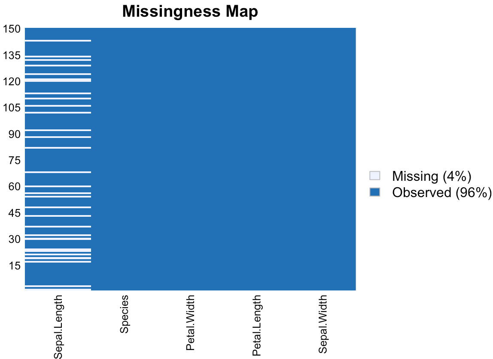

본 글은 본인이 '데이터 분석 준전문가' 필기 시험을 준비하면서 개인적으로 작성하는 글이라 일부 이해가 되지 않고 부정확할 수 있음을 밝힙니다. 모두 화이팅^^

# R 기초

(이번 장은 너무 자세하게 공부한다기 보단, R의 간단한 문법 메커니즘을 이해하고 함수를 익숙해질 정도로만 해도 될 것 같다)

R 설치 → R Studio 설치(by `homebrew`)

### 타입

`class()`함수로 해당 요소의 타입을 확인할 수 있다. 다음과 같은 종류들이 있다.

- 문자형 (character)

  'abc',"abc", ...

- 숫자형 (numeric), double, integer, complex(복소수)

  1, Inf, NaN(Not a number)...

- 논리형(logical)

  TRUE, FALSE, NA(not available, 결측값)...

- NULL

### 기본 연산자

- 대입 연산자: = <- <<- 등 방향에 따라 대입 위치가 달라질 수 있다.
- NA인지 판단하는 방법: is.na()로만 가능하다. ==로 판단 불가
- 몫 : %/%, 나머지 : %%

### R 데이터 구조(Data Sturcture)

1. vector(벡터)

   타입이 같은 여러 데이터를 하나의 행으로 저장. `c()`로 데이터를 묶을 수 있다. (만약 타입이 다른 것들이 concatenate된다면 casting됨)

   `:`으로 시작값, 끝값 지정하여 벡터 생성 가능

2. matrix(행렬)

   타입이 같은 2차원 구조의 벡터. 가장 기본적으로 `matrix(vector, nrow/ncol=n, byrow=T/F)`으로 생성 가능하다. 모든 요소를 담고 있는 벡터에서, 행 또는 열의 수를 정해주면 default로 열부터 저장이 된다. byrow 속성을 T(true)로 해주면 행부터 저장이 될 것이다.

   또는, `dim(vector)`함수로 벡터에 차원을 부여함으로써 행렬을 만들 수도 있다. `dim(v1) <- c(2,3)` => v1벡터를 2행 3열 차원의 행렬로 변환

3. array(배열)

   3차원 이상의 구조를 갖는 벡터. `array(vector, dim=c( x, y, z, ...))`와 같이 차원을 명시해야한다. dim으로 명시하지 않으면 1차원 벡터 생성

4. list(리스트)

   데이터 타입에 상관없이 저장할 수 있는 자료구조. `list()`로 선언한 뒤에, `A[[1]]`과 같이 인덱스로 원소를 추가해줄 수 있다. 인덱스는 1부터 시작한다.

5. dataframe(데이터프레임)

    2차원 구조를 갖는 관계형 데이터 구조로 R에서 가장 많이 활용된다. `data.frame(vectors...)`로 만들 수 있다.

   ```R
   > v1 <- c(1,2,3)
   > v2 <- c('a','b','c')
   > df = data.frame(v1,v2)
   > df
     v1 v2
   1  1  a
   2  2  b
   3  3  c
   ```

### 통계 함수

이하의 함수들은 모두 `func(vector)`로 통계치를 구할 수 있다.

sum, mean, median, var(표본 분산), sd(표본 표준편차), max, min, range(최대 최솟값), summary(요약값, 통계치 여러개 보여줌), **skewness(왜도), kurtosis(첨도)** 

### R 데이터 핸들링

- `colnames(행렬)`, `rownamew(행렬)`함수로 matrix의 행과 열의 이름을 get, set 해줄 수 있다.

- `matrixName[행, 열]`의 방법으로 데이터에 접근할 수 있다. 인덱스 또는 이름 모두 접근 가능하다.

- dataframe에서는 [ ] 뿐만 아니라 $로도 접근 가능하다.

- 두 행렬, 벡터, 데이터프레임을 결합할 때에는 행 결합 `rbind(v1, v2)`과 열결합`cbind(v1,v2)`함수를 사용할 수 있다. 

  ```R
  > v1 <- c(1,2,3)
  > v2 <- c('a','b','c')
  > df = data.frame(v1,v2)
  > df
    v1 v2
  1  1  a
  2  2  b
  3  3  c
  > v1 <- c(1:6)
  > m1 <- matrix(v1, nrow=2)
  > m1
       [,1] [,2] [,3]
  [1,]    1    3    5
  [2,]    2    4    6
  > colnames(m1) <- c('c1', 'c2', 'c3')
  > colnames(m1)
  [1] "c1" "c2" "c3"
  > m1
       c1 c2 c3
  [1,]  1  3  5
  [2,]  2  4  6
  > m1[,'c2']
  [1] 3 4
  > m1[1,'c2']
  c2 
   3 
  > v1<-c(1,2,3)
  > v2<-c(4,5,6)
  > rbind(v1,v2)
     [,1] [,2] [,3]
  v1    1    2    3
  v2    4    5    6
  ```

### 통계 분석에 자주 사용되는 R 함수

적당히 하면서 익히도록 하자!

- 행렬 연산

  t(matrix) : 전치행렬, diag(m) : 대각행렬 추출, `%*%` 두 행렬 곱하기

- 데이터 전처리

  subset(data, 조건) : 조건에 맞는 데이터 추출, merge(data1, data2, by=열/행) : 특정 열 또는 행 기준으로 두 데이터 합병, apply(data,1 또는 2, 함수) : 1이면 행. 2면 열에 각 함수를 적용 

  

- 정규 분포 : default는 표준정규분포

  rnorm(m, sd, n) : n개 표본 추출


# 데이터 마트

## 데이터 마트의 이해

### 데이터 마트

효율적인 데이터 분석에 앞서 분석 목적에 맞춰 데이터를 수집, 변형하는 과정 필요.

각각의 DB가 모여 만들어진 <u>DW(데이터 웨어하우스)로부터 데이터를 주제별, 부서별로 추출하여 모은 작은 규모의 데이터 웨어하우스</u>가 **데이터 마트**이다.


데이터 마트를 개발하고 데이터 전처리가 이루어진다.

### 데이터 전처리

전처리(processing)에는 <u>데이터를 정제(cleaning)</u>하고 <u>분석 변수를 처리</u>하는 과정이 포함된다.

1. 정제 과정: 결측값과 이상값을 처리하는 내용으로 주로 구성
2. 분석변수 처리 과정: 변수 선택, 차원 축소, 파생변수 생성, 변수 변환, 클래스 불균형(불균형 데이터 처리) 등으로 구성

R에서는 다음과 같은 패키지를 활용하여 전처리를 해줄 수 있다.

## 데이터 마트 개발을 위한 R 패키지 활용

패키지가 설치되어있지 않은 경우, `install.packages(패키지명)`으로 로컬에 설치가 가능하며 `library(패키지명)`으로 불러와 사용할 수 있다.

우선 데이터셋은 아래를 사용하였다.

### 1. reshape

- `melt(data, id=c(columns...))` : id를 제외한 다른 열들을 녹여서 행으로(long format으로) 세분화시켜준다.
- `cast(melted data, 요약할 변수, 함수)` : 녹은 데이터를 해당 함수로 요약해준다.

```R
> n <- c(1, 1, 2, 2)
> time <- c(1, 2, 1, 2)
> x <- c(6, 3, 2, 5)
> y <- c(1, 4, 6, 9)
> df <- data.frame(n, time, x, y)
> df
  n time x y
1 1    1 6 1
2 1    2 3 4
3 2    1 2 6
4 2    2 5 9
> melted_df <- melt(df, id=c("n","time"))
> melted_df
  n time variable value
1 1    1        x     6
2 1    2        x     3
3 2    1        x     2
4 2    2        x     5
5 1    1        y     1
6 1    2        y     4
7 2    1        y     6
8 2    2        y     9
> cast(melted_df, n~variable, mean)
  n   x   y
1 1 4.5 2.5
2 2 3.5 7.5
```

위의 데이터프레임에서 n과 time 기준으로 나머지 열은 variable과 value 열에 포함하도록 각 행으로 분해가 된다.

cast함수는 위의 melted_data의 n과 variable에 따라 나오는 값의 평균을 구해준다.

### 2. sqldf

R에서 dataframe을 `sql`로 다루게 해준다. `sqldf`패키지를 포함시켜야하며, `sqldf('SQL문')`으로 사용할 수 있다.

### 3. plyr

apply함수를 기반으로 데이터를 분리하고 결합하는 처리기능을 제공한다.

`(입력 데이터 구조)(출력 데이터 구조)ply`꼴의 함수로 사용가능하다. 예를 들어, 데이터프레임(d) 입력 배열(a)출력 함수는 daply()함수이다. 주로 ddply가 많이 쓰이며, `ddply(데이터, 그룹지을 컬럼명, summarise/transform, 요약하거나 추가할 데이터 내용)` 의 꼴로 사용된다.

```R
> install.packages("plyr")
> library("plyr")
> df1 = iris
> ddply(df1, "Species", summarise, petal_width_avg=mean(Petal.Width))
     Species petal_width_avg
1     setosa           0.246
2 versicolor           1.326
3  virginica           2.026
```

위는 종에 따른 petal_width의 평균을 내는 코드이다. ddply함수는 이와 같이 데이터를 요약하는데에도 사용된다. 기준이 되는 변수는 위에서는 "Species" 하나였지만, `c( )` 함수를 통하여 여러개의 열을 묶어줄 수도 있다.

### 4. data.table

데이터프레임과 유사하지만, 특정 컬럼별로 주솟값을 갖는 인덱스를 생성하여 연산 속도를 향상시켰다.

`as.data.table(dataframe)`와 같이 캐스팅할 수 있다.

# 데이터 탐색

## 탐색적 데이터 분석(EDA)

탐색적 데이터 분석(EDA: Exploaratory Data Analysis)이란 데이터를 이해하고 의미있는 관계를 찾기 위해 데이터의 통곗값과 분포 등을 시각화하고 분석하는 것을 말한다.

### 붓꽃(iris) 데이터 활용

R에서 기본적으로 iris라는 데이터프레임 데이터셋을 제공하므로, 이를 통하여 다양한 것들을 해볼 수 있다.

```R
> summary(iris)
  Sepal.Length    Sepal.Width     Petal.Length    Petal.Width          Species  
 Min.   :4.300   Min.   :2.000   Min.   :1.000   Min.   :0.100   setosa    :50  
 1st Qu.:5.100   1st Qu.:2.800   1st Qu.:1.600   1st Qu.:0.300   versicolor:50  
 Median :5.800   Median :3.000   Median :4.350   Median :1.300   virginica :50  
 Mean   :5.843   Mean   :3.057   Mean   :3.758   Mean   :1.199                  
 3rd Qu.:6.400   3rd Qu.:3.300   3rd Qu.:5.100   3rd Qu.:1.800                  
 Max.   :7.900   Max.   :4.400   Max.   :6.900   Max.   :2.500  
# 데이터 구조 파악
> str(iris)
'data.frame':	150 obs. of  5 variables:
 $ Sepal.Length: num  5.1 4.9 4.7 4.6 5 5.4 4.6 5 4.4 4.9 ...
 $ Sepal.Width : num  3.5 3 3.2 3.1 3.6 3.9 3.4 3.4 2.9 3.1 ...
 $ Petal.Length: num  1.4 1.4 1.3 1.5 1.4 1.7 1.4 1.5 1.4 1.5 ...
 $ Petal.Width : num  0.2 0.2 0.2 0.2 0.2 0.4 0.3 0.2 0.2 0.1 ...
 $ Species     : Factor w/ 3 levels "setosa","versicolor",..: 1 1 1 1 1 1 1 1 1 1 ...
```

## 결측값

존재하지 않는 데이터를 의미하며, NA(Not Available)로 표현하지만, 데이터를 수집하는 환경에 따라 null, 공백, -1 등 다양하게 표현 가능하다. 결측값은 삭제 등의 방법으로 처리를 해줘야하며, 상황에 따라 결측값이 의미를 가질 수도 있다.

Amelia 패키지를 이용하여 결측값을 확인하는 예시로 아래의 코드를 참고하자. iris 데이터에서 1번열 데이터 30개 정도를 비복원 추출 함수 sample로 추출하여 결측값으로 대치한 것이다.

```R
> install.packages("Amelia")
> library(Amelia)
> iris_mod <- iris
> iris_mod[sample(1:150,30),1] <- NA	#150개 중 30개 추출하여 결측값 할당
> missmap(iris_mod)
```

아래는 plot된 결과이다.



### 결측값 대치 방법

위와 같은 결측값은 크게 4가지 방법으로 대치될 수 있다.

1. 단순 대치법

   결측값이 존재하는 행을 삭제한다. 위 예시의 iris_mod 변수를 이용하여 단순 대치를 해보자. `complete.cases(data)`함수는 결측값이 존재하는 인덱스에서 FALSE를 리턴하는데(`is.na()`함수와 정반대로), 이를 이용하여 해당 행 자체를 지워줄 수 있다. 같은 논리로 `is.na(data)`함수를 이용하고도 결측값을 제거할 수 있다.

   ```R
   > dim(iris)
   [1] 150   5
   > simple_replacement <- iris_mod	#iris_mod는 1열에 결측값 30개가 들어있다.
   > complete.cases(iris_mod)	#dataframe인자로 넣으면 결측값이 FALSE로 보이게 된다.
     [1]  TRUE  TRUE  TRUE  TRUE  TRUE  TRUE  TRUE FALSE  TRUE  TRUE  TRUE  TRUE  TRUE  TRUE  TRUE
    [16]  TRUE FALSE  TRUE FALSE  TRUE  TRUE FALSE  TRUE  TRUE  TRUE  TRUE FALSE  TRUE  TRUE FALSE
    [31] FALSE  TRUE  TRUE  TRUE  TRUE  TRUE  TRUE FALSE  TRUE  TRUE FALSE  TRUE  TRUE  TRUE FALSE
    [46]  TRUE  TRUE  TRUE FALSE  TRUE  TRUE  TRUE  TRUE  TRUE  TRUE  TRUE  TRUE  TRUE FALSE  TRUE
    [61]  TRUE  TRUE FALSE  TRUE  TRUE  TRUE  TRUE  TRUE FALSE  TRUE  TRUE  TRUE  TRUE  TRUE  TRUE
    [76]  TRUE  TRUE  TRUE  TRUE  TRUE  TRUE  TRUE FALSE  TRUE  TRUE  TRUE  TRUE  TRUE  TRUE  TRUE
    [91] FALSE  TRUE  TRUE  TRUE FALSE  TRUE FALSE  TRUE  TRUE  TRUE  TRUE  TRUE FALSE  TRUE  TRUE
   [106]  TRUE  TRUE FALSE  TRUE  TRUE  TRUE  TRUE  TRUE FALSE  TRUE  TRUE  TRUE  TRUE FALSE  TRUE
   [121] FALSE  TRUE  TRUE  TRUE  TRUE  TRUE FALSE FALSE  TRUE FALSE  TRUE FALSE  TRUE FALSE  TRUE
   [136]  TRUE  TRUE  TRUE  TRUE  TRUE  TRUE  TRUE  TRUE  TRUE  TRUE  TRUE  TRUE FALSE  TRUE FALSE
   
   > simple_replacement <- simple_replacement[complete.cases(iris_mod), ]	#결측값이 없는 행만 저장
   > dim(simple_replacement)
   [1] 120   5
   
   > simple_repl <- simple_repl[!is.na(simple_repl) ,]	#is.na()함수 이용하여 결측값 대치
   > dim(simple_repl)
   [1] 120   5
   
   ```

2. 평균 대치법

   평균 혹은 중앙값으로 결측값을 대치하여 불완전한 자료를 완전하게 만드는 방법이다. 직접 평균을 계산하여 대치하거나, `DMwR2`의 `central Imputation`함수를 이용할 수도 있다.

3. 단순 확률 대치법

   평균 대치법의 `추정량 표준 오차의 과소 추정 문제`를 보완하고자 고안됨. `KNN`(K-Nearest Neighbor) 알고리즘이 대표적이다. 

4. 다중 대치법

   여러 번의 대치를 통해 n개의 임의 완전 자료를 만드는 방법. 결측값 대치, 분석, 결합의 단계로 구성된다. `amelia()`함수를 이용하여 구현 가능하다.

## 이상값

결측값과 달리 다른 데이터와 비교하였을 때, 극단적으로 크거나 작은 값. 제거하는 것이 일반적이나, 목적이나 종류에 따라 적절한 판단이 필요하다.

### 이상값 판단

1. ESD(Extreme Studentized Deviation)

   평균으로부터 표준편차 3이상 떨어진 값들을 이상값으로 판단하는 방법이다. 정규분포상에서는 99.7%가 좌우 3시그마에 속하므로 나머지 0.3%를 이상값으로 판단한다.

2. 사분위수

   값이 존재하는 범위를 오름차순으로 정렬한 후 Q1, Q2(==중앙값), Q3로 구분한다. Q1~Q3의 값 범위를 IQR(Interquartile Range, 사분범위)라고 하며, `Q1-1.5*IQR ~ Q3+1.5*IQR` 의 범위를 벗어나면 이상값으로 판단한다.

결측값은 대치에, 이상값은 판단하는 방법에 초점을 맞춰서 공부하면 될 것 같다.
