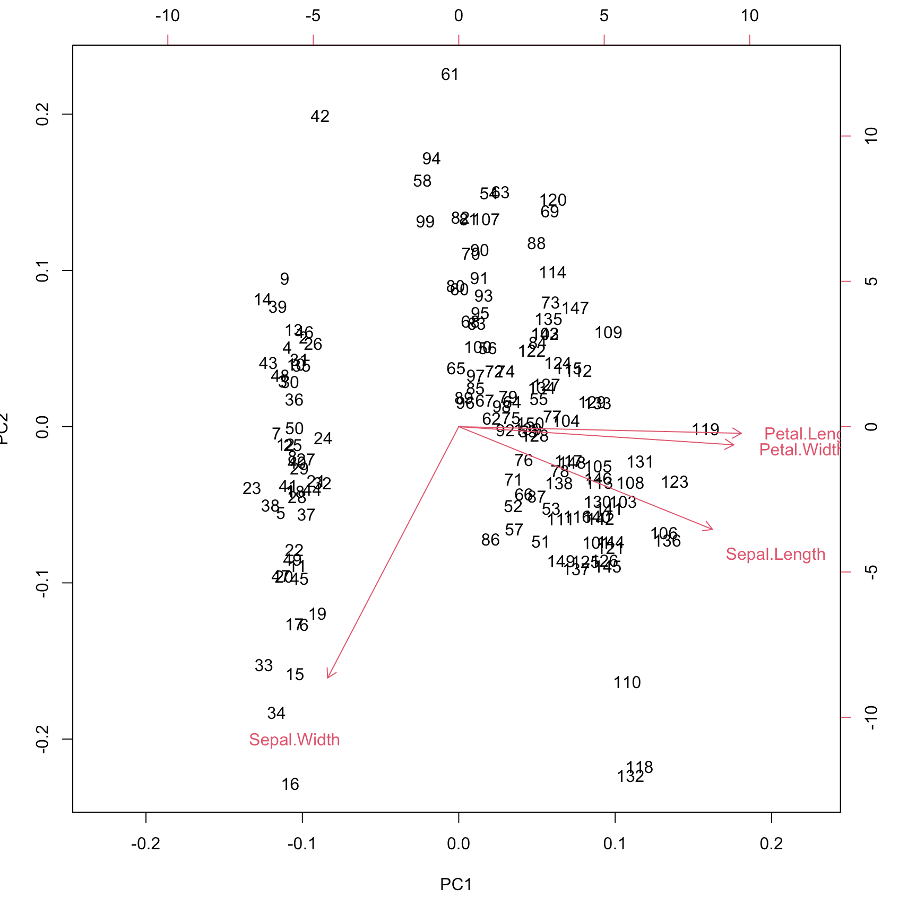

본 글은 본인이 '데이터 분석 준전문가' 필기 시험을 준비하면서 개인적으로 작성하는 글이라 일부 이해가 되지 않고 부정확할 수 있음을 밝힙니다. 모두 화이팅^^

# 회귀 분석

> 인과관계를 규명하고 예측하는 회귀분석의 개념에 대해 학습한다.
>
> 최적회귀방정식을 통해 모형의 성능을 높이는 방법을 숙지한다.

## 회귀분석 개요

회귀분석이란 하나 이상의 독립변수들이 종속변수에 얼마나 영향을 미치는지 추정하는 통계기법이다.

회귀분석을 이용하여 원인과 결과 사이의 인과관계를 알 수 있으며, 나아가 회귀함수를 이용하여 <u>예측도 가능</u>하다.

### 회귀분석의 가정(암기!) : 분산분석의 가정 + 선형성 추가

| 성질     | 설명                                                         |
| -------- | ------------------------------------------------------------ |
| 선형성   | - **독립변수와 종속변수가 선형적**이여야 한다<br />- 예외적으로 2차함수 회귀선을 갖는 다항회귀분석에는 선형성을 갖지 않아도 된다<br />- 산점도를 통해 분석하기 전에 변수 사이의 관계를 짐작할 수 있어 회귀분석 하기 전 상관분석은 거의 필수적으로 함께 따라온다 |
| 독립성   | - 단순회귀분석에서는 **잔차와 <u>독립변수</u>의 값이 서로 독립**이여야 한다<br />- 독립변수가 여러 개인 <u>다중회귀분석의 경우에는 독립변수들 간에 상관성이 없이 독립이어야 한</u>다<br />- 만약 독립변수들 간에 상관성이 존재하는 경우 다중공선성이라 하며, 이를 제거하고 회귀분석을 수행해야 한다 |
| 등분산성 | - 분산이 같다는 의미(잔차들이 고르게 분포하고 있다는 의미)<br />- **잔차의 중심에서 분산이 같아야 한다**. 등분산성을 만족하지 못하면 회귀선은 어떤 추세를 띠지 못하고 덩어리진 모양을 한다 |
| 정규성   | - **잔차항이 정규분포 형태를 띠는 것**을 정규성을 만족한다고 한다<br />- Q-Q Plot에서 잔차가 오른쪽으로 상승하는 형태를 띠면 정규성을 만족한다고 판단한다 |

- 오차 : <u>모집단</u>의 데이터를 활용하여 회귀 식을 구한 경우 예측값과 실제값의 차이
- 잔차 : 모집단 특정이 불가하여 <u>표본집</u>단으로 회귀식을 추정하는데, 이때 예측값과 실제값의 차이
- 잔차도 : 예측 값과 실제 값의 차이를 나타낸 산점도. 선형성과 등분산성의 가정 위배 여부 등을 확인할 수 있다.

## 단순선형회귀분석

독립변수와 종속변수가 각 1개일때 둘 사이의 인과관계를 분석. 두 변수의 관계가 **선형**이다.

`최소제곱법`(Least Square Method/ Least Mean Square)을 활용하여 오차가 가장 작아지는 직선의 방정식을 찾는다.
$$
Y = \beta_0+\beta_1X+\epsilon \newline
(\beta_0: 회귀계수 상수항, \beta_1X: 회귀계수 기울기, \epsilon: 오차항)
$$
실제 관측치 Y와 추세선에 의해 예측된 위의 수식의 차를 제곱하여 최소화하는 방향으로 간다. 즉, 잔차의 제곱 합이 최소가 되는 추세선이 가장 합리적이라고 볼 수 있다.

### 회귀분석모형의 적합성 : 분산분석으로 모형의 설명력을 검정한다!

회귀분석모형의 적합성을 검정하기 위해서는 **분산분석표**를 이용한다. 회귀분석의 결과를 분산분석을 해주면 된다.

- 단순선형회귀분석의 분산분석표

  |                        | DF(자유도)                        | Sum Sq(제곱합) | Mean Sq(제곱평균) | F value | Pr(>F) |
  | ---------------------- | --------------------------------- | -------------- | ----------------- | ------- | ------ |
  | 독립변수(집단간)       | a= 집단수 - 1 => **1**            | SSR            | MSR = SSR/a       | F값     | P값    |
  | Residuals(집단내 잔차) | b= 전체데이터 - 집단수 => **n-2** | SSE            | MSE = SSE/b       |         |        |

  f값은 p-value와 반비례하므로, 높을수록 유의미하다.(귀무가설이 기각되어야 회귀분석이 의미있다는 뜻)

  여기서 R^2를 구할 수 있어야 한다. R스퀘어는 항상 1보다 작으며, 1에 가까울수록 오차가 낮고 설명력이 높다고 판단한다. R^2의 값은 0.8이상이면 아주 설명력이 높다고 하며, 0.5 미만이면 설명력이 낮다고 판단한다.
  $$
  R^2 = \frac{SSR}{SST} = \frac{SSR}{SSE+SSR}
  $$
  
- 다중선형회귀분석의 분산분석표 : k개의 독립변수와 1개의 종속변수로 구성되어 있을 때

  |                        | DF(자유도)                          | Sum Sq(제곱합) | Mean Sq(제곱평균) | F value | Pr(>F) |
  | ---------------------- | ----------------------------------- | -------------- | ----------------- | ------- | ------ |
  | 독립변수(집단간)       | a= 집단수 - 1 => **k**              | SSR            | MSR = SSR/a       | F값     | P값    |
  | Residuals(집단내 잔차) | b= 전체데이터 - 집단수 => **n-k-1** | SSE            | MSE = SSE/b       |         |        |

<u>분산분석이 사용되는 곳 : 3개 이상 다수의 그룹의 평균을 비교할 때, 선형회귀분석의 적합성을 검정할 때</u> 라고 볼 수 있다.

### 회귀모형의 통계적 유의성 검증

F-검정을 통해 확인 가능

F-검정은 분산의 차이를 확인할 때 사용디는데, **분산의 차이가 크다는 것은 회기계수가 크다는 의미**를 갖는다.

F값 크다 => p값 작다 => 귀무가설 기각 => 인과관계 O

### 회귀계수의 유의성 검증

t-검정을 통해 확인 가능

### 모형의 설명력

회귀모형의 설명력이 좋다는 것은 데이터들의 분포가 회귀선에 밀집하게 분포하고 있다는 의미이다. R^2으로 모형의 설명력을 판단한다.

R^2가 크면(1에 가까우면) 오차는 적고, 회귀선에 밀집하다는 뜻이다.

## 단순선형회귀분석의 예

`lm(Y~X)`로 회귀분석을 할 수 있으며, 이후 결과를 `anova(result)`로 회귀분석모형의 적합성을 판단할 수 있다. `mtcars`차량 데이터셋을 이용하여 cyl(실린더)와 hp(마력)과의 선형회귀분석을 해보자.

```R
> Y <- mtcars$cyl
> X <- mtcars$hp
> result <- lm(Y~X)	#마력에 따른 실린더 회귀분석
> summary(result)

Call:
lm(formula = Y ~ X)

Residuals:
     Min       1Q   Median       3Q      Max 
-2.27078 -0.74879 -0.06417  0.63512  1.74067 

Coefficients:
            Estimate Std. Error t value Pr(>|t|)    
(Intercept) 3.006795   0.425485   7.067 7.41e-08 ***	# 1행 1열이 상수항 의미
X           0.021684   0.002635   8.229 3.48e-09 ***	# 2행 1열이 회기계수 의미
---
Signif. codes:  0 ‘***’ 0.001 ‘**’ 0.01 ‘*’ 0.05 ‘.’ 0.1 ‘ ’ 1

Residual standard error: 1.006 on 30 degrees of freedom
Multiple R-squared:  0.693,	Adjusted R-squared:  0.6827 
F-statistic: 67.71 on 1 and 30 DF,  p-value: 3.478e-09
```

R^2(Multiple R-squared)가 0.693이라는 것은 마력이 실린더의 69% 정도를 설명할 수 있다는 뜻이다.

또한, 회기계수는 0.021684이며 상수항은 3.006795이다. 회기계수가 0이 아니고 p값이 매우 낮으므로 귀무가설을 기각한다. 따라서 추정되는 회귀식은 Y(cyl) = {0.021684*(마력X)}+3.006795 이다.

추가적으로 회기계수가 클수록 회기계수의 영향력이 크다(인과관계가 강하다)라고 하며, F값(==분산의 차이)도 커진다.

이걸 갖고 분산분석(anova)를 해보자. 회귀분석의 결과를 분산분석할 때에는 `aov`함수가 아닌 `anova`함수가 쓰인다!!

```R
> anova(result)
Analysis of Variance Table

Response: Y
          Df Sum Sq Mean Sq F value    Pr(>F)    
X          1 68.517  68.517   67.71 3.478e-09 ***
Residuals 30 30.358   1.012                      
---
Signif. codes:  0 ‘***’ 0.001 ‘**’ 0.01 ‘*’ 0.05 ‘.’ 0.1 ‘ ’ 1
```

위의 결과로 SSR = 68.517, SSE = 30.358이다. 따라서 R^2 = SSR/(SSR+SSE) = 0.693정도라는 것을 알 수 있다. 회귀분석의 결과와 같다는 것을 알 수 있다. 

## 다중선형회귀분석

독립변수가 2개 이상이고 종속변수가 하나일 때 사용하는 회귀분석. 여기서는 결정계수보다는 수정된 결정계수(Adjusted R square)가 사용된다.

### 다중공선성의 문제

다중선형회귀분석에는 독립변수 간 강한 상관관계가 발생하는데, 이를 `다중공선성`이라고 부른다. (즉, 독립변수끼리 겹치는 영역이 존재한다는 말이다) 다중공선성은 회귀분석의 가정 중 하나인 `독립성`을 위배하므로 이를 진단하고 해결해야한다.

### 다중공선성 진단

R^2의 값이 커서 회귀식의 설명력은 높지만, 각 독립변수의 p-value 또한 큰 경우 의심할 수 있다. 보통 **분산팽창요인(VIF)**를 구해 10이 넘으면 다중공선성이 있다고 판단할 수 있다.
$$
VIF = \frac{1}{1-R^2} (R^2는 결정계수)
$$

### 다중공선성 해결법

주성분분석(PCA)을 통해 변수의 차원을 축소한다. 많은 변수를 몇개의 주성분으로 축소하면서 회귀분석의 설명력은 유지하는 것이다. PCA분석에서 scree plot을 보고 주성분 개수를 선택할 수 있다. 이는 밑에서 해볼 것이다. 

이 외에도 선형판별분석(LDA), t-분포 확률적 임베딩(t-SNE), 특잇값 분해(SVD)로 차원을 축소한다.

### 다중선형회귀분석 실습

`lm(y~x1+x2+x3...)`와 같이 독립변수를 더하기 연산자로 묶어서 함수를 실행하면 된다. 위의 `mtcars`예시에서 독립변수를 추가하여   다중선형회귀분석을 해보도록 하자.

```R
> result <- lm(mtcars$cyl~mtcars$hp+mtcars$mpg+mtcars$qsec)
> summary(result)

Call:
lm(formula = mtcars$cyl ~ mtcars$hp + mtcars$mpg + mtcars$qsec)

Residuals:
    Min      1Q  Median      3Q     Max 
-1.5744 -0.4486 -0.1442  0.7381  1.3318 

Coefficients:
             Estimate Std. Error t value Pr(>|t|)    
(Intercept) 11.218721   3.110991   3.606  0.00119 ** 
mtcars$hp    0.007367   0.004576   1.610  0.11859    
mtcars$mpg  -0.168500   0.040466  -4.164  0.00027 ***
mtcars$qsec -0.152764   0.121894  -1.253  0.22048    
---
Signif. codes:  0 ‘***’ 0.001 ‘**’ 0.01 ‘*’ 0.05 ‘.’ 0.1 ‘ ’ 1

Residual standard error: 0.8183 on 28 degrees of freedom
Multiple R-squared:  0.8104,	Adjusted R-squared:  0.7901 
F-statistic: 39.89 on 3 and 28 DF,  p-value: 3.053e-10
```

회귀식은 표의 1열(회귀계수)을 참고하면 된다. 유의수준 내에서 보면, mpg만 의미 있다고 볼 수 있겠다. (테이블의 4열 참고)

## 최적 회귀 방정식

1개의 반응변수 y를 설명하기 위한 k개의 독립변수 후보들이 있을 때 반응변수 y를 가장 잘 설명할 수 있는 회귀식을 찾기 위해 최적 회귀 방정식을 이용한다. R^2와 adjusted R^2가 모두 사용될 수 있다.

### 변수 선택에 사용되는 성능 지표

1. 벌점화(penalty) 방식의 AIC와 BIC

   회귀모형은 변수의 수가 증가할수록 편향(bias)는 작아지고 분산(variance)는 커지는 경향이 있다. 그래서 복잡해진 모형에 벌점을 부여하여 회귀모형에 설명력을 높이려고 하는 방법이다.

2. AIC(Akaike Information Criteria: 아카이케 정보 기준)

3. BIC(Bayes Information Criteria: 베이즈 정보 기준)

4. 멜로우 Cp(Mallow's Cp)

### 단계적 변수 선택법

1. 전진선택법(forward selection) : `direction='forward'`

   가장 영향을 줄 것 같은 변수부터 하나씩 추가한다. 즉, p-value가 가장 낮은 변수부터 시작하여 모형에 추가한다. 변수가 많을 때 사용할 수 있지만, 변수가 조금만 변해도 결과에 큰 영향을 미치므로 안정성이 부족하다.

2. 후진제거법(backward elimination) : `direction='backyard'`

   가장 적은 영향을 주는 변수부터 하나씩 제거한다. p-value가 큰 변수부터 제거한다. 변수가 너무 많은 경우 적용하기 어렵다.

3. 단계별 방법(stepwise method) : `direction='both'`

   위의 두 방법을 보완한 방법으로, 전진선택법에 의해 변수를 추가하면서 추가될 때 예상되는 벌점 값과 이미 추가된 변수가 제거될 때 예상되는 벌점 값이 가장 작도록 하는 방법이다.

# 다변량 분석

> 객체들 사이의 유사성/비유사성을 측정하여 시각화하는 다차원 척도법에 대해 학습한다.
>
> 변수축소기법 중 하나인 주성분분석에 대해 학습한다.

## 다차원 척도법(MultiDimensional Scaling, MDS)

- 객체 간의 근접성을 시각화하는 통계기법, 군집분석과 유사
- 데이터를 축소하는 목적으로 사용됨. 즉 데이터들의 유사성 혹은 비유사성과 같은 데이터들의 정보 속성을 파악하기 위한 수단으로 활용됨

### MDS stress 계산

$$
stress = \sqrt{\frac{(실제거리 - 추정거리)^2}{\sum{실제거리}^2}}
$$

실제 거리와 모형에 의해 추정된 거리 사이의 적합도를 측정하기 위해 stress를 계산한다. 수식을 보면, **스트레스가 클수록 추정과 실제와의 오차가 크다**는 것을 알 수 있다.

stress값은 0.05 이내면 적합도가 좋다고 판단하고, 0.15 이상이면 적합도가 매우 나쁘다고 판단한다.

### MDS의 종류

- 계량적 MDS : 구간 척도, 비율 척도에 대하여 유클라디안 거리를 이용하여 `cmdscale()`함수로 다차원 척도법을 수행할 수 있다.

- 비계량적 MDS : 서열척도를 거리속성값으로 변환하여 `isoMDS`함수로 다차원 척도법 수행 가능 

### cmdscale(dist 데이터)

케이스간 거리(유사도)를 측정한 거리 데이터를 인자로 `cmdscale()`를 사용할 수 있다. 만약 거리 데이터가 없다면 `dist()`함수로 거리 데이터를 구할 수 있다. 유럽 도시간 거리 데이터를 모아둔 `eurodist` 데이터셋을 이용하여 다차원 척도법으로 분석해보자.

```R
> data <- eurodist
> euro_loc <- cmdscale(data)
> euro_loc
                        [,1]        [,2]
Athens           2290.274680  1798.80293
Barcelona        -825.382790   546.81148
Brussels           59.183341  -367.08135
Calais            -82.845973  -429.91466
Cherbourg        -352.499435  -290.90843
Cologne           293.689633  -405.31194
Copenhagen        681.931545 -1108.64478
Geneva             -9.423364   240.40600
Gibraltar       -2048.449113   642.45854
Hamburg           561.108970  -773.36929
Hook of Holland   164.921799  -549.36704
Lisbon          -1935.040811    49.12514
Lyons            -226.423236   187.08779
Madrid          -1423.353697   305.87513
Marseilles       -299.498710   388.80726
Milan             260.878046   416.67381
Munich            587.675679    81.18224
Paris            -156.836257  -211.13911
Rome              709.413282  1109.36665
Stockholm         839.445911 -1836.79055
Vienna            911.230500   205.93020
> x_loc <- euro_loc[,1]
> y_loc <- euro_loc[,2]
> plot(x_loc, y_loc, type='n')	# n : 점 찍지 않음
> text(x_loc, y_loc, rownames(euro_loc))
> abline(v=0, h=0)
```


이것을 통하여 각 도시간 거리 차이를 볼 수 있다. (단, x축과 y축이 의미하는 것은 없음)

## 주성분 분석(Principal Components Analysis, PCA)

서로 상관성이 높은 변수들의 **선형 결합으로 새로운 변수, 즉 주성분을 만들어 기존 변수를 요약 및 축소**하는 분석방법이다.

데이터를 바라보는 관점은 다양하지만, 그 중 <u>손실이 가장 작은 축(분산이 가장 큰 축)</u>을 찾는 것이 주성분분석의 과정이라고 볼 수 있다.

### 목적

- 변수를 축소하여 모형의 설명력을 높임
- 위의 다중공선 문제를 해결 
- 군집분식 시 모형의 성능을 높임
- IoT 센서 데이터를 주성분분석하여 스마트팩토리에서 활용

### 1. prcomp() 또는 princomp() 함수로 주성분 분석

붓꽃 예제로 해보자. 우선, 모든 PCA에서는 연속형 자료만 사용하므로 명목 척도인 5열은 제외하고 하였다. 

그리고 center와 scale 값을 **T로 표준화**하여 변수 간의 단위 차이를 없애주면서 PCA를 해주자.

```R
> data <- iris[,-5]
> result <- prcomp(data, center = T, scale. = T)
> result
Standard deviations (1, .., p=4):
[1] 1.7083611 0.9560494 0.3830886 0.1439265

Rotation (n x k) = (4 x 4):
                    PC1         PC2        PC3        PC4
Sepal.Length  0.5210659 -0.37741762  0.7195664  0.2612863
Sepal.Width  -0.2693474 -0.92329566 -0.2443818 -0.1235096
Petal.Length  0.5804131 -0.02449161 -0.1421264 -0.8014492
Petal.Width   0.5648565 -0.06694199 -0.6342727  0.5235971

# 각 열은 기존의 변수들을 어떤 조합으로 묶었는지를 나타낸다. 예를 들어, PC1 = 0.5210659*Sepal.Length-0.2693474*Sepal.Width + ...이런 식이다. 계수가 클수록 해당 열이 주성분에 영향을 많이 끼친다고 볼 수 있다.

> summary(result)
Importance of components:
                          PC1    PC2     PC3     PC4
Standard deviation     1.7084 0.9560 0.38309 0.14393	# 표준편차
Proportion of Variance 0.7296 0.2285 0.03669 0.00518	# 설명력(해당 주성분이 전체 데이터의 얼마나 설명하는지)
Cumulative Proportion  0.7296 0.9581 0.99482 1.00000	# 누적설명력

```

보면 PC1 주성분으로 전체데이터의 72.96%가 설명된다는 것을 알 수 있다. 또한, PC2까지 포함시킨다면 두개의 주성분만으로 95.8%정도를 설명할 수 있다는 것을 알 수 있다. 기존 4개의 변수에서 2개의 주성분으로 약간의 로스는 있지만 줄일 수 있다는 것을 알 수 있다. + 설명력이 크다는 말은 분산이 큰 축이라는 말과 같다!

### 2. scree plot

x축을 성분의 개수, y축을 고윳값(eigenvalue)로 하는 그래프로 주성분의 개수를 선택하는데 도움을 주는 그래프이다. 그래프로 주성분의 개수를 판단하는 방법은 크게 두가지가 있다.

1. 고윳값(y좌표)이 1 근처의 값을 갖는 주성분 개수로 결정
2. 그래프가 수평을 유지하기 바로 전을 주성분 개수로 결정

plot 함수로 그려보자. type="l"로 직선으로 그래프를 그려볼 수 있다.

```R
> plot(result, type="l")
```


위의 그래프에서 두개의 해석을 해볼 수 있다.

1. y값이 1 근처인 2개로 주성분을 정한다.
2. 3~4가 수평이 유지되므로 그 전인 2개로 주성분을 정한다.

### 3. biplot()

첫번째와 두번째 주성분을 축으로 하는 그래프이다. MDS처럼 데이터가 어떻게 퍼져 있는지 시각화할 수 있다.

```R
> biplot(result)
```



위의 prcomp()함수의 결과로 나온 표에서 PC1와 PC2를 축으로 하도록 시각화하여 실제 데이터의 좌표를 찍은 것이다.

요약: 다차원 척도법, 주성분 분석으로 변수가 많을 때에도 표현할 수 있는 방법들이 있다. 다차원 척도법은 실제와 추정과의 거리를 통하여 볼 수 있으며 거리가 짧을수록 적합도가 높다고 평가한다. 주성분 분석은 다중공선성이 발생할 때 주성분 몇개로 차원을 줄여서 해석을 용이하게 하며, 손실이 최소화되는 조합(분산이 큰 축이 주성분이 되도록)으로 만든다.

# 시계열 분석

> 시간의 흐름에 따른 시계열 데이터의 특성을 이해한다.
>
> 시계열 분석의 다양한 방법에 대해 숙지한다.

## 시계열 분석(Time-series analysis)

- 시계열 분석은 일정 시간 간격으로 <u>기록된 자료들에 대하여 특성을 파악하고 미래를 예측</u>하는 분석방법이다. 
- 주가, 환율, 일일 확진자 수 등이 시계열 자료에 해당한다.

### 시계열 자료의 자기상관성

시계열 자료들은 **자기상관성**을 갖는다. 즉, 시계열 자료는 이웃하는 자료끼리 일종의 상관관계를 갖는다. (수학적으로 하나의 잔차항의 크기가 이웃하는 다른 잔차항의 크기와 서로 일정한 관련이 있다는 말) *공분산은 두 개의 확률 변수의 선형관계(확률변수의 흩어진 정도)를 나타내므로, 시계열자료에서 중요하게 이용된다***. 공분산이 0이라면 두 확률변수가 독립임을 의미하므로, **시계열 자료들은 공분산이 0이 아니다**(어느 정도는 연관 있을 것)!

### 시계열 분석의 자료

시계열 분석의 자료는 크게 `정상성 시계열 자료`와 `비정상성 시계열 자료`로 나뉘는데, 대부분은 후자에 속한다. 하지만 시계열 분석을 하기 위해서는 정상성 시계열 자료여야 하므로, 아래의 방법으로 변환할 수 있다.

### 시계열 자료의 <u>정상성 조건</u>

​	항공기 탑승수에 대한 시계열 데이터인 `AirPassengers`  R 내장 데이터를 사용하도록 하자.

1. 일정한 평균 → `diff(data, lag=n)` n회 차분 실시하여 평준화

   시계열 자료가 정상성을 만족하려면 평균이 일정해야한다.

   ```R
   > data <- AirPassengers
   > plot(data, type='l')
   > data_diff <- diff(data, lag=1)
   > plot(data_diff, type='l')
   ```

   

   위의 그래프는 평균이 일정하지 않다. 차분이란 **현 시점의 자료 값에서 전 시점의 자료 값을 빼는 것**이다. 차분 1회를 실시한 이후의 그래프는 아래와 같다. 

   

   비교적 일정해졌음을 확인할 수 있다.

2. 일정한 분산 → 로그나 지수함수로 낮춰줌

   시계열 자료가 정상성을 만족하려면 분산이 일정해야한다. 따라서 `log()` 함수 등을 이용하여 평균 근처에 모이도록 자료를 변환해주자.

3. **시차에만 의존**하는 공분산

   공분산은 **특정 시점이 아닌 시차에만 의존적**이다. t는 시점, s는 시차라고 할때, 't시점과 t+s시점의 공분산'과 't시점과 t-s시점의 공분산'은 서로 같다.

   공분산이 특정 시점에 의존하지 않는다는 말은 't 시점과 t+s시점의 공분산'과 't시점과 t-s시점의 공분산'은 서로 같다는 의미다...(?)

### 자기상관계수(ACF : Autocorrelation Function)

시계열 자료들은 자기상관성(시차값 사이의 선형관계)을 갖는다고 했다. 

자기상관함수는 특정 시점 t로부터 l만큼의 시차를 갖는 t+l시점에서의 값의 상관계수(=자기상관계수)를 나타내는 함수이다. 시차가 0이면 자기 자신과의 상관계수이므로 1이고, 일반적으로 시차가 증가할수록 자기상관계수의 값이 감소한다. 

### 부분자기상관계수(PACF : Partial Autocorrelation Function)

두 시계열 확률변수 간에 <u>다른 시점의 확률변수 영향력은 통제</u>하고 **상관관계만** 보여준다. 두 시계열 확률변수의 상관관계를 읽어볼 때, 그에 영향을 주는 요소들을 제외하고 오로지 둘 사이의 상관관계만을 고려할 때 사용한다.

일반적으로 부분자기상관계수는 특정 시점 이후 급격히 감소한다.

### 시계열 분석 기법

1. 이동평균법

   시계열 데이터에서 일정 기간별로 자료를 묶어 평균을 구하는 방법이다. 시간에 따라 포함되는 기간의 자료가 바뀌므로 이동평균법이라고 함

   장기적인 추세를 파악하는 데 효과적이나 m기간에 따라 평균의 수가 감소하는 단점이 존재한다.

2. 지수평활법

   최근 데이터일수록 큰 가중치를 부여하고, 오래된 데이터일수록 작은 비중을 부여하여 평균을 계산한다.

## 시계열 모형

솔직하게 이부분은 이해가 잘 안된다... 추후에 다시 익히도록 하자.

### 자기회기(AR: AutoRegressive) 모형 -> PACF()로 확인

t라는 시점에서의 값은 이전 시점들 n개에 의해 설명될 수 있음을 의미한다. 즉, 이전 자신의 관측값이 이후 자신의 관측값에 영향을 준다는 말이다. AR모형의 상수항은 `백색잡음(white noise)`이라고 불리며, 현재 시점과 이전 시점과의 상관관계가 존재하지 않는 독립적인 시계열자료를 의미한다. 이는 대표적인 시계열 자료 중 하나이다.

### 이동평균(MA : Moving Average) 모형 -> ACF()로 확인

예측오차를 통하여 미래를 예측하는 모형이다. 백색잡음들의 선형결합으로 이루어져 있기에 항상 정상성을 만족한다.

### 자기회귀누적이동평균(ARIMA : AutoRegressive Integrated Moving Average) 모형

 d차 차분한 데이터에 AR 모형과 MA 모형을 합친 모형이다.

### 분해 시계열

시계열은 다양한 요인들이 서로 복합하게 혼합되어 있다. 분해 시계열은 <u>추세요인(Trend), 계절요인(Seasonal), 순환요인(Cyclical), 불규칙요인(Irregular)</u>의 4가지로 구성되어 있다.
