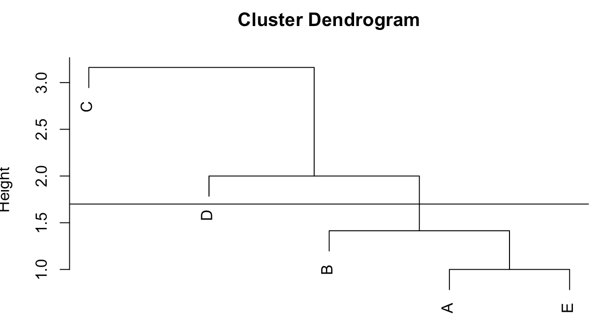
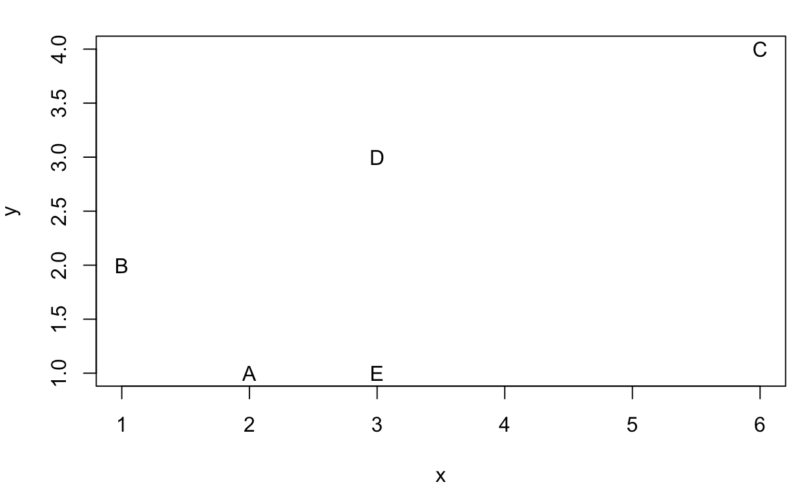
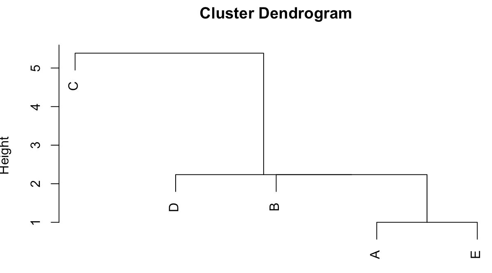

본 글은 본인이 '데이터 분석 준전문가' 필기 시험을 준비하면서 개인적으로 작성하는 글이라 일부 이해가 되지 않고 부정확할 수 있음을 밝힙니다. 모두 화이팅^^

# 군집분석

> 비지도학습인 군집분석에 대해 학습한다.
>
> 군집분석을 통해 인사이트를 얻는 과정을 학습한다.

## 군집분석

군집분석이란 여러 변수로 표현된 자료들 사이의 유사성을 측정하고 유사한 자료들끼리 몇 개의 군집(cluster)으로 묶고 다변량 분석(상관분석, 회귀분석, 주성분 분석 등)을 활용하여 각 군집에 대한 특징을 파악하는 기법이다. 생물학에서의 종의 분류, 마케팅에서의 시장 세분화, 금융에서 산업 분석 등에 활용되며 `협엽 필터링(Collaborative Filtering)`같은 추천 서비스가 등장하는 기반을 제공하였다.

### 거리측도

1. 변수가 연속형인 경우

   - 유클라디안 거리(Euclidean)

     두 점 사이의 가장 짧은 거리를 계산. 통계적이지 않고 수학적인 거리로 변수들의 산포정도를 감안하지 않는다. == 좌표계에서 점과 점 사이의 거리

   - 맨하튼 거리(Manhattan)

     길을 따라 갔을 때의 거리. 시가 거리라고도 함. 가로지르지 않는 **축들의 차이의 합**이라고 볼 수 있다. x의 이동거리, y의 이동거리, z의 이동거리를 더한다.

   - 체비셰프 거리(Chebychev)

     **변수 간 거리 차이 중 최댓값**을 데이터 간의 거리로 정의한다. x,y,z 축이 있을 때 각 축에서 최대와 최소값의 차이를 구하고, 그 중 최대를 의미한다.

   - 표준화 거리(Standardized)

     유클리드 거리에서 변수 간 단위의 차이로 생기는 문제를 표준편차로 나눔으로써 해결한 거리이다.

   - 마할라노비스 거리

     표준화 거리에서 변수 간 상관성까지 고려한 거리이다.

   - 민코프스키 거리

     유클리디안 거리와 맨하튼 거리를 한번에 표현한 거리로, m=1일때는 맨하튼 거리이며, m=2 일때는 유클리디안 거리가 된다.

   유클라디안 거리, 맨하튼 거리, 체비셰프 거리를 비교해보자.

   A(1,2,3), B(2,6,-1)라고 했을 때, 각각의 거리를 구하면

   1. 유클라디안 : $\sqrt{(1-2)^2+(2-6)^2+(3+1)^2} = \sqrt{33}$
   2. 맨하튼 : $\abs{1-2}+\abs{2-6}+\abs{3+1} = 9$
   3. 체비셰프 : $max((1-2), (2-6), (3+1)) = 4$

2. 변수가 범주형인 경우 : 얼마나 공통된 요소를 갖고 있는지 판단 가능

   - 단순 일치 계수(Simple Matching Coefficient, SMC) : 두 객체의 상이성을 **불일치 비율**로 계산한다. p는 총 변수의 개수, m은 일치한 수를 의미한다. 즉 전체 중에 일치하지 않은 비율을 의미.

     $d(i,j) = \frac{p-m}{p}$

   - 자카드 지수 : 두 집합 사이의 유사도를 측정하는 지표로서 두 집합이 같으면 1, 완전 다르면 0이 된다. cap/cup으로 계산.

     $J(X,Y) = \frac{n(A\cap B)}{n(A\cup B)}$

   - 자카드 거리 : 자카드 지수를 거리화하기 위해, 1에서 자카드 지수를 뺀 값(같으면 0, 다르면 1이 되도록)

   - 코사인 유사도 : 텍스트의 유사도를 측정하기 위한 지표로서 **크기가 아닌 방향성을 측정**하는 지표다. 완전 일치하면 1, 완전 다른 방향이면 -1의 값을 갖는다.

     $Cosine Similarity(X,Y) = \frac{\overrightarrow{X}\cdot\overrightarrow{Y}}{\abs{X}\abs{Y}}$ : <u>두 내적값을 두 벡터의 크기의 곱으로 나눈 값</u>이다. (내적은 단순하게 같은 좌표계끼리 곱해주면 됨)

   - 코사인 거리 : 코사인 유사도를 거리화하기 위해, 1에서 코사인 유사도를 뺀 값

   - 순위 상관 계수 : 순서척도인 두 데이터의 거리를 비교하기 위해 `스피어만 상관계수`를 이용

## 계층적 군집분석

개별 관측치 간의 거리를 계산하여 **가장 가까운 관측지부터 결합해나가면서 계층적 트리 구조를 형성하고, 이를 통해 군집화를 수행**하는 방법이다. 각 데이터를 하나의 군집으로 간주하고 가까운 데이터부터 순차적으로 병합하는 '병합적 방법'과 전체를 하나의 군집으로 간주하는 '분할적 방법'이 존재한다. '가깝다'라는 것은 어떻게 거리를 계산하냐에 따라 방법이 달라지게 된다.

### 군집 간의 거리

계층적 군집은 한 번 병합된 객체는 다시 분리되지 않고 사용되는 연결법에 따라 생성되는 군집이 달라진다. 따라서 여러 연결법을 통해 군집을 생성한 후, 유의미한 군집을 형성하는 방법을 적용하도록 한다.

- 군집간의 연결법 → 각 연결법의 특징을 익히도록 하자.
  1. 단일연결법(최단연결법) : 군집안의 데이터들과 기존의 데이터들의 거리를 가장 가까운 것을 거리로 계산한다.
  2. 완전연결법(최장연결법) : 군집안의 데이터들과 기존의 데이터들의 거리를 가장 먼 것을 거리로 병합한다.
  3. 평균연결법 : 각 데이터끼리의 거리의 평균을 계산하는 방법이다. *계산량은 불필요하게 많아지나 이상치에 덜 민감*하다.
  4. 중심연결법 : 각 군집의 중심점 사이의 거리를 이용한다. 평균연결법보다 계산량이 적다.
  5. 와드연결법 : 생성된 군집과 기존의 데이터들의 거리를 **군집 내 오차가 최소가 되는 데이터**로 계산한다. 군집 내 <u>분산을 최소</u>로 하므로, 좀 더 조밀한 군집이 생성될 수 있다.

### 계층적 군집분석 실습 : hclust() 함수 이용

```R
> x <- c(2,1,6,3,3)
> y <- c(1,2,4,3,1)
> data = data.frame(x,y)
> rownames(data) <- c('A','B','C','D','E')	# 행에 이름 할당
> dist_data <- dist(data, method="euclidean")	# 거리 행렬 데이터로 변환. default method : Euclidean
> print(dist_data)
         A        B        C        D
B 1.414214                           
C 5.000000 5.385165                  
D 2.236068 2.236068 3.162278         
E 1.000000 2.236068 4.242641 2.000000
# 각 지점에서 다른 지점까지의 거리 데이터가 dist_data에 저장됨
> hclust_data <- hclust(dist_data, method='single')	#단일연결법(최단연결법)으로 연결
> plot(hclust_data)
> abline(h=1.7)	#높이를 1.7으로 선을 그어 군집을 나눠볼 수 있다.
```



높이를 1.7으로 하였을때는 {c},{d},{a,b,e}의 3 군집으로 나눠지는 것을 확인할 수 있다.위의 점들의 위치는 아래와 같다.



 최단연결법이 아닌 다른 방법으로도 구현해보자. method의 기본값은 'complete', 최장연결법이다.



최단 연결법과 다르게 군집이 형성되는 것을 확인할 수 있다.

### 비계층적 군집분석 : k-means 군집

계층적으로 군집을 형성하지 않고 구하려는 군집의 수(k)를 사전에 정의해 정해진 군집의 수만큼 형성하는 방법이다. 집단 내 동질성과 집단 간 이질성이 모두 높게 전체 데이터를 k개의 군집으로 분할하는 알고리즘이다.

1. 군집의 수 k를 정하고 각각의 k를 설명할 변수의 값을 임의로 정하거나 데이터 중에서 k개를 선택한다. 이때 선택된 k개를 seed라고 한다.
2. 각 데이터를 가장 가까운 seed로 할당한다.
3. 각 군집의 데이터들 사이의 평균값/중앙값을 계산하여 새로운 seed를 설정한다. 
4. 새로운 seed를 중심으로 군집을 재할당한다.
5. 각 군집의 중심이 변하지 않을 때까지(이상적으로 군집화될때까지) 3,4를 반복한다.

- k-means 군집 특징

  | 장점                                                         | 단점                                                         |
  | ------------------------------------------------------------ | ------------------------------------------------------------ |
  | - 분석 기법의 적용이 비교적 단순하고 빠르다<br />- 다양한 데이터에서 사용 가능하다 | - 초깃값(k)의 설정이 어렵다<br />- 결과의 해석에 어려움이 있다<br />- 데이터의 변수들이 연속형이여야 한다<br />- 안정된 군집은 보장하나 최적의 보장은 없다<br />- **이상값에 민감하게 반응**한다 → 평균값 대신 중앙값 사용하면 됨 |

### DBSCAN(Density Based Spatial Clustering of Applications with Noise)

밀도 기반 군집분석의 한 방법으로 개체 간의 거리를 기반으로 한 다른 군집 방법과 다르게 밀집한 정도에 기초하여 군집을 형성한다.

군집의 형태에 구애받지 않아 데이터의 분포가 기하학적이고 노이즈가 포함된 데이터셋에 대해서도 효과적으로 군집을 형성할 수 있고, 초기 군집의 수를 정할 필요가 없다.

## 자기조직화지도(SOM)

SOM(자기조직화지도) 알고리즘은 코호넨 맵이라고도 불리며, 인공신경망 기반 **차원축소와 군집화**를 동시에 수행할 수 있다. 고차원 데이터를 2차원에 가깝게 표현하여 한눈에 파악하는 **시각화 방법** 중 하나이다.

### 자기조직화지도 구성

은닉층 없이 j개의 입력층과 이를 n개의 노드(뉴런)로 표현하고자 하는 경쟁층으로 완전 연결(fully connected)되어 있다.

1. 초기 학습률과 임의의 값의 가중치 행렬, 경쟁층의 노드 개수를 지정한다.
2. 입력 벡터(첫번째 데이터)를 제시하고 가중치 행렬에 의하여 가장 가까운 노드에 나타낸다.
3. 입력 벡터에 대한 승자노드가 입력 벡터를 더 잘 나타내도록 학습률을 사용하여 해당 가중치를 재조정한다.
4. 2단계로 돌아가서 반복하여 모든 입력 벡터를 승자노드에 나타낸다. 모든 입력 벡터가 승자노드에 표시되는 과정을 1회 반복이라 한다.
5. 일정 반복수에 도달할때까지 2번으로 돌아가 반복하며, 그 과정에서 승자노드는 변경될 수 있다.

### 자기조직화지도 특성

인공신경망의 일종이지만 은닉층을 보유하고 있지 않고, 순전파 방식만 사용하므로 속도가 매우 빠르다.

| 장점                                                         | 단점                                                         |
| ------------------------------------------------------------ | ------------------------------------------------------------ |
| - 순전파 방식을 사용하여 속도가 매우 빠르다<br />- 저차원의 지도로 형상화되어 시각적 이해가 쉽다<br />- 패턴 발견 및 이미지 분석에서 성능이 우수하다<br />- 입력 데이터에 대한 속성을 그대로 보존한다 | - 초기 학습률 및 초기 가중치에 많은 영향을 받는다<br />- 경쟁층의 이상적인 노드의 갯수를 정하기 어렵다 |

### 군집분석 모형의 평가

군집 간 분산이 최대가 되는 군집의 수가 몇개인지, 군집 내 분산이 최소가 되는 군집의 수가 몇개인지 확인하는 방법이다.

- 외부 평가
  - 자카드계수 평가
  - 분류모형 평가 방법을 응용
- 내부 평가
  - 단순 계산법
  - 군집 간의 거리를 계산
  - 실루엣 계수 : 데이터가 속한 군집 안에 데이터들이 잘 속해 있는지 평가. -1~1의 값을 가지며 1에 가까울수록 군집이 잘 되어있다고 평가.
  - 엘보 메소드 : K-means 분석 시각화

### 협업 필터링

협업 필터링은 수많은 사람들로부터 유사한 사람들을 찾고 유사한 사람들이 선호했거나 경험한 것을 예측하는 추천 방법 중 하나이다.

# 연관분석

> 마케팅에서 자주 사용되는 연관분석에 대해 학습한다.
>
> 연관분석의 다양한 알고리즘과 특징을 이해한다.

## 연관분석의 개요 및 측도

장바구니 분석으로도 불리며 '치킨을 구매한 고객은 콜라를 구매할 확률이 높다'와 같이 고객들의 구매 패턴을 분석하여 의미 있는 규칙을 찾아내는 분석이다. If~then의 꼴로 해석된다. 탐색적 기법의 일종이며 비지도학습 유형으로 다양하게 활용될 수 있다.

하지만 연관분석은 품목의 수가 증가하면 분석 계산이 기하급수적으로 증가할 수 있다. 이를 개선하기 위해 범주화하여 일반화하는 작업을 수행하기도 한다.

### 연관분석의 측도(!)

1. **지지도** : 전체 거래 중 A와 B라는 두 개의 품목이 동시에 포함된 거래의 비율. 단순하게 A cap B로 구할 수 있다. $P(A\cap B)= \frac{A와 B가 동시에 포함된 거래 수}{전체 거래수}$
2. **신뢰도** : 어떤 하나의 품목이 구매되었을 때 다른 품목 하나가 구매될 확률. 조건부 확률로 나타낼 수 있다. A가 구매되었을 때 B도 구매될 확률과 B가 구매되었을 때, A도 구매될 확률은 분모가 다를 것이다.
3. **향상도** : 품목 A가 주어지지 않았을 때 B가 구매될 확률 대비 A가 구매될 때 B가 구매될 확률. 신뢰도를 A의 확률로 나누면 된다. 신뢰도와 다르게 향상도(A→B)와 (B→A)는 같을 것이다. $\frac{P(A\cap B)}{P(A)P(B)}$

## 연관분석의 알고리즘과 특징

### 연관분석 알고리즘 

1. aporiori 알고리즘 : 지지도를 사용해 빈발 아이템 집합을 판별하고 이를 통해 계산의 복잡도를 감소시키는 알고리즘이다.
   - 최소 지지도를 설정한다
   - 최소 지지도보다 큰 지지도를 갖는 단일 품목을 선별한다
   - 단일품목 2개로 이루어진 연관규칙 중 최소 지지도 이상의 연관규칙을 찾는다
   - 이를 반복적으로 수행하며 3개 이상의 품목에 대한 연관규칙을 생성하면서 의미 있는 결과를 찾는다
2. FP-Growth 알고리즘 : 데이터셋이 큰 경우 하나씩 검사하는 것이 비효율적이므로 지지도가 낮은 품목부터 아이템 집합을 생성하는 상향식 알고리즘. apriori 알고리즘보다 속도가 빠르며 연산 비용이 저렴하다.

### 연관분석의 특징

| 장점                                                         | 단점                                                         |
| ------------------------------------------------------------ | ------------------------------------------------------------ |
| - 결과가 단순하고 분명하다<br />- 분석을 위한 계산이 간단하다<br />- 목적변수가 없으므로 데이터 탐색을 위해 사용 가능하다 | - 품목 세분화에 어려움이 있다<br />- 품목 수의 증가는 기하급수적인 계산량의 증가를 초래한다<br />- 거래가 발생하지 않은 품목에 대하여는 분석이 불가능하다 |

