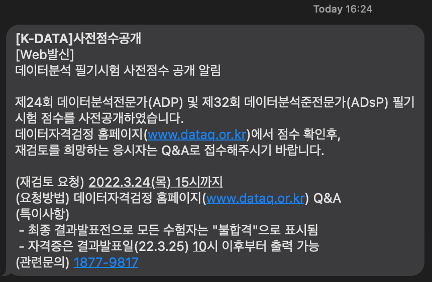
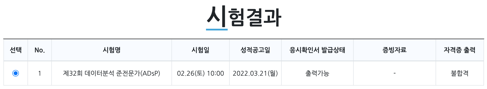
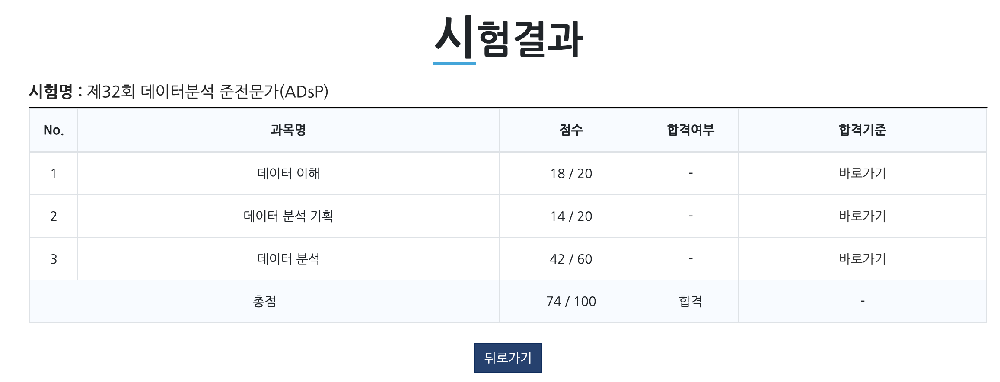

ADsP 32회 시험을 본지 거의 한달이 되었는데 아직도 시험결과가 나오지 않아 까먹고 있었는데, 이런 문자가 도착했다.

바로 들어가서 확인했는데, 불합격이다...?

근데, 문자 내용을 다시보니, 아직 최종 결과 발표전이라 모두 "불합격"으로 표시된다는 것이였다!!(휴...) 그래서 '시험 결과 확인' 버튼을 눌러보니

다행히 합격이다~ 응시료가 50000원으로 비싸서 다시 보지 않으려 했는데 다행이다. 아직 합격증은 나오지 않았지만, 짧게 시험 리뷰를 해보려고 한다.

# 준비기간

우선, 나는 고등학교 확률과 통계 과정을 이해정도만 하고 있는 사람이고, 현재 컴퓨터공학과에서 공부하고 있어 R 스크립트 작성에 부담을 가지진 않았다. 

나는 한달간 준비를 했는데, 방학이라 평일에 2~3시간정도 하고 주말에는 쉬면서 했다. 마지막 주에는 4시간 넘게도 했다. 블로그에 기록하면서 공부하지 않았다면 2~3주면 가능할 것 같다고 생각한다!

# 추천 하는 자료

- 보통 기출문제를 많이 담고 있는 책을 하나 갖고 있는 것이 좋다. 나도 솔직히 책 한권과 구글링, 유튜브로만 공부를 했다. 이외의 참고 서적은 없다. 

- 카페에 가입하여 기출문제를 얻을 수 있다고 하는데, 나는 책도 다 못 풀었기에 그럴 시간은 없었다.

- 그리고, 나는 컴공이라 예제 R코드를 직접 입력해보면서 실습을 했는데, <u>솔직히 거의 필요없다</u>고 봐도 무방하다. 함수 이름과, 그 함수의 return 값의 의미 정도만 외우면 될 것 같다. 

# 과목별 난이도

## 1과목. 데이터의 이해 

1단원은 많은 통계적 용어와 기업에서 사용하는 통계 자료들에 대한 용어(CRM, SCM, ERP, DW, DM 등...)를 알고 있는 것이 중요하다. 거의 유형이 정해져 있고, 이해하기 쉬운 내용이라서 가장 쉽게 끝낼 수 있을 것이다. 사례가 7가지 빅데이터 분석 방식 중 어디에 해당하는지 분류하는 유형, 빅데이터의 문제와 해결방안도 자주 나오는 것 같다. <u>주제에 대한 키워드 맥락을 암기</u>하고 있으면, 사례나 단어가 바뀌더라도 해결할 수 있는 문제라고 생각한다. 

## 2과목. 데이터 분석 기획

나는 개인적으로 2단원이 가장 어려웠다(시험 결과도 가장 안좋다). 2단원은 용어가 너무 헷갈리게 범주화가 되어있다. 분석 방법론, 분석 방법론이 적용되는 모델, 분석 과제 탐색 방법, 분석 마스터플랜, 분석 준비도, 분석 성숙도, 데이터 거버넌스, 데이터 분석 조직 유형... 말들이 다 비슷하고 헷갈린다. 큰 흐름 정도만 이해하고, 지엽적인 것은 과감하게 포기하는 전략으로 하였다. 1단원과 3단원에서 보충하여 60점을 넘긴다는 마인드로 공부했다. 2과목은 통계학과 전공생보다는 경영학과 전공생이 더 잘 이해할 것 같다.

## 3과목. 데이터 분석 

가장 배점이 높은 과목으로, 이부분부터 공부하는 것을 추천한다. 가장 재미있기도 한데, 궁금증은 해결되지 않는 과목이였다. 회귀분석의 결과를 왜 분산분석을 하는지 잘 모르겠는데, 찾아보면 더 모르겠다... 이론적 배경을 파고 들기는 어려우므로, **해당 분석 방법의 결과와 쓰임새정도까지만** 파악하면 충분한 것 같다(그 이상 물어보지도 않는다). 타 과목에 비해 문제가 2배 출제되므로, 범위도 많다... 나도 뒷부분은 시간이 없어 거의 포기했다. 통계와 분석 방법에 대하여 하나도 모른다면, 1주일 이상 충분히 시간을 갖고 공부하는 것을 추천한다.

# 난이도 총평

너 회귀 분석 어떻게 하는지 알아? (X) -> 회귀분석이 뭔지 알아? (O)

상관계수가 왜 두 집단의 상관성을 나타내는지 알아? (X) -> 상관계수가 1이면 상관성이 크다고 볼 수 있지? (O)

**단순한 결과 암기로 거의 모든 문제가 해결 가능**하며, 응용력은 크게 필요없다. 물론 개념을 깊게 이해하고 있다면 다른 유형의 문제가 나와도 해결할 수 있겠지만, 그러지 않아도 합격할 수준은 충분히 되는 것 같다고 생각한다. 코딩 역시 큰 상관은 없는 것 같다. 할 줄 안다면 스크립트를 봤을 때 겁을 덜 먹는 정도인데, 합격에 영향을 주진 않는다.

시험고사장은 아무래도 얼마 안된 사설시험이다 보니 2-30대의 젊은 사람들이 많아 보였으며, 응시료 때문인지 결석생은 거의 없었다. 공부를 했다면 2~30분이면 다 풀고 나올 정도로 계산이나 생각할 거리가 많지 않다. 나는 모르는 문제를 찍느라 시간이 더 걸렸던 것 같다.

결론적으로 시간이 남는다면 볼만한 시험이지만, 그것이 아니라면 얻어갈 것이 많은 시험은 아닌 것 같다. 시험이름처럼 준전문가까지는 아니고, **데이터 분석 새내기**정도가 맞는 것 같다. 나는 시간도 남고 평소 빅데이터 분석에 흥미를 갖고 있어 찍먹해보았는데, 이 분야가 어떻게 구성되었는지 정도를 간단하게 파악해볼 수 있는 시험이였던 것 같다.
