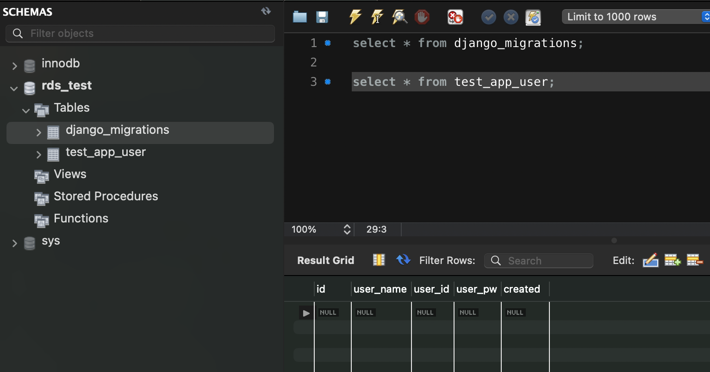
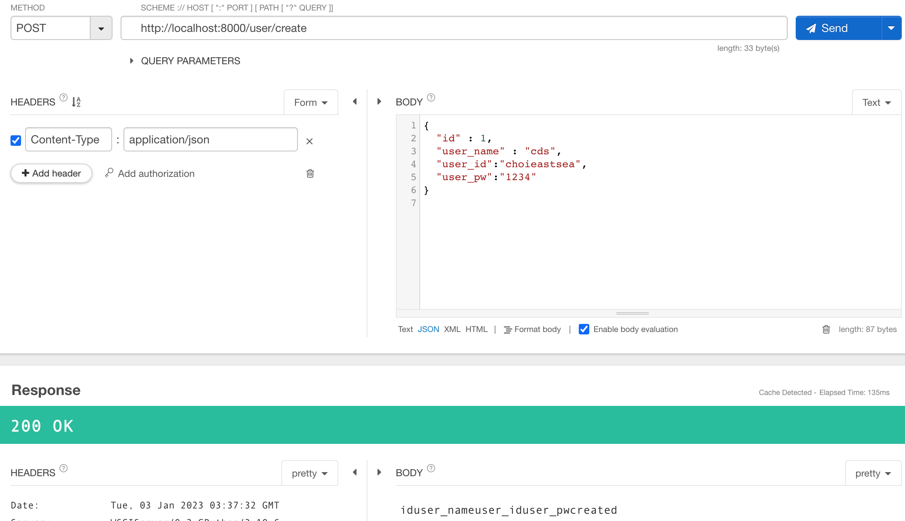
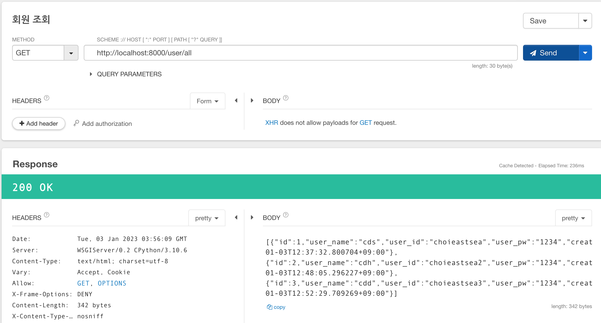

Django를 이용하여 서버를 구축하는 과정에 있어서, model을 설계하고 Serailizer를 이용하여 데이터를 CRUD하면서 헷갈리는 개념을 공부해보았다.

우선, DRF는 설치되어 있어야한다. (가상 환경 만들고, drf project 생성하고, app 생성하고 실행하기)

## DRF 데이터 흐름

**DB ↔ QuerySet/Model ↔ OrderdDict(ReturnDict) ↔ JSON**

우리가 사용할 데이터는 보통 DB에 테이블로서 존재하는데, 여기서는 하나의 테이블이 하나의 모델이 될 것이다.

DB의 값을 바로 가져와 python 코드레벨에서 사용하는 것은 불가능하고, 위의 과정을 거쳐서 JSON으로 사용할 수 있게 된다. (역으로 JSON 데이터를 DB에 넣거나 수정할 때에도 마찬가지) 

DRF에서는 model에서 dictionary로 변환하는 과정을 `Serialize`(직렬화,,, 의역하여 객체화.?) 라고 정의하고, dictionary에서 model로 변환하는 과정을 `Deserialize`라고 정의한다. 

DRF에서는 이 두가지의 과정을 도와주는 `Serializer` 클래스와 `ModelSerializer` 클래스가 제공된다. 따라서, 이 두 클래스를 선택적으로 상속받아 구현하면 된다.! 두 클래스의 차이는 아래를 참고한다.

### 모델 만들어서 Create, Read 해보기(개념)

1. DB 연결
    1. settings.py에 db의 정보를 적어준다. timezone 도 현재 위치에 맞게 수정해주는 것이 좋다.
    2. 또한 installed app에다가 만든 app을 추가해준다. appconfig가 있다면 그걸 추가해주는 것으로 보인다.
    
    ```python
    TIME_ZONE = 'Asia/Seoul'
    USE_TZ = True
    ...
    DATABASES = {
        'default': {
            'ENGINE': 'django.db.backends.mysql',
            'NAME': 'your db name',
            'USER' : 'your user(ex root)',
            'PASSWORD' : 'your pw',
            'HOST' : 'your db server(ex localhost / aws rds endpoint)',
            'PORT' : '3306'
        }
    }
    
    INSTALLED_APPS = [
        'django.contrib.admin',
        'django.contrib.auth',
        'django.contrib.contenttypes',
        'django.contrib.sessions',
        'django.contrib.messages',
        'django.contrib.staticfiles',
    		'rest_framework', #for rest request
        'test_app'  # your app
    ]
    ```
    
2. 모델 정의
    1. models.py에 클래스로 생성
    2. 이는 우리가 다루는 데이터의 단위이자 DB 테이블의 단위가 될 것임
    3. DB schema가 없는 상태에서, 모델을 먼저 정의하고 `migrate`해주면 DB에 테이블이 생성될 것이다! (sql이나 dbms의 코드를 이용하지 않고 테이블을 만들 수 있는 것임) 
       
        DB를 직접 설계하지 않고, migration을 해주는 것의 장점은, 귀찮고 헷갈리는 SQL을 생략할 수 있다는 점과, 버전별로 스키마의 내용을 코드로 갖고 있을 수 있다는 장점이 있을 수 있다. [참고](https://tibetsandfox.tistory.com/24)
        
    4. 만약, DB가 이미 구축되어 있다면, `inspectdb` 커맨드를 이용하여 models.py를 역으로 만들어줄 수도 있다.([관련 링크1](https://dev.to/idrisrampurawala/creating-django-models-of-an-existing-db-288m), [관련링크2](https://hyun-am-coding.tistory.com/entry/Django%EB%A5%BC-%EC%9D%B4%EC%9A%A9%ED%95%9C-%EC%9B%B9-API-%EB%A7%8C%EB%93%A4%EA%B8%B0))
    
3. 모델을 코드로 다루기 위한, 혹은 DB에 저장하기 위한 Serializer class 정의
   
    Serializer는 serialize와 deserialize의 두가지 역할을 수행하며, 추가적으로 save()메소드가 실행될 때, 내부적으로 create(), update()을 실행해준다. ModelSerizlizer는 create, update를 기본적으로 제공해주므로 더 간단하게는 구현해볼 수 있다([참고](http://www.incodom.kr/Django/DRF-Serializer))
    
    1. Serializer 클래스 상속하여 만들기([공식문서](https://www.django-rest-framework.org/tutorial/1-serialization/#creating-a-serializer-class))
    2. ModelSerializer 클래스 상속하여 만들기([공식문서](https://www.django-rest-framework.org/tutorial/1-serialization/#using-modelserializers))

## 모델 만들어서 Create, Read 해보기(구현)

우리는 간단하게 ModelSeirzlizer로 해봅시다!

1. models.py에 모델 정의
   
    간단한 회원을 만들어보자.
    
    ```python
    from django.db import models
    
    class User(models.Model):
        user_name = models.CharField(max_length=10)
        user_id = models.CharField(max_length=20)
        user_pw = models.CharField(max_length=20)
        created = models.DateTimeField(auto_now_add=True)
    ```
    
2. db migrate
   
    `python manage.py makemigrations ${app_name}`  
    
    해서 마이그레이션 파일을 생성해주고, 이를 db에 적용한다. (settings.py installed_apps에 해당 app_name 있어야함)
    
    `python manage.py migrate ${app_name} ${migration_name}`
    
    이러고 DB에 가보면 적용되어 있을 것이다!! 추가적으로, 마이그레이션 버전을 위한 것인지 `django_migrations` 테이블도 생성되어 있음을 확인할 수 있다.
    
    
    
    mysql에서 잘 적용되어 있음을 확인하였다. 테이블 이름은 `${app_name}_${model_name}`으로 생성해주더라.
    
3. DB에 값 추가 (Serializer 이용)
   
    아주 간단하게 Serializer도 만들어준다. (UserSerializer.py)
    
    ```python
    class UserSerializer(serializers.ModelSerializer):
        class Meta:
            model = models.User
            fields = '__all__'
    ```
    
    그리고, 해당 app의 views.py에서 새로운 사용자를 만드는 로직을 만들어주자.
    
    ```python
    @api_view(['POST'])
    def create_user(request):
        print(f'data :{request.data}')
        serializer = UserSerializer(data= request.data)
        if(serializer.is_valid()):
            serializer.save()
            return HttpResponse(serializer.data, status=200)
        return HttpResponse(serializer.errors, status = 400)
    ```
    
    여기서 사용하는 serializer는 deserialize를 해주는 것이라고 보면 된다.(파라미터만 잘 넣으면 알아서 db로 넣도록 데이터를 만들어준다)
    
    이러고 JSON데이터를 post로 보내주면 생성된다. (내가 근데 설정을 잘못한 건지, 한글 필드를 적었다가 에러가 계속 나더라)
    
    
    
    (id는 auto increment라서 없어도 됨)
    
    이제 getter를 만들어보자.! 여기서 serialize를 해주고, json으로 변환하여 리턴해주면 된다. 위에서 말했다시피, serialize는 model까지만 바꿔주므로, 이를 json으로 다시 바꿔주기 위해서는 JSONRenderer를 이용하면 된다.
    
    ```python
    @api_view(['GET'])
    def get_all_user(request):
        users = User.objects.all()
        print(users)
        serialized_users = UserSerializer(users, many=True)
        json_data = JSONRenderer().render(serialized_users.data)
        return HttpResponse(json_data)
    ```
    
    
    

## 정리

핵심은 DB의 데이터를 조작하기 위해 Serializer를 거쳐야 한다는 것이다. db에 넣기 위해 deserailize, db에서 값을 가져오기 위해 serailize를 수행하고, 이를 위한 Serailizer 객체를 구현하여 사용하면 된다.

아직은 간단하게 구현해보았지만, 조건을 부여하여 orm으로 가져오는 QuerySet과 view를 간단하게 처리하기 위한 ViewSet 등의 개념도 배워봐야할 것 같다... 어렵네요.! +django admin도 해봐야한다..!