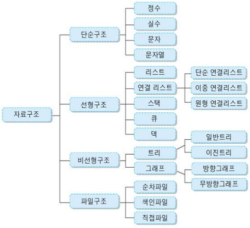

# 자료구조

도서관에서 책을 찾을 때를 생각해보자. 만약 '로미오와 줄리엣'책을 찾는다면, `문학-영문고전-가나다` 순으로 찾는다. 도서관에서 책을 찾을 수 있는 이유는 도서관에서 일정한 기준으로 책을 구조화하였기 때문이다. 일정한 약속대로 짜여진 구조가 있으므로 누구나 원하는 책을 찾을 수 있게 된다.
컴퓨터에 데이터를 저장할 때에도 일정한 구조에 맞게 데이터를 저장한다. 우리는 이를 `자료구조`라고 한다. 도서관의 책을 '출판일자'순으로 배치하였다면 우리는 찾기 힘들 것이다. 이와 같이 각 자료구조에는 더 나은(빠르고 편한) 방법이 존재할 수 있다.

### 데이터를 저장하고 관리하기 위해 사용하는 구조

자료구조는 데이터의 효율적인 접근 및 조작을 가능하게 해주는 저장 및 관리 방식이라고 볼 수 있다.
우리는 상황에 따라 최선의 자료구조 선택을 통하여 효율적인 프로그램을 짤 수 있을 것이다!

# 자료구조의 종류

# 향후 학습 방향

상황에 따라 더 맞는 자료구조가 있으며, 우리는 이를 성능(시간, 공간 복잡도)으로 판단할 수 있어야 한다.
다양한 자료구조를 `언어에서 제공하는` 것을 이용하는데 그치지 않고, 직접 구현해보고 시공간 복잡도에 대한 분석을 해보며 자료구조 공부를 할 예정이다. (개념-의사코드-구현 순)
언어는 JavaScript로 할 예정이나 아직은 미정!
