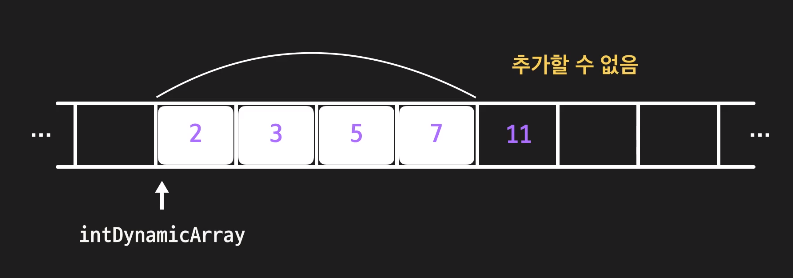
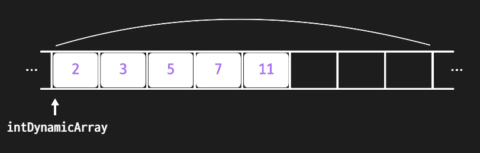

# 언어마다 다른 자료구조

JavaScript의 Array의 MDN 설명을 보면 다음과 같다.

> 배열은 프로토타입으로 탐색과 변형 작업을 수행하는 메서드를 갖는, 리스트와 비슷한 객체입니다. JavaScript에서 배열의 길이와 요소의 자료형은 고정되어 있지 않습니다. 배열의 길이가 언제든지 늘어나거나 줄어들 수 있기 때문에 JavaScript 배열들은 밀집도가 보장되지 않습니다.

JS의 Array는 key가 int type index인 `특수한 Object`이다. 배열은 length라는 특별한 프로퍼티를 갖고 있으며, 이와 관련된 함수가 제공된다. 배열의 길이는 정해져 있지 않으며 각 원소의 크기 또한 정해져 있지 않다. 메모리상에서 연속된 형식으로 저장되어 있다고 보장을 못하는 `sparse array`이다. 

C, Java의 Array는 크기와 타입이 정해져 있는 **정적배열(static array)**이다. 따라서 선언시에 메모리 공간이 할당되며 모든 원소의 타입이 고정되어 있다. 크기가 정해져 있으므로 요소의 삽입과 삭제가 불가능하다. 또한 메모리 공간에서 연속적인 공간을 차지하고 있는 `dense array`이다. 

언어마다 자료구조는 다른 방법으로 구현되어 있을 수 있다. 오늘은 자바스크립트 array를 이용하여 ArrayList 자료구조를 직접 구현해보고, 언어의 특수성으로 인한 차이점들을 공부해볼 것이다.


# ArrayList 구현 요구 사항

ArrayList는 배열이므로 인덱스를 통하여 요소에 접근(access)한다. 각 요소는 연속된 인덱스에 1대1로 할당되어 있다는 자료구조적 특이성을 갖고 있다. JS의 array는 이미 모든 것이 구현되어 있지만, 직접 ArrayList 자료구조의 요구사항을 파악해보며 구현을 해보도록 하자. (자바스크립트에는 타입이 고정되어 있는 `TypedArray`가 별개로 제공되지만, 기능적인 면이 중요하므로 이로 구현하지는 않겠다)

ArrayList의 class property로는 요소들의 **배열(list)과 길이(length)**를 갖고 있으면 될 것이다. 함수 프로퍼티로는 다음이 있으면 될 것 같다.

1. **접근** get(index) → element

   index번째 요소(element)를 return한다. index가 유효하지 않은 경우에는 -1을 return

   배열에서의 index 접근방법을 사용한다. 이는 대략 `O(1)`이 걸린다.

   ```javascript
   get(index) {
      return index >= 0 && index < this.length ? this.list[index] : -1;
   }
   ```

2. set(index, element)

   index번째 요소를 element로 set한다.

   ```javascript
   set(index, obj) {
       this.list[index] = obj;
   }
   ```

3. **추가** append(element)

   ArrayList 제일 뒤에 element를 추가해주고 length를 1 늘려준다.

   ```javascript
   append(obj) {
     this.list[this.length] = obj;
     this.length += 1;
   }
   ```

4. **삽입** insert(index, element)

   index 바로 뒤에 element를 삽입한다. index가 유효하지 않은 경우 -1을 return

   ```javascript
   insert(index, obj) {
     if (index >= 0 && index < this.length) {
       this.list.splice(index + 1, 0, obj);
       this.length += 1;
     } else {
       console.log('Invalid index');
       return -1;
       }
   }
   ```

5. unshift(element)

   insert함수로는 맨 앞에 요소를 삽입하지 못하므로 필요하다. element를 맨 앞에 삽입한다.

   ```javascript
   unshift(obj) {
       this.list.unshift(obj);
       this.length += 1;
   }
   ```

6. **삭제** remove(index) → element

   index번째 element를 삽입하고 성공하면 return한다.  index가 유효하지 않은 경우 -1을 return

   ```javascript
   remove(index) {
     if (index >= 0 && index < this.length) {
       this.list.splice(index, 1);
       this.length -= 1;
     } else {
       console.log('Invalid index');
       return -1;
     }
   }
   ```

7. **탐색** search(element) → index OR -1

   배열에서 element의 위치를 반환한다. 만약에 없다면 -1을 리턴한다.

   ```javascript
   search(obj) {
     for (let i = 0; i < this.length; i++) {
       if (this.list[i] === obj) {
         return i;
       }
     }
     //return this.list.indexOf(obj)
     return -1;
   }
   ```

8. isEmpty() → boolean

   배열이 비어있다면(length===0) true를 리턴한다.

   ```javascript
   isEmpty() {
     return this.length === 0;
   }
   ```

이외에도 기본적인 Constructor 함수가 있으면 좋을 것 같다.

최종 코드는 [깃허브](https://github.com/choieastsea/DataStructureJS/blob/main/DS01_ArrayList.js)에 올려놓았으니 참고하면 된다. 


# JS 배열의 특이성

위에서 말했다시피 JS 배열은 참조타입의 Object이고, 이는 `{"key": value}`의 쌍으로 이루어져 있고 `Hash Table`로 구현되어 있다. 따라서 search는 **위와 같이 선형적으로 구현할 필요는 없다**. Hash Table에서 탐색은 최대 `O(1)`정도로 해결가능하기 때문이다. 따라서 indexOf 함수를 사용하면 더 빠른 속도로 탐색이 가능할 것이다. JS 배열은 객체이므로 index로 접근할때 원래 배열보다 조금 느릴 수 있다. 하지만, 삽입, 삭제하는 경우에는 배열보다 빠른 성능을 기대할 수 있다.

또한 JS는 기본적으로 동적배열이므로 요소를 추가(append)할 때 추가적인 연산에 대하여 개발자는 고려하지 않아도 된다. 처음부터 배열의 크기는 일정부분 잡혀있을 것이고, 요소가 추가됨에 따라 배열의 크기가 조절되는 것은 자바스크립트 엔진의 몫이다. 하지만 정적배열이 제공되는 언어에서는 동적배열처럼 배열에 요소를 추가할 때 다음과 같은 요소를 고려할 필요가 있다.

### 동적배열에서 resize가 필요한 경우



C나 Java에서는 배열을 정의할 때, `int DynamicArray[4]`와 같이 배열의 크기를 미리 선언한다. 이는 컴파일러가 4칸만큼의 정수자료형이 들어올 만큼의 연속공간을 확보하는 계기가 된다. 하지만, 4칸이 다 차게 된다면 더이상 추가할 수 없다. 동적배열에서는 실제 배열의 크기보다 더 많은 공간을 확보함으로써 요소의 추가가 가능해지는 것이다. 



하지만, 동적배열에서 무조건 많은 공간만을 확보하는 것은 공간의 낭비가 커질 수 있으므로 적당한 공간확보가 공간복잡도, 즉 성능을 결정하게 된다. 또한, 남는 공간이 없을때 추가하고 싶은 경우, **새로운 공간에서 더 커진 배열만큼의 메모리 공간을 확보하고 기존의 데이터를 복사해가는 작업**이 필요하다. 이를 **resize**라고 한다! resize는 `동적배열에서 남는 공간이 부족할 때` 일어나게 된다. 

얼만큼의 더 커진 공간을 확보하느냐는 여러가지 방법이 있는데, 대표적으로 `doubling strategy`가 있다. 두배씩 늘려가며 공간을 확보하는 것이다. 예를 들어 크기가 4인 배열이 다 찼다면, resize가 일어날텐데 이때는 4*2=8만큼의 공간을 확보하여 기존의 데이터를 옮기면 된다. 이러한 전략으로 동적배열에서 추가, 삽입 등이 일어날 수 있다. 이에 대한 시간복잡도는 `Amortized Analysis`를 이용하여 계산하는데 이를 따로 계산하지는 않겠다.

또한 자바스크립트의 배열은 모든 기능이 이미 구현되어 있다. 또한, 앞으로 배울 다양한 선형자료구조에 대하여 **거의 모든 기능이 구현되어 있으니** 따로 사용할 일은 없을 것이다!

### 번외) List와 Array의 차이점

자꾸 List와 Array에 대해 얘기하다 보니 헷갈리게 되었다. 언어마다 이를 해석하는 것도 약간 다를 수 있겠지만, 찾아보니 List는 연속적인 요소(element) 여러개를 담을 수 있는 `추상자료형`이고 Array는 인덱스를 통해 메모리상에 연속적으로 저장되어 있는 `자료구조`이다. List는 구현된 것이 아닌 interface만을 명시하고 있으며, 이를 구현한 것이 우리가 알고 있는 `ArrayList`, `LinkedList`등으로 생각하면 될 것같다. 반면에 Array는 자료구조이며 웬만한 언어에 내부적으로 `[ ]` 연산자를 이용하여 이미 구현되어 있다. 다음에는 list를 구현하는 다른 방법인 `LinkedList`를 구현해보고 분석해보자.