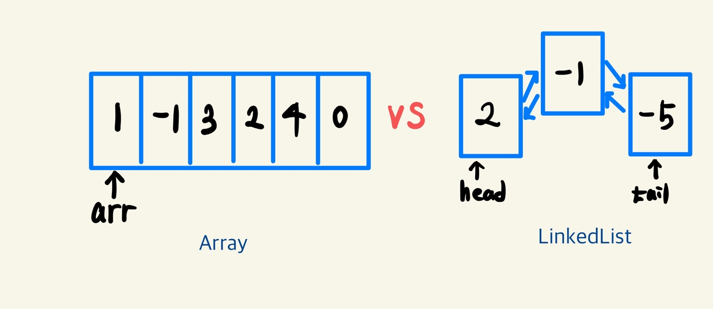
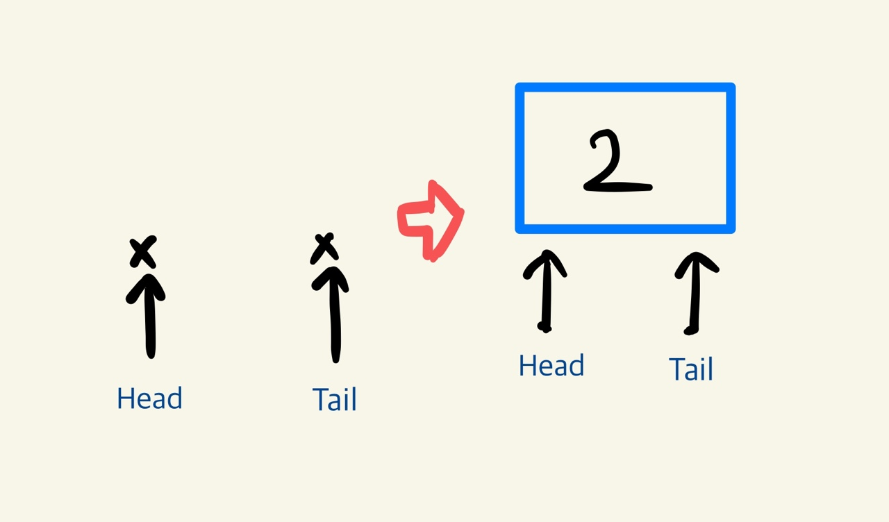
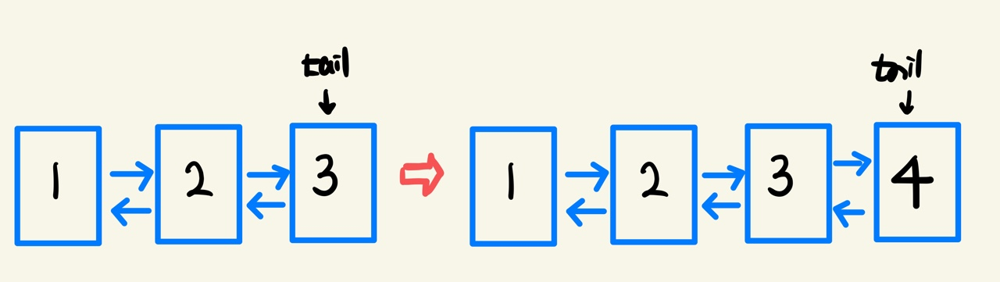
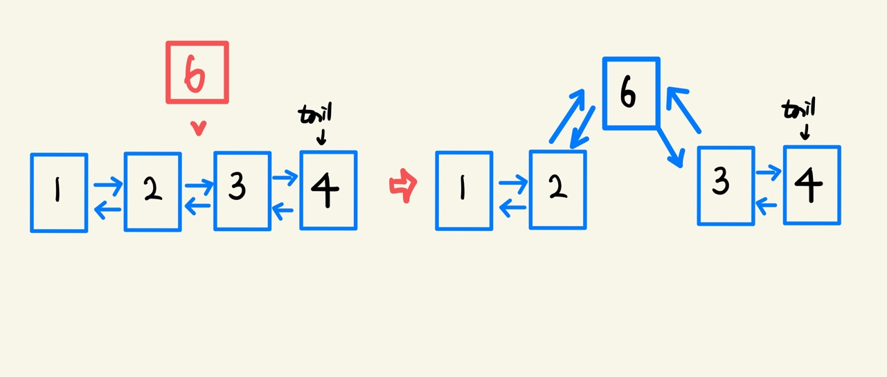

# LinkedList란

LinkedList(연결리스트)는 **리스트라는 추상자료형을 구현하는 선형 자료구조** 중 하나로, `노드`끼리 참조를 통하여 연결되어 선형적인 형태를 이루고 있는 자료구조이다. Array는 크기가 정해져 있고 메모리에서 연속적으로 존재하였지만, 링크드 리스트는 각 노드에 데이터가 저장되어 있으며 이웃한 노드의 정보(주소)를 가리키고 있는 형태로 여러 데이터를 저장한다.



간단하게 위의 그림으로 Array와 LinkedList를 비교해볼 수 있다. 연결리스트에서는 데이터가 노드에 저장되며, 노드끼리의 연결관계가 존재한다. 또한 head와 tail은 각각 처음과 마지막 노드를 가리키고 있어 모든 노드에 접근할 수 있게 되는 것이다. 따라서 각 노드는 메모리상에서 연속적으로 존재할 필요가 없으며, 데이터의 자료형이 같을 필요도 없을 것이다.


# LinkedList 구현 요구 사항

LinkedList에서는 배열과 다르게 데이터를 `Node`에서 갖고 있도록 한다. 노드는 데이터를 갖고 있으며, 다른 노드에 대한 레퍼런스를 갖고 있는 객체로 만들면 될 것이다. 여기서는 이전 노드와 다음 노드에 대한 주소를 갖고 있는이중연결리스트(`Doubly LinkedList`)로 구현해보도록 한다. 

## Node 객체

- Fields
  - data
  - prev : 이전 노드의 정보를 갖고 있는 프로퍼티
  - next : 다음 노드의 정보를 갖고 있는 프로퍼티
- Functions
  - setData
  - setPrev
  - setNext

## LinkedList 객체

연결리스트는 여러개의 노드로 이루어져 있으며, 시작점과 끝점인 head와 tail을 갖고 있는다. 

- Properties
  - head : 첫 노드를 가리킨다. 만약 노드가 하나도 없다면 head는 `null`일 것이다.
  - tail : 가장 마지막 노드를 가리킨다. 만약 노드가 하나도 없다면 tail도 `null`일 것이다.
  - size : 처음부터 마지막 노드까지의 갯수

1. **접근** get(index) → Node

   head가 가리키는 노드부터 next 노드에 접근하여 next노드가 없을때까지 **index번**만큼 접근한다. 만약 없다면 -1을 return한다.

   head를 iterator로 지정해주고 하나씩 다음 노드로 넘어간다. index만큼 넘어가는 loop를 반복해주면 해당 인덱스의 노드를 얻을 수 있다.

   ```javascript
   get(index) {
     let iterator = this.head;
     for (let i = 0; i < index; i++) {
       if (iterator.next !== null) {
         iterator = iterator.next;
       } else return -1;
     }
     return iterator;
   }
   ```

2. **추가** append(Node)

   맨뒤에 새로운 노드를 추가할 때, 나올 수 있는 경우는 두가지 정도로 생각할 수 있다.

   1. 빈 연결리스트에서 추가할 때, null을 가리키고 있던 head와 tail 모두 바꿔줘야 한다.

      

   2. 그것이 아니라면, tail만 바꿔주면 될 것이다. 기존의 tail이 가리키고 있던 노드는 새 노드를 next로 갖도록 해야하며, new_node는 기존의 tail 노드를 prev로 갖고 있을 것이다. 

      

      코드는 다음과 같을 것이다. 또한 size를 1씩 증가시켜줘야한다.

   ```javascript
   append(new_node) {
     if (this.size === 0) {
       this.head = this.tail = new_node;
     } else {
       this.tail.next = new_node;
       new_node.prev = this.tail;
       this.tail = new_node;
     }
     this.size += 1;
   }
   ```

3. **삽입** insert(index, new_node)

   index번째 노드 뒤에 new_node를 삽입하는 경우도 역시 2가지로 나눠볼 수 있다. 

   1. index===size-1인 경우에는 append와 같을 것이다.

   2. 그 외의 경우, 아래의 그림을 참고하여 prev와 next를 조정해주면 된다.

      

   주의할 점은 next와 prev를 초기화하는 순서를 혼동하여 노드간의 연결이 끊기지 않도록 하는 것이다.

   ```javascript
   insert(index, new_node) {
     //index에 해당하는 node를 찾아서 삽입한다.
     let nodeToFind = this.get(index);
     if (nodeToFind !== -1) {
       if (nodeToFind === this.tail) {
         //맨끝삽입
         this.append(new_node);
       } else {
         //가운데삽입
         new_node.next = nodeToFind.next;
         nodeToFind.next.prev = new_node;
         new_node.prev = nodeToFind;
         nodeToFind.next = new_node;
         this.size += 1;
       }
     } else {
       throw new Error('index에 해당하는 노드가 없습니다.');
     }
   }
   ```

   

4. **제일 앞에 삽입** unshift(new_node)

   위의 경우들로는 맨 앞에 노드를 추가해줄 수 없다. 따라서,  맨 앞에 노드를 추가해주는 unshift 함수를 정의해주도록 하자. 역시 빈 연결리스트일때와 나머지 경우로 나눠볼 수 있으며, head를 조정해주면 될 것이다.

   ```javascript
   unshift(new_node) {
     if (this.size === 0) {
       this.append(new_node);
     } else {
       this.head.prev = new_node;
       new_node.next = this.head;
       this.head = new_node;
     }
     this.size += 1;
   }
   ```

5. **삭제** remove(index)

   삭제는 정수형 인덱스를 넘겨 i번째 노드의 **전후 노드를 이어줌으로써** 구현한다. 삭제는 인덱스가 유효한 경우에 맨 앞, 맨 뒤, 나머지의 3가지 경우가 있을 수 있다. 

   1. 맨앞 삭제: 기존의 head가 가리키는 노드의 다음노드를 head가 가리키도록 한다. 또한 head가 가리키게 된 노드의 prev는 null로 해준다.
   2. 맨뒤 삭제: 기존의 tail이 가리키는 노드의 이전노드를 tail이 가리키도록 한다. 또한 tail이 가리키게 된 노드의 next는 null로 해준다.
   3. 나머지: i번째 노드에 접근하여 삽입의 역순과 같이 해주면 된다.

   ```javascript
   remove(index) {
     if (index < 0 || index >= this.size) {
       return new Error('Invalid Index');
     } else if (index === 0) {
       //head 삭제시
       this.head.next.prev = null;
       this.head = this.head.next;
       this.size -= 1;
       return;
     } else if (index === this.size - 1) {
       //tail 삭제시
       this.tail.prev.next = null;
       this.tail = this.tail.prev;
       this.size -= 1;
       return;
     }
     let iterator = this.head;
     for (let i = 0; i < index; i++) {
       iterator = iterator.next;
     }
     iterator.prev.next = iterator.next;
     iterator.next.prev = iterator.prev;
     this.size -= 1;
   }
   ```

6. **탐색 **search(data) → index/-1

   위의 find와 마찬가지로 iterator를 지정해주고, data를 비교하며 탐색한다. 만약 tail까지 탐색했는데 원하는 data가 없는 경우, -1을 return하도록 한다.

   ```javascript
   search(data) {
     let iterator = this.head;
     let count = 0;
     while (iterator !== null) {
       if (iterator.data === data) return count;
       else {
         iterator = iterator.next;
         count += 1;
       }
     }
     return -1;
   }
   ```

7. isEmpty

   ```javascript
   isEmpty() {
       return size === 0;
   }
   ```

8. 출력

   배열과 다르게 직접 구현하여 내장된 출력함수가 없으므로, 출력에 대한 함수를 만들어줘야한다. 각 노드가 담고 있는 데이터를 담도록 하였다. (`process.stdout.write`함수를 사용한 이유는 개행없이 연결리스트를 출력하기 위해서이다)

   ```javascript
   printFromHead() {
     let pointer = this.head;
     process.stdout.write('head');
     for (let i = 0; i < this.size; i++) {
       process.stdout.write(` ↔ ${pointer.data}`);
       if (pointer.next !== null) {
         pointer = pointer.next;
       }
     }
     process.stdout.write(` ↔ tail`);
     console.log('');
   }
   ```

링크드리스트의 구현은 헷갈리는 부분이 있을 수 있지만, 한번 그려보면 이해하고 바로 구현하기 어렵지 않다. 과거 tmp를 두고 a와 b를 swap했던 기억을 떠올리며 **prev와 next가 교차되면서 헷갈리지 않도록 주의**하자!

전체 코드와 예제는 [깃허브](https://github.com/choieastsea/DataStructureJS/blob/main/DS02_DoublyLinkedList.js)에 올려놨으니 참고하면 된다.

# LinkedList 성능 분석

## 시간복잡도

- 접근

  `get(index)` 를 보면 index 번째 노드에 접근하기 위해 head 노드부터 차례로 next node로 iterator가 이동하는 것을 볼 수 있다. 이는 `O(n)`의 시간이 걸린다고 볼 수 있다.

- 탐색

  탐색 역시 head node부터 선형탐색을 진행하므로 `O(n)`의 시간이 걸린다.

- 삽입

  `insert(index, new_node)`함수를 보면 접근 이후에 실제 삽입을 한다. 삽입 자체는 연결리스트의 크기와 상관없이 상수시간에 해결 가능하지만, 접근이 O(n)만큼 걸리므로 삽입의 시간복잡도는 `O(n)`이라고 볼 수 있다. 하지만, 맨 뒤에 삽입하는 `append(new_node)`나 맨 앞에 삽입하는 `unshift(new_node)`의 경우에는 크기와 상관없이 일정한 시간에 가능하므로`O(1)`이 걸린다고 볼 수 있다.

- 삭제

  `remove(index)`함수와 같이 접근 이후에 실제 삭제를 한다. 따라서 위와 같이 `O(n)`의 시간이 걸린다고 볼 수 있다. 하지만 맨 앞과 끝 노드를 삭제할 경우에는 일정한 시간 `O(1)`에 끝낼 수 있다고 볼 수 있다.

## 장단점

### 장점

- 새로운 elements를 삽입, 삭제 시 용이하다. **전통적인 배열(js array와 다름)**에서는 원소를 추가하는 경우 resize의 과정이 추가적으로 존재하는데, 연결리스트는 이가 불필요하다. 데이터가 메모리상에 연속적으로 저장된 것이 아니라, 연속적인 데이터를 담고 있는 노드가 메모리 공간에서 서로를 참조하고 있기 때문이다.

- 양 끝에 삽입하거나 삭제하는 경우에 head나 tail을 field로 갖고 있으므로 `O(1)`의 시간복잡도로 해결가능하므로 빠르게 처리할 수 있다. (정적 배열의 경우 꽉차 있으면 resize가 필요하므로 `O(n)`이 걸릴 수도 있음)


### 단점

- 접근시, 배열은 `O(1)`에 바로 접근할 수 있지만, 연결리스트는 head부터 가야하므로 시간이 많이 걸린다. 
- 같은 데이터를 저장할 때 앞뒤 노드의 참조를 갖고 있으므로 메모리를 비교적 많이 차지하게 된다. (더 큰 공간복잡도)

데이터의 접근은 배열이 `O(1)`으로 빠르지만, 삽입 삭제는 대체적으로 연결리스트가 빠르다고 볼 수 있을 것 같다.


# LinkedList의 종류와 비교

**다음 노드만 가리키는** 링크드 리스트를 simple linked list(단순연결리스트)라고 하며 한 노드가 이전노드와 다음노드를 가리키는 것을 double linked list(이중연결리스트)라고 한다. 또한, 모양에 따라 **가장 마지막 노드가 제일 처음 노드를 가리키는 형태**를 circular linked list(원형 연결 리스트)라고 한다. 여기서는 이중연결리스트로 구현했다고 볼 수 있다. 각 연결리스트의 특징은 다음과 같다고 생각해볼 수 있다.

- 단일연결리스트

​	위의 코드와 다르게 prev없이 next만 존재. 공간복잡도, 코드량이 적은 대신 앞 노드로 접근이 안된다. 

- 이중연결리스트

​	한 노드 기준으로 앞 뒤 노드 모두 접근이 바로 가능하다. 그대신 공간 복잡도와 코드량이 늘어난다.

- 원형연결리스트

​	보통 next만 갖고 있으며 tail이 head를 바로 가리키므로, head를 굳이 갖고 있지 않아도 된다. 단일연결리스트의 개선안이라고 생각하면 될 것 같다.


저번 포스트에도 얘기했지만, JavaScript에서는 사실상 연결리스트를 따로 사용할 일이 없다. 왜냐하면 Array에 모든 것이 최적의 시간복잡도로 구현되어 있기 때문이다. 이는 이후에 공부할 스택, 큐 등에도 해당하는 내용이다. 하지만, 배열과 다른 연결리스트의 관점을 파악하는 것이 이번 자료구조의 목적이므로 앞으로도 다양한 자료구조를 공부해볼 것이다.

