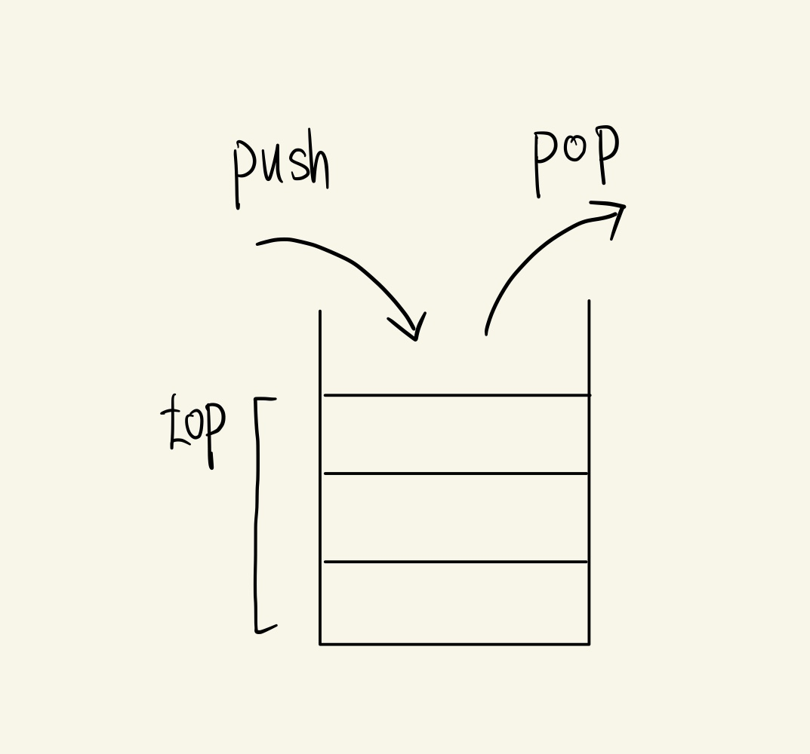
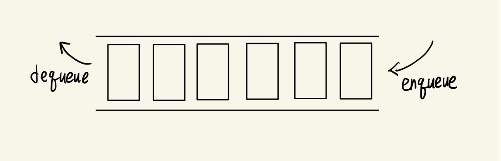

추상자료형에 대하여 공부해보고, stack과 queue에 대하여 알아보자.

# Abstract Data Type(ADT, 추상자료형)

스택은` 추상자료형`이다. 추상자료형은 자료구조를 추상화한 것으로, 구현보다는 기능에만 초점을 맞춘다. `OOP`를 배울 때 `추상클래스`에 대하여 배운 적이 있을텐데, 이는 실제 구현된 것이 아니고 기능에 대한 메서드만 명시되어 있다. 이를 implement한 클래스가 정해놓은 기능을 구현하는 방식으로 되어있다. **list, set, dictionary, stack, queue는 모두 추상자료형**으로 정해진 기능만을 담고 있으며 다양한 방법으로 구현될 수 있다. 예를 들어 스택은 다양하게 구현할 수 있지만, 우리는 array를 이용하여 직접 구현해볼 것이다.

# Stack이란

Stack(스택)은 **메모리의 끝에서만 operation이 이루어지는 선형 자료구조**로, 차곡차곡 쌓아올린 형태를 생각하면 이해하기 편하다. 



(물론 메모리가 저렇게 생기지는 않았을 것이다. 단지 스택을 그릴때 저렇게 표현한다고 생각하자.)

그림과 같이 끝부분만 열려있는 배열과 같고, `LIFO(Last In First Out)`방식(후입선출)이라고 알고 있으면 외우기 쉽다. 지금 내가 있는 소방조직에는 티셔츠에 First In Last Out이라고 써있는 것들이 많은데, 이것도 stack이라고 볼 수 있다!! 스택의 이러한 특성은 항상 같이 언급되는 `Queue`(큐)와 대조적인데, 큐는 앞부분만 열려있으며 `FIFO(First In First Out)`의 방식이다.

# Stack 구현 요구 사항

JS Array는 stack과 queue의 모든 기능이 이미 구현되어있으므로 여기서는 배열을 이용하여 stack을 구현해보도록 하겠다. 선형구조이므로 **head없이 tail만 있는 linkedlist로도 스택의 기능을 구현할 수 있다**!

Stack은 데이터의 순서 관계가 항상 유지되므로 배열로 구현할 것이며, (유일하게 신경쓰는)맨 끝의 원소의 인덱스(즉 스택의 높이라고도 볼 수 있다)를 갖는 **top**과 데이터를 담을 공간인 list를 갖고 있는다.

1. 맨 끝에 원소 삽입(push)

   배열의 맨 끝에 원소를 추가하고, top을 1 증가시킨다. 정적배열로 구현하였다면 정해진 크기 이상이 push가 되었을 때, `stack overflow`(우리가 아는 그거 맞다)가 발생한다. 하지만 js array는 내부적으로 배열의 크기를 조정하므로 overflow가 발생할 일은 없다. 하지만 정적배열을 지원하는 C나 Java와 같은 것으로 stack을 구현하였다면, stack overflow에 대한 처리 또한 해줘야 한다. js에서 size_max와 같이 <u>배열 크기의 한계를 둬서 overflow를 보여줄 수도 있을 것 같다</u>. 근데 그러지는 않았다.

   ```javascript
   push = (element) => {
     this.list.push(element);
     this.top += 1;
   };
   ```

2. 맨 끝의 원소 삭제(pop)

   배열의 맨 끝 원소를 삭제하고 top을 1 감소시킨다. 만약 top이 0이라면(더 이상 삭제할 원소 없음) `stack underflow`오류가 발생한다.

   ```javascript
   pop = () => {
     //빈 stack pop한 경우
     if (this.top <= 0) {
       return new Error('Stack Underflow');
     } else {
       //원소 있을때 pop한 경우
       this.top -= 1;
       return this.list.pop();
     }
   };
   ```

3. 모든 원소 출력

   현재 스택의 상태를 보기 위하여 print함수를 추가적으로 만들어주었다.

   ```javascript
   print = () => {
       for (let i = this.list.length - 1; i >= 0; i--) {
         console.log(`| ${this.list[i]} |`);
       }
       console.log(`‾‾‾‾‾`);
     };
   ```

4. isEmpty

   top이 0이면 비어있으므로 true를 return한다.

   ```javascript
   isEmpty = () => {
     return this.top === 0;
   };
   ```

   전체 코드는 [깃허브에](https://github.com/choieastsea/DataStructureJS/blob/main/DS03_Stack.js) 올려놓았으니 참고하도록 하자.

# Stack 성능 분석

## 시간 복잡도

- 접근

  맨 위의 **top element만 접근이 가능**하다!

- 탐색

  여기서는 배열로 구현하였기에 인덱스로 접근이 가능하고 탐색 또한 가능하지만, stack은 원래 탐색을 하려면 모든 원소를 pop해보면서 확인해야한다. 굳이 시간복잡도를 따지자면 `O(n)`이 걸린다고 볼 수 있다.

- 삽입

  맨 뒤에 삽입하는 것만 가능하며, 일반적으로 스택의 크기와 상관없이 `O(1)`로 가능하다. 정적배열로 구현하였을 경우, resize가 일어날 경우에는 `O(n)`이 걸리겠지만 분할상환분석을 하면 `O(1)`이라고 말할 수 있다. 연결리스트로 구현하였을 때도 상수시간에 가능하다.

- 삭제

  맨 뒤를 삭제하는 것만 가능하며 역시 `O(1)`로 가능하다. 연결리스트로 구현하였을 때도 상수시간에 가능하다.

## 장단점

- 장점

데이터의 삽입과 삭제가 `O(1)`로 빠르며 다른 선형구조(연결리스트 등)에 비해 가벼운 편이다.

- 단점

탐색이 불가능하다. 맨 위의 원소만 접근 가능하다.

# Stack 응용

스택은 뒤로가기, 실행 취소와 같이 **가장 최근 것만 필요한 상황에서 자주 사용**된다. 또 다른 예시로는 다항식을 계산하기 위한 `후위표기식` (postfix)에도 활용이 된다. 이는 매우 유용한데, 나중에 다룰 기회가 있다면 직접 구현해보도록 하겠다.

# Queue란

Queue(큐)는 **메모리의 끝에서 들어오고 메모리의 시작부분에서 들어오는 선형 자료구조**이다. 양쪽이 열려있는 파이프관을 생각할 수 있겠다. `Queue`는 가장 먼저 들어온 데이터가 가장 먼저 나오는 `FIFO`(First In First Out, 선입선출)방식으로 스택과 대조된다. <u>게임할 때 큐가 잡혔다고 하는데 이게 그 큐가 맞다</u>. 게임사의 알고리즘에 의하여 우선순위가 생기게 되며 대기하게 되는데, 이게 조건이 맞아 게임이 성사될때마다 우선순위 순으로 대기열에서 나가게 되는 것이다.



큐에서는 맨 뒤에 들어오는 것을 `enqueue`, 맨 앞이 나가는 것을 `dequeue`라고 한다. 통용되는 말이 스택과 약간 다르므로(push, pop) 참고하자.

# Queue의 기능

1. `Enqueue` : 맨 끝에 원소 삽입

   stack의 push와 비슷하다고 볼 수 있다.

2. `Dequeue` : 맨 앞의 원소 삭제하고 나머지 원소 앞으로 옮기기

   맨 앞 원소를 삭제하며 return하고, 나머지 원소들을 모두 한 칸씩 앞으로 옮겨야 한다. js에서는 `shift`함수를 이용하여 간단하게 구현할 수 있다.

큐는 스택과 마찬가지로 **배열과 링크드리스트로 구현가능**하다.

# Queue 시간 복잡도

- 삽입

  스택의 push와 같은 시간복잡도를 지닌다. 배열, 연결리스트 모두 `O(1)`로 삽입이 가능하다.

- 삭제

  맨 앞 원소를 삭제하고 나머지 원소를 `shift`해야하므로 배열로 구현시 `O(n)`의 시간복잡도를 갖는다. 연결리스트로 구현할 경우 단순히 head의 위치만 조정해주면 되므로 원소의 갯수와 관계없이 `O(1)`로 가능하다.

# Queue의 응용

- 대기열 등과 같이 정해진 순서대로 처리해야하는 일에 사용된다.

- `Priority Queue`(우선순위 큐)는 트리의 구조이며, FIFO가 아니라 정해진 우선순위(예를 들면 숫자 원소의 크기)에 따라 dequeue했을 때 나오게 되는 자료구조가 있다. 이는 나중에 `tree`를 배우며 구현해보도록 하자~
