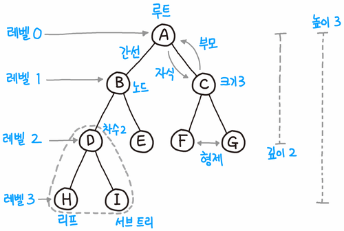

`Tree`(트리)는 계층적인 구조를 나타내기 위한 자료구조이다. 나무를 뒤집어 놓은 듯한 구조로 보통 표현되며, 뿌리인 root node에서부터 자식 노드로 단방향으로 뻗어져 나간다. 파일 디렉토리가 트리의 경로와 같이 표현되어 있으며 (ex C>>Desktop>>Document>>index.md), `Heap`, `Trie`  등에도 사용된다.


# Tree 용어



- root(루트) : 최상위 계층에 있는 노드. 한 트리에서 루트 노드는 유일하게 존재한다. 

- level(레벨) : 루트에서 특정노드까지의 거리(엣지의 수)

- parent/child node(부모-자식 노드) : 한 노드와 직접 연결되어 있는 경우, 부모 자식 노드의 관계이다. 가리키는 노드가 부모, 아닌 노드가 자식 노드라고 보면 된다.

- sibing nodes(형재 노드) : 같은 부모 노드를 갖는 노드

- height(높이) : 트리의 높이 == `max(all nodes' level)`

- sub tree(서브 트리) : 한 노드를 기준으로 하는 트리. 트리를 재귀적으로 볼 수 있게 해준다.

# Tree의 특징과 종류

## 특징

- 루트에서 특정 노드까지의 경로가 유일하다.(두 노드를 잇는 경로는 유일하다)
- 부모 노드에서 자식노드로 단방향 연결되어 있다.

## 종류

- 이진 트리 : 자식이 최대 2개인 트리. 보통 자식을 왼쪽 오른쪽으로 구분하여 표현
- 완전 이진 트리 : 이진 트리 중, 자식 노드가 왼쪽부터 차례대로 채워져 있는 트리. 0번 인덱스를 무시하면 **배열로 편하게 구현 가능하다.**
- 힙: 부모노드의 값이 항상 자식노드의 값보다 큰(혹은 작은) 완전 이진 트리. 이 경우, **루트 노드의 값은 항상 최댓값(혹은 최솟값)**이 된다.
- Binary Search Tree(BST, 이진 탐색 트리)

그 중 오늘은 `Binary Tree`를 직접 구현해보자. 

# Binary Tree(이진 트리)

`Binary Tree`(이진트리)는 한 노드의 자식이 최대 2개인 트리이며, 보통 왼쪽 자식과 오른쪽 자식으로 나눈다. n개의 노드가 있을 때, 가능한 레벨은 log(n)~n이라고 볼 수 있다. log(n)은 모든 노드의 자식이 가능할 때까지 2개씩 차있는 경우이며, n일때는 모든 노드가 하나의 자식 노드만을 갖는 경우(skew tree)이다.

# 이진 트리 구현

이진트리를 만드는데에는 다양한 방법이 있지만, 데이터를 담고 있는 노드간의 참조(reference)로 계층적인 구조를 구현해보자. 우선 노드는 다음의 properties를 갖고 있어야 한다.

- data
- left child
- right child

부모 노드는 자식(최대 2개)을 가리키고 있으며, 데이터를 갖고 있도록 한다.

`Binary Tree` class는 root만 갖고 있으면 된다. root에서 그 이하의 노드들까지 모두 접근이 가능하기 때문이다. 따라서 나는 아래와 같이 루트 노드를 만들어 트리 관계를 만들어주었다. 

```javascript
class BT_Node {
  	//이진 트리의 노드
    value;
    leftChild = null;
    rightChild = null;
    constructor(value) {
        this.value = value;
    }
}

class BinaryTree {
    root;
}
const node_1 = new BT_Node(1);
const node_2 = new BT_Node(2);
const node_3 = new BT_Node(3);
const node_4 = new BT_Node(4);
const node_5 = new BT_Node(5);
const node_6 = new BT_Node(6);
const node_7 = new BT_Node(7);
const node_8 = new BT_Node(8);

node_1.leftChild = node_2;
node_1.rightChild = node_3;
node_2.leftChild = node_4;
node_2.rightChild = node_5;
node_3.leftChild = node_8;
node_3.rightChild = node_7;
node_7.leftChild = node_6;

const bt = new BinaryTree();
bt.root = node_1;
```

이는 아래와 같은 트리 구조를 보이게 될 것이다.


# 이진 트리의 탐색

위의 트리 구조를 직접 확인하기 위해서는 <u>트리 탐색(`traverse`)</u>가 필요하다. <u>트리의 **모든 노드를 일정한 순서로 한번씩 탐색**</u>해야 하며 루트 노드를 기준으로 시작한다. (탐색은 출력과 같은 의미로 해석 가능)

탐색에는 크게 두가지 방법이 있으며 `recursion`(재귀)을 이용하여 구현해볼 수 있다.

## 1. Pre order traverse

이진트리를 탐색하는 방법으로 후위, 중위, 전위 순회가 있다. 한 노드를 기준으로 트리를 보면 현재 노드, 왼쪽 서브 트리, 오른쪽 서브 트리로 볼 수도 있다. 각각을 1,2,3번이라고 했을 때 1-2-3의 순서로 탐색을 하는 것이 `pre-order-traverse`방식이다. 2-3-1로 서브 트리를 먼저 탐색한 후 현재 노드를 탐색하는 `post-order`, 2-1-3의 순서로 서브 트리 사이에 현재 노드를 탐색하는 `in-order`방식이 존재한다. 여기서는 그 중 하나인 `pre-order-traverse`를 구현해보도록 하자.

위의 그림을 탐색한 결과를 예상해보면 아래와 같다.

1. node1을 탐색(출력)
2. node2를 root로 하는 sub-tree 탐색
   1. node2를 탐색(출력)
   2. node4를 root로 하는 sub-tree 탐색
      - node4 탐색(출력)
   3. node5를 root로 하는 sub-tree 탐색
      - node5 탐색(출력)
3. node3을 root로 하는 sub-tree 탐색
   1. node3을 탐색(출력)
   2. node8을 root로 하는 sub-tree 탐색
      - node8 탐색(출력)
   3. node7을 root로 하는 sub-tree 탐색
      - node7 탐색(출력)
      - node6을 root로 하는 sub-tree 탐색
        - node6 탐색(출력)

위의 순서로 재귀적으로 탐색할 것이므로 1-2-4-5-3-8-7-6의 순서로 출력될 것이다.

BinaryTree class의 traverse 메서드의 코드는 다음과 같다.

```javascript
traverse = (node) => {
		//pre-order-traverse : 부모-왼쪽-오른쪽 탐색
  	//탐색은 출력과 같은 의미
    console.log(node.value);
    if (node.leftChild) {
        this.traverse(node.leftChild);
    }
    if (node.rightChild) {
        this.traverse(node.rightChild);
    }
}
```

## 2. BFS Algorithm을 이용한 트리 탐색

그래프에서 사용하는 `BFS` 알고리즘을 통하여 트리에서 사용해보자. 결국 트리도 그래프이므로 그래프 탐색 알고리즘을 사용할 수 있으며, 이진 트리일 필요는 없다.

Breadth First Search(BFS, 너비 우선 탐색)은 그래프에서 인접한 노드를 먼저 탐색하는 방법이다. 트리에서는 루트에서부터 떨어진 거리(level)에 따라 탐색한다고 보면 될 것같다. 즉 루트, 루트에서부터 거리가 1인 노드들, 거리가 2인 노드들... 순으로 말이다.


위의 그림을 BFS방식으로 루트부터 탐색하면, 1-2-3-4-5-8-7-6의 순서로 될 것이다. 어쩌면 BFS알고리즘으로 트리를 탐색하는 것이 pre-order-traverse보다 우리의 직관으로 이해하기 쉽다. BFS는 FIFO의 특성을 갖는 `queue`를 이용하여 구현가능하다.

이하는 큐를 이용한 BFS 알고리즘(tree ver)이다.

1. 현재 노드를 탐색한 후, 큐에 넣는다(enqueue)
2. 큐에 노드가 없을 때까지
   1. 큐 가장 앞 노드를 꺼낸다.(dequeue)
   2. 꺼낸 노드의 자식 노드들을 탐색 후 큐에 넣는다(enqueue)

코드는 다음과 같다. 인자로 root node를 넣어주면 트리 순회를 확인할 수 있다.

```javascript
bfsTraverse = (node) => {
    const queue = [];
    queue.push(node);
    while (queue.length !== 0) {
        const current_node = queue.shift();
        console.log(current_node.value);
        if (current_node.leftChild) {
            queue.push(current_node.leftChild);
        }
        if (current_node.rightChild) {
            queue.push(current_node.rightChild);
        }
    }
}
```

전체 코드는 [깃허브에](https://github.com/choieastsea/DataStructureJS/blob/main/DS04_BinaryTree.js) 업로드 해놓았다~

힙과 Binary Search Tree(BST, 이진 탐색 트리)는 다음에 알아보도록 하자.

