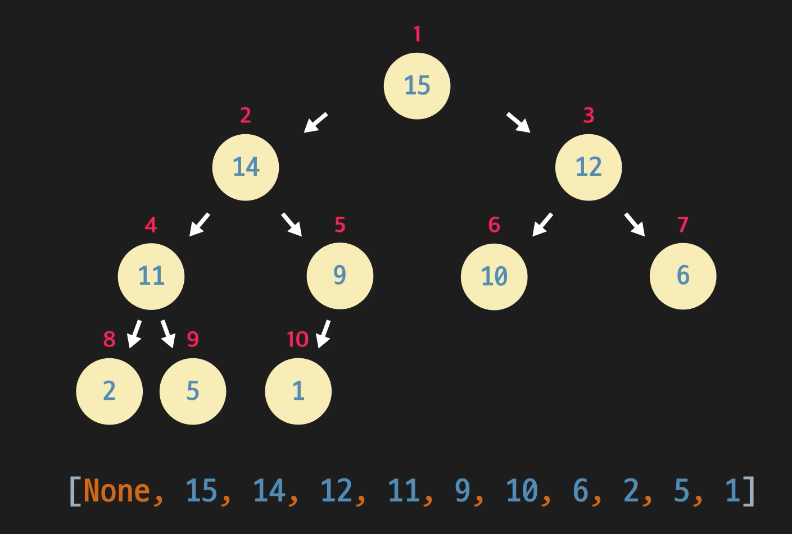

Tree의 종류인 Heap에 대하여 알아보도록 하자.

# Heap

`Heap`(힙)이란  <u>부모노드가 자식노드보다 큰(혹은 작은) 완전 이진 트리</u>를 의미한다. 형제 노드간의 대소관계는 상관없이 오직 부모와 자식관의 대소관계만 보면 된다. 완전이진트리는 마지막 레벨을 제외한 모든 노드가 가득차있고, 마지막 레벨은 왼쪽부터 순서대로 채워져 있는 이진트리이다. 

부모가 자식보다 큰 힙을 `최대힙(max heap)`, 부모가 자식보다 작은 힙을 `최소힙(min heap)`이라고 한다. 최대힙의 경우 모든 노드의 값 중 **최댓값이 루트 노드로 오게 되며, 최소힙은 최솟값이 루트노드**로 오게 되는 것이 자명하다. 이러한 힙의 속성을 이용하여 루트 노드를 반복적으로 `unshift`하는 `heap sort`(힙 정렬)을 구현할 수 있다. 또한 우선순위에 따라 선순선출(?)이 되는`Priority Queue`(우선순위 큐) 추상자료형을 구현할 수 있다.

# 완전 이진 트리 구현

우선 힙의 구조적인 형태는 Complete Binary Tree(완전 이진 트리)이다. 이는 이전 게시글과 같이 노드간의 레퍼런스로 구현할 수도 있지만, <u>배열로 편하게 구현 가능</u>하다! 아래의 트리를 보도록 하자. 아래는 완전 이진 트리이며 동시에 최대 힙이다.



루트 노드에서부터 *BFS의 탐색순서*로 (그림의 빨간 글씨처럼) 노드에 숫자를 붙혀줄 수 있다. 완전 이진 트리이므로 마지막 레벨이 아니라면 노드가 채워져서 들어오므로, **노드의 숫자는 그대로 배열의 인덱스로 표현 가능**하다! 배열의 첫 인덱스는 보통 비워두는데, 이유는 이후에 접근을 쉽게 하기 위해서다. 위의 배열에서 10번 인덱스의 원소는 10번 노드인 1이 되는 것이다.

배열로 완전 이진트리를 구현하면 노드의 번호만 안다면 접근을 `O(1)`로 가능하게 해준다. 또한 부모-자식간의 관계를 표현할 수도 있는데, 이 역시 인덱스를 이용할 수 있다.

> - 현재 노드의 인덱스 * 2 == 현재 노드의 왼쪽 자식 노드
> - 현재 노드의 인덱스 * 2 + 1 == 현재 노드의 오른쪽 자식 노드
> - int(현재 노드의 인덱스 /2) == 현재 노드의 부모 노드

10번 노드의 부모는 5번 노드가 되며, 2번 노드의 오른쪽 자식은 5(2*2+1)번 노드가 되는 것이다. 6번 노드의 왼쪽 자식은 존재하지 않는 다는 사실도 알 수 있다.(배열의 12번은 out of array index이므로)

# Heapify : 배열을 힙을 만족하도록 변형(sift down)

여기서 힙을 다루는 경우는 크게 `heap sort`를 하기 위해, `Priority Queue`를 구현하기 위해서 정도이다. 한 배열을 Heap속성을 만족시키도록 변형할 수도 있고, 처음부터 Heap속성을 만족시키도록 노드를 하나씩 힙에 추가할 수도 있다. 전자에 필요한 것이 `Heapify`이고, 후자의 경우에 필요한 것이 `Reverse Heapify`라고 하겠다. 일단 Heapify부터 구현해보도록 하자!

Heapify(sift down)는 한 노드를 해당 서브트리에서 힙 속성을 만족시키는 곳에 위치하도록 하는 것이라고 볼 수 있다. 모든 인덱스에 Heapify를 해준다면 일반 배열을 Heap으로 바꿔줄 수 있다.  최소 힙에서의 Heapify의 재귀적인 알고리즘은 다음과 같다.

**Alg Heapify** : 아래로 내려가며 compare & swap

0. 해당 인덱스(인덱스가 유효하다면)를 루트로하는 서브트리를 관찰한다. 
1. 해당 노드, 그 자식들을 비교하여 최솟값을 갖는 노드를 고른다.
2. 최솟값을 갖는 노드를 서브트리의 루트(부모노드 위치)와 바꿔준다.
3. 바뀐 노드에서 다시 heapify 해준다.

```javascript
heapify = (index) => {        
    if (index * 2 > this.count) {
        //재귀 탈출 조건 : 자식 노드가 없는 아예 경우(한쪽만 있는 경우 처리 필요)
        return;
    }
    else if (index * 2 == this.count) {
        //왼쪽 자식만 있는 경우
        const current = heap_list[index];
        const leftChild = heap_list[index * 2];
        if (current <= leftChild) {
            return;
        }
        else {
            //왼쪽 자식이 더 작은 경우
            this.swap(index, index * 2);
            //heapify해주지 않아도됨. (인덱스 벗어나게 되므로)
            return;
        }
    }
    else {
        const current = heap_list[index];
        const leftChild = heap_list[index * 2];
        const rightChild = heap_list[index * 2 + 1];
        if (current <= leftChild && current <= rightChild) {    //current node가 가장 작은 경우
            return;
        }
        else if (leftChild <= current && leftChild <= rightChild) {  //leftChild node가 가장 작은 경우
            swap(index, index * 2);
            heapify(index * 2);
        }                                                   
        else {    //그 외의 경우(rightChild node가 가장 작거나, 모두 같거나 등)
            swap(index, index * 2 + 1);
            heapify(index * 2 + 1);
        }

    }
}
```

heapify는 root node부터가 아닌 **leaf node부터 올라와야한다**!(엄밀히 말하면 leaf node의 부모부터 올라와야함) 루트에서 heapify가 되면 자식들이 이미 힙을 만족시키지 않는 상태이므로, 한 노드만 자리를 찾아가더라도 원하는 곳으로 가지 않게 된다. 따라서 아래의 서브트리부터 heap을 만족시켜가며 올라가는 devide&conquer의 형식으로 가야한다. 

```javascript
heap_list = [null, 2, 10, 1, 4, -2, 6];
for (let i = heap_list.length - 1; i > 0; i--) {
    heapify(i);
}
console.log(`heapified Arr: [null${heap_list}]\n`);
// heapified Arr: [null,-2,2,1,4,10,6]
```

## 시간복잡도

자 이제 **배열을 힙으로** 바꾸는 것까지는 구현했다. heapify 1회에 걸리는 시간은 평균적으로 트리의 높이에 비례한다고 볼 수 있다. 힙의 높이는 완전 이진 트리이므로 대략 `log2(n)`에 비례한다. 따라서 시간 복잡도는 `n*log(n)`이라고 볼 수 있다.

이제는 Heap class를 구현해보도록 하자!

# Heap 구현 요구 사항

이제 힙 클래스를 구현해보도록 하자. 최솟값이 루트 노드로 오는 최소힙으로, 트리의 각 노드는 단순히 값만 갖고 있다고 가정하고 배열로 구현한다.(이후 Prim algorithm을 구현하면서 여러 값이 있는 노드 또한 배열로 처리 가능) 배열의 0번째 인덱스는 `null`을 넣어주며, 추가적으로 힙의 크기를 측정하는 count라는 optional property를 두었다.(지금 생각해보니 count는 아무 필요 없다)

```javascript
class MinHeap {
    //1. 완전 이진 트리는 노드클래스 없이 배열로 구현 가능
    //index n의 자식 노드: 2n,2n+1
    //i의 부모 노드: parseInt(n/2)
    //2. 부모 노드의 키 값은 항상 자식 노드의 키 값보다 작다
    heap_list = [null,];
    //[null, 1, 2, 3]의 경우 count는 3
    count = 0;
}
```

1. reverseHeapify : 위로 올라가며 compare & swap **(sift up)**

   한 트리가 Heap을 만족한다고 가정하였을 때, heap 성질을 만족하지 않을 것 같은 부분이 있다면 다음과 같은 일을 해줄 수 있다.

   1. 의심되는 노드와 부모 노드를 비교한다. (힙성질을 만족하는지 확인)

      그림에서는 3이 의심된다고 판단되어 부모노드인 11과 비교한다.

      

   2. 부모가 더 크다면(힙 성질 위배) 의심되는 노드와 부모 노드를 바꿔준다.

      

   3. 바뀐 노드는 다시 heap 성질을 만족하지 않을 수 있으므로 **재귀적으로 수행**한다.

      그림에서는 바뀐 3이 의심되므로 3의 부모인 5와 비교하여 수행하는 것이다.

      

   이는 insert시 사용되는 핵심 개념이다. **heapify는 해당 노드와 그 자식들을 비교했다면, 이는 해당 노드와 그 부모를 비교하므로 reverseHeapify라고 부르겠다.**

   ```javascript
   reverseHeapify = (index) => {
       //하나씩 삽입할 때, 끝에서부터 올라오면서 힙의 조건을 만족시키도록(min heap에서는 부모가 더 크다면) 재귀적으로 스왑해주도록 한다
       if (index > 1) {
           const parentIndex = parseInt(index / 2);
           if (this.heap_list[index] < this.heap_list[parentIndex]) {
               this.swap(index, parentIndex);
           }
           this.reverseHeapify(parentIndex);
   
       }
       else {
           return;
       }
   }
   ```

2. swap

   힙에서 스왑은 매우 자주 일어나므로, 메서드로 만들어주었다.

   ```javascript
   swap = (index_a, index_b) => {
       //swap은 재활용 많이 되므로
       let tmp = this.heap_list[index_a];
       this.heap_list[index_a] = this.heap_list[index_b];
       this.heap_list[index_b] = tmp;
   }
   ```

3. insert : 힙 성질을 유지하도록 노드 추가

   힙성질을 만족하는 트리에서 한 노드를 추가할때는 아래와 같은 순서를 따른다.

   1. 일단 노드를 힙의 맨 끝에 추가한다.
   2. 맨 끝 부분은 <u>힙 성질에 위배될 수 있는 의심점</u>이므로, reverseHeapify를 통하여 힙성질을 만족하는 곳으로 위치하도록 한다.

   ```javascript
   insert = (value) => {
       //일단 Complete Binary Tree의 말단에 값을 삽입하고, 해당 인덱스에서 reverseHeapify 수행
       this.heap_list.push(value);
       this.reverseHeapify(this.heap_list.length - 1);
       this.count += 1;
   }
   ```

4. unshift : 삭제하기

   힙에서 맨 끝 노드를 삭제하는 것은 단순히 pop해주면 되므로 어려운 문제가 아니다. heap에서 가장 unique한(최소/대값이므로) root node를 추출하는 것은 단순하지는 않다. 이는 아래와 같이 해준다.

   1. 루트 노드와 가장 마지막 노드를 swap한다.
   2. 루트였던 마지막 노드를 pop해준다. 그러면 추출은 완료 되었다.
   3. 하지만 현재 바뀐 루트 노드로 인해 heap 성질에 위배될 수 있다. **이를 맞춰주기 위해 내려가면서 compare&swap하는 heapify를 진행한다**(reverse heapify와 방향이 다르다!)

```javascript
unshift = () => {
    //루트 노드를 삭제
    //루트 노드와 마지막 노드의 위치를 바꾸고 루트였던 노드를 삭제한다. 그리고 heap 조건을 맞추도록 heapify 수행
    this.swap(1, this.count);
    const returnValue = this.heap_list.pop();
    this.count -= 1;
    this.heapify(1);
    return returnValue;
}
```

​	unshift 연산은 남아있는 최솟값(루트 노드)을 계속 추출하여 정렬된 상태로 만드는 `heap sort`에 사용된다!

전체 코드는 [깃허브에](https://github.com/choieastsea/DataStructureJS/blob/main/DS05_Heap.js) 올려놓았다.