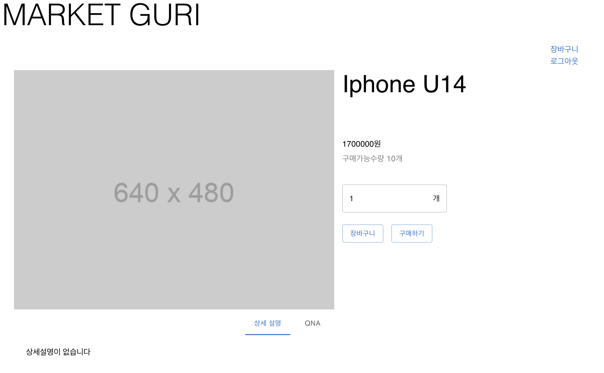
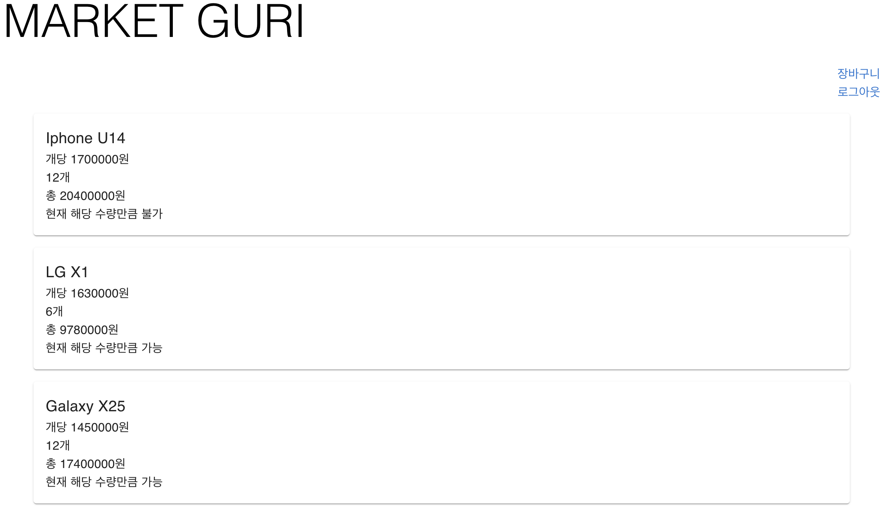

저번까지 Item 모델과 연관된 Question과 Answer 모델을 구현해보았다. 질문을 남긴 사람만 해당 질문을 변경할 수 있고, 답변은 관리자 페이지를 통해서만 달 수 있다. 

오늘은 쇼핑몰의 핵심 기능인 사용자가 물건을 장바구니에 담고, 구매하는 기능을 구현해보도록 하자.

## 장바구니(Cart) 모델 만들기

장바구니에 대한 요구사항을 간단하게 정리해보자. 장바구니는 User model과 Item model을 `N:M`으로 연결해주는 테이블이므로, 별도의 모델로 작성하도록 한다. `python manage.py startapp cart`로 장바구니 앱을 만들자.

- 사용자
- 물건(item) & 물건의 현재 가격
- 수량
- 장바구니 추가/업데이트 시점(추가, 수정 등으로 7일 지나면 장바구니 삭제되도록 할 수 있을 것)

위의 요구사항을 `cart/models.py`에 구현해보자.

```python
class Cart(models.Model):
    user = models.ForeignKey(settings.AUTH_USER_MODEL, on_delete= models.CASCADE, verbose_name='사용자') # 사용자 삭제되면 장바구니도 삭제되도록
    item = models.ForeignKey(Item, on_delete=models.CASCADE, verbose_name='상품')
    amount = models.PositiveIntegerField(verbose_name='수량', default=1)
    date_created = models.DateField(verbose_name='최종 수정 일자', auto_now=True) # 추가되거나, 수정되면 update되도록 함
    class Meta:
        db_table = 'cart'
        verbose_name = '장바구니 물건'
        verbose_name_plural = '장바구니 물건들'
```

다음으로는, serializer를 구현한다. serializer에서는 아래의 두가지 필드가 추가되면 좋을 것 같다.

- 총 금액
- 주문이 가능한지 여부(품절이 되면 주문이 불가능)

사용자에게 해당 필드를 제공하면서, 동시에 Create나 Update 할때는 필요 없으므로 `readonly`로 선언하도록 한다. 추가적으로, user 정보 역시 `request.user`로만 받고, **body를 통하여 변경되면 안되므로 readonly여야한다**.

### SerializerMethodField - set value in serializer's field

총 금액, 주문 가능 여부와 같은 필드는 참조를 통해 바로 알아낼 수 있는 값이 아니므로, 별도의 함수를 통하여 값을 가져와야 한다. 이는 `SerializerMethodField`로 선언해주면 된다. [공식문서참고](https://www.django-rest-framework.org/api-guide/fields/#serializermethodfield)

인자로 `method_name` 을 명시하지 않는다면 `get_{field_name}`의 함수를 오버라이드 하면 되고, 명시한다면 해당 함수를 작성하면 해당 함수를 통하여 값을 가져온다. 해당 함수는 model instance를 `obj`인자로 받아 접근할 수 있다.

`cart/serializers.py`는 다음과 같다.

```python
class CartSerializer(serializers.ModelSerializer):
    user = serializers.CharField(source='user.username', read_only= True)
    total_price = serializers.SerializerMethodField()
    is_available_now = serializers.SerializerMethodField(method_name='is_available')

    def get_total_price(self, obj):
        # 총 금액 리턴
        return obj.item.price * obj.amount
    
    def is_available(self, obj):
        # 현재 수량이 주문 가능한지
        return obj.item.stock_count >= obj.amount
    
    def create(self, validated_data):
        # user, itm_info 이미 존재한다면 수량만 누적하는 update
        cart_exist = Cart.objects.filter(user=validated_data.get('user'), item=validated_data.get('item')).first()
        if cart_exist:
            validated_data['amount'] = validated_data.get('amount') + cart_exist.amount
            return self.update(cart_exist, validated_data)
        # 존재하지 않는다면 create
        else:
            return super().create(validated_data)
    
    # item을 보여줄 때, id만 보여주는 것이 아닌, 안의 내용들을 ItemCartSerializer 통해서 보여주도록 해야함
    def to_representation(self, instance):
        response = super().to_representation(instance)
        response['item'] = ItemCartSerializer(instance.item).data
        return response
    
    class Meta:
        model = Cart
        fields = "__all__"
```

- SerializerMethodField를 이용하면 <u>필드마다 동적인 데이터로 처리</u>해줄 수 있다. 또한 이는 **항상** `read_only` 속성이므로, deserialize 과정에서는 필요가 없다.
- serializer를 통해서 Cart instance를 create가 될 때, **해당 사용자에게 이미 있던 item이라면 `update`가 되도록 해야한다!** 따라서 create 함수를 오버라이드 해주었다.

- 이전에 사용자의 이름을 마스킹하기 위해 `to_representation` 함수를 사용했었는데, 여기서는 item에 대한 JSON을 보여주기 위해 사용할 수 있다. 추가적으로, item은 `ItemCartSerializer`의 data로 가져오지 않으면 item__id만 가져오므로 ItemCartSerializer를 정의하여 장바구니에 담은 아이템의 정보들을 보여줄 수 있을 것이다. serializer의 field로 ItemCartSerializer를 갖도록 하는 방법도 있지만, 그렇게 하면 request에 Item id만이 아닌 Item model 객체를 실어야 하므로 이 방법이 더 좋아 보인다.

```python
class ItemCartSerializer(serializers.ModelSerializer):

    item_id = serializers.IntegerField()
    class Meta:
        model = Item
        fields = "__all__"
```

이제, ViewSet을 만들어보자!

### CartModelViewSet - 메소드에 따라 오버라이드

요구사항은 다음과 같다.

1. 장바구니는 **본인의 것만 보여주도록** 해야한다. 

2. 또한, 수정에 있어서 **item 자체는 수정이 불가능하고 <u>수량만 수정 가능</u>하도록** 한다. 이러한 요구사항에 맞게 ViewSet을 구성해보도록 하자.

우선, 요청이 들어온 사용자가 갖고 있는 Cart만 보여줘야 하므로, `queryset`을 수정해야한다.! 이는 `get_queryset()`을 오버라이드 하면 될 것이다. 

수정에 있어서는 입력 인자를 `amount`만 가능하게 해야하므로, PUT 요청에 대하여는 다른 `serializer_class`를 선택하도록 한다. Update를 위한 serializer는 다음과 같다.

```python
class CartUpdateSerializer(serializers.ModelSerializer):
    item = ItemCartSerializer(read_only=True) # 아이템 정보 보여주기 read_only

    class Meta:
        model = Cart
        fields = ('amount', 'item',)
```

item을 read_only로 하였기에 amount만 입력받을 것이다. amount는 Cart model에서 `PositiveIntegerField`로 정의되어있기에 serializer에서 별도의 validation은 진행하지 않았다. 이를 이용한 ModelViewSet은 아래와 같다.

```python
class CartModelViewSet(viewsets.ModelViewSet):
    queryset = Cart.objects.all()
    serializer_class = CartSerializer
    permission_classes = [IsAuthenticated] # 인증된 사용자만 접근 가능
    
    def get_queryset(self):
        # 본인이 장바구니에 포함시킨 것들만 보여주도록 해야함(타인 접근 불가)
        queryset = Cart.objects.filter(user=self.request.user)
        return queryset
    
    def get_serializer_class(self):
        if self.action == 'update':
            return CartUpdateSerializer
        else:
            return CartSerializer

    def perform_create(self, serializer):
        # cart 생성되기 전, serializer에 auth에 해당하는 user 정보 넣어줘야함
        serializer.save(user=self.request.user)
```

이제 테스트를 해보자!

- POST (create)

  item_id와 amount를 body에 넣으면 생성된다.

- GET

  본인이 담은 장바구니만 볼 수 있다.

- UPDATE

  amount만 수정 가능하다.

- DELETE

  본인의 것만 삭제할 수 있다.

모두 완료되었음을 확인해보았다~ api 테스트는 DRF에서 localhost:8000으로 접속시 디버깅모드로 확인할 수 있으니, 편하게 이를 사용하였다.

서버 소스코드는 [여기와](https://github.com/choieastsea/market-guri-django/commit/91de4eca0979d470484655ee452d7b5efd158f7f), [여기에](https://github.com/choieastsea/market-guri-django/commit/a66ff714d2a4a278711d9034429012bd2dfee799) 있다.

### CSRF token 관련 로직 수정

프론트에서 장바구니를 담는 부분을 확인하려고 했는데, CSRF Token 관련하여 내가 잘못한 부분이 있어 수정을 해야할 것 같다. (이전 게시물의 내용은 바꿔 놓을 것)

CSRF는 만료되므로 주기적으로 점검해줘야한다. 따라서, 프론트에서 페이지가 바뀔때마다 CSRF token을 요청하도록 수정하였고, 서버에서도 이에 대하여 토큰을 발급하도록 api를 추가해주었다.

```python
from django.middleware.csrf import get_token
from django.http import HttpResponse

@api_view(['GET'])
def get_csrf(request):
    """
    unsafe method에 대하여 csrf 검증을 위한 토큰을 발급하는 함수
    """
    csrf_token = get_token(request)
    response = HttpResponse()
    print(csrf_token)
    response.set_cookie('csrftoken',csrf_token)
    # print(response.cooki)
    return response
```

위의 view 함수를 myuser app에 추가하였고, 프론트에서 주기적으로 호출하여 token을 쿠키의 형태로 유지하도록 구현하였다.

## 프론트와 함께보기

프론트 코드는 [여기](https://github.com/choieastsea/market-guri-react/commit/c007c68cd908c98dffbe812eceff4fce0c4aad03)를 참고한다. 

- 아이템 페이지

  

  수량을 체크하고 장바구니를 누르면 장바구니에 추가된다.

- 장바구니 페이지

  

  본인의 장바구니에 담긴 물건들과 총 수량, 가격과 재고에 따른 현재 구매 가능 여부를 보여준다.


오늘 배운 내용을 복습해보면,

- read_only `SerializerField`로 보여줄때만 사용하는 필드를 추가할 수 있다
- `to_representation`을 오버라이드하여 nested serializer를 보기 좋게 할 수 있다 (request 받을 때에는 단순 id로만 받고, response는 model의 데이터를 해당 모델의 시리얼라이저로 보여줌)
- ViewSet에서 request method 등에 따라 serializer를 바꿔줄 수 있다
- get_queryset에서 필요에 따라 `self.request.user`에 접근할 수 있다


다음에는 장바구니를 통하거나 상품 페이지에서의 구매를 할 수 있도록 `구매` 기능을 만들어보자! 지금은 프론트가 매우 못생겼지만, 심심하면 바꾸도록 하겠다...^_^

