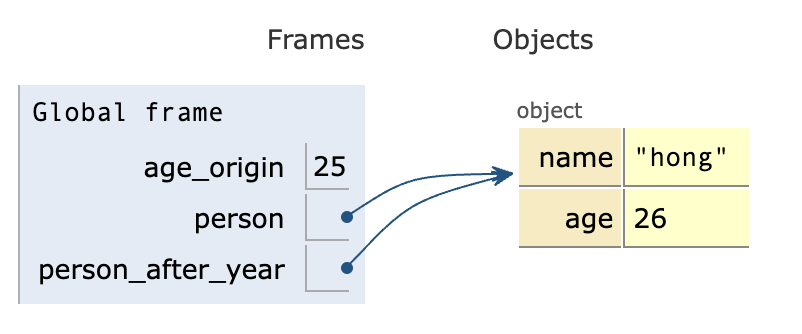

# JS 타입

우리는 타입을 크게 신경쓰지않으며 변수를 선언하지만, 실제 js에서는 크게 7가지 타입이 있다. 타입에 따라 js엔진이 저장, 처리하는 방법이 다르고 결과에 영향을 미치기에 우리는 타입에 대하여 알 필요가 있다.

js 변수에는 주소가 할당된다. 변수는 결국 사람이 보기 위해 만든 '식별자'이며, 변수는 어떠한 값을 갖는 주소로 대치된다. 여기서는 구체적으로 js가 stack, heap의 공간에 적재하는 방법보다는 그 값들을 어떻게 사용하는지, 즉 타입에 대한 정책을 공부해보고자 한다.

## 원시 타입(Primitive type) -> immutable

- Boolean
- Null
- Undefined
- Number
- BigInt
- String
- Symbol

위의 타입들은 원시 타입에 해당하며, 원시값은 불변하다.

불변한 값들은 바뀌지 않고, 대입 연산자(=)를 통하여 새로운 값이 할당 된다.

<u>여기서 말하는 값은 변수가 가리키는 주소에 적혀있는 내용</u>! 그걸 값이라고 생각하자.

```javascript
let a = 1;
let b = a;
console.log(a===b); // true
a+=1; 
console.log(a === b);	// false
```

a는 새로운 값(2)이 할당된다. a는 1이 위치한 주소를 가리키고 있다가 대입 연산을 통하여 [1이 2로 변경된 것이 아닌] **2가 위치한 주소를 가리키도록 바뀌**는 것이다. 

### const

위의 코드에서 변수 선언 키워드를 let에서 const로 바꾸면 반드시 에러가 난다. const로 선언된 변수는 값의 재할당이 되지 않기 때문이다. 

```javascript
const a = 1;
const b = a;
console.log(a===b); //true
a+=1;	// Uncaught TypeError: Assignment to constant variable.
```

즉, 원시타입의 변수는 항상 대입연산자에서 새로운 주소로 할당이 이루어 진다는 것을 알 수 있다!

추가적으로, const에 대하여 헷갈렸던 점을 정리해보자면...

const로 선언한 변수에 재할당이 완전 불가능한 것은 아니다. **const로 선언한 변수로는 재할당이 불가능**한 것이다... 말이 어렵지만, `react.js`에서 힌트를 얻을 수 있다. `const [count, setCount] = useState(0);`와 같이 state를 const로 선언하고, setState함수로 state를 재할당하지 않는가?

당연히, 리액트에서 `count +=1;`와 같은 코드는 존재하면 의도하지 않은 결과를 보이겠지만, const로 선언하면 해당 코드에서 에러가 나오게될 것이다! 따라서 state를 const로 선언하는 것은 리액트가 추구하는 방향인 것이다 ^_^


원시값에도 각 타입마다 사용가능한 함수가 다르므로 차이를 알고 사용할 수 있도록 한다. 원시값의 함수는 대부분 새로운 값을 리턴하는 immutable function일 것이다.

## 객체(object type) / 참조(reference) 타입 -> mutable

객체, 함수, 배열 등

객체타입은 변경이 가능하다. 따라서, 객체 타입에서의 대입 연산은 원시타입과 다른 결과를 보여준다.

```javascript
const age_origin = 25;
let person = {name : 'hong', age: age_origin};
let person_after_year = person;
person_after_year.age +=1;
console.log(person === person_after_year); // true
console.log(person.age === age_origin) //false
```

위의 코드를 [pythontutor.com](https://pythontutor.com/visualize.html#mode=display)의 visulize 서비스를 이용하여 이를 시각화해볼 수 있다.



객체 타입을 대입해주면, 해당 변수가 객체의 주소를 갖게 되는 것이다. 따라서, 여러 변수가 같은 객체를 공유하게 되는 상황이 올 수 있다. 이러한 상황을 '얕은 복사'라고 볼 수 있다. person과 person_after_year는 `alias`관계를 갖게 되는 것이다.

### const

그럼 여기서도 const로 선언해도 될까? 당연히 가능하다!! const는 재할당을 막는 것이지만, **객체의 프로퍼티를 변경하는 것은 값을 변수의 주소를 재할당하는 것이 아니**기 때문이다 ~

```javascript
const age_origin = 25;
const person = {name : 'hong', age: age_origin};
const person_after_year = person;
person_after_year.age +=1;	//에러가 발생하지 않는다!!
console.log(person === person_after_year); // true
console.log(person.age === age_origin) //false
```

### 복사(얕은, 깊은)

원시값과 다르게 참조의 형태로 값이 전달되는 것(얕은 복사)은 간혹 의도하지 않은 결과가 나올 수 있다. (실행 순서에 따라 다른 결과가 나올 수도 있다) 

따라서, 객체타입에서 값을 대입할 때(복사할 때)에는 깊은 복사를 진행해줄 필요가 있다. 이를 위해서는 크게 3가지 방법이 존재한다.

1. 정석적으로 깊은 복사(depth만큼의 for loop를 통하여 원시값들을 복사해온다) : 이 방법은 깊이가 낮을 때에는 편하지만 깊어질수록 어려워진다. 재귀함수를 써서 구현해볼 수 있을 것 같다.
2. 라이브러리(`immutable.js`등) : 이를 위한 신뢰도 높은 라이브러리가 존재하므로 잘 읽어보고 사용하면 될 것 같다.
3. 트릭 : `JSON.parse(JSON.stringify(object))` js에서 객체 타입은 JSON으로 변경이 가능하므로, 이와 같은 트릭으로 할 수도 있다. 하지만, 객체를 문자열로 바꾸고 다시 JSON으로 파싱하는 것이므로 속도가 느릴 것이며 권장되지 않는다.


깊은 복사를 성공적으로 했다면 위와 같이 분리된 객체로 저장될 것이다. 두 변수는 이제 서로 영향을 미치지 않는다!

추가적으로, `spread연산자`(`...`)는 1 depth에 대하여만 깊은 복사를 해준다. (값을 옮겨 담는다고 생각하면 편할 것 같다)


## 함수의 성격

함수의 성격 역시 mutable, immutable로 구분할 수 있다. mutable한 함수는 값을 변화시킬 것이고, immutable한 함수는 파라미터 값을 기반으로 새로운 결과값을 리턴하는 형식으로 구현되어 있다. 배열에서 concat, push를 보면 차이를 알 수 있을 것이다.

```javascript
const list_a = [1,2,3];
list_a.concat(4); //[1,2,3,4]의 새로운 배열을 리턴 (immutable)
console.log(a); // [1,2,3]!
list_a.push(4);	// list_a에 접근하여 4를 추가 (mutable)
console.log(a); // [1,2,3,4]
```

물론 함수 자체는 mutable하지만, 이는 함수의 성격에 따라 나눈 것이므로 구분지을 필요가 있다.

## 타입의 필요성

나도 위의 내용을 이해하고 있지 않아, 의도하지 않은 결과가 나올때가 종종 있었다. 또한, react js에서 state는 불변하게 관리되어야 하므로 꼭 타입에 대한 이해가 선수되어야 한다는 것을 깨달았다.

또한, 타입에 따라 제공되는 함수가 다르므로 각 타입을 구분할 수 있어야 할 것이다!

다음에는 js에서 변수를 선언하는 방식(var, let, const)과 이에 따른 메모리 구조에 대하여 간단하게 알아보자. 

출처 : https://developer.mozilla.org/ko/docs/Web/JavaScript/Data_structures

