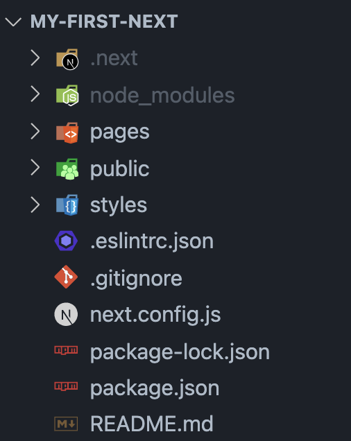
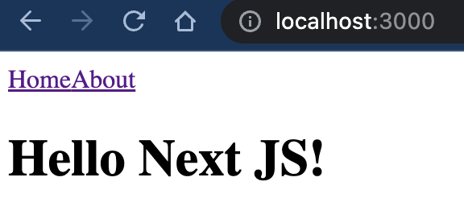
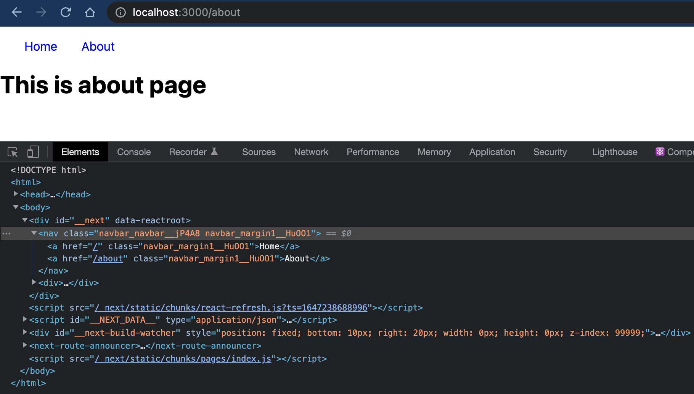
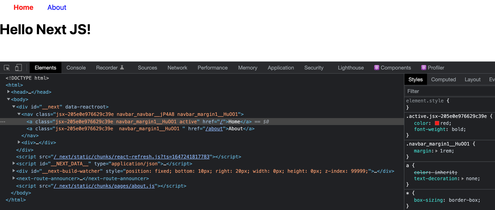
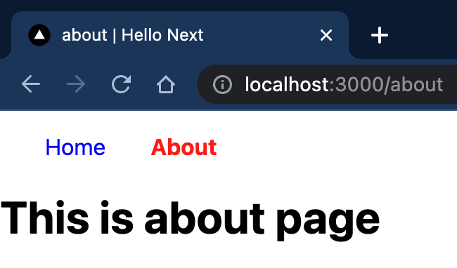

React로 웹사이트를 만드는 가장 대표적인 3가지 방법이 있는데, CRA, NextJS, Gatsby이다. 그중에서, Gatsby는 정적 페이지 생성에 대한 것이고, CRA는 가장 쉽고 입문하기 좋은 보일러 플레이트라고 알려져있다. 나도 CRA로만 리액트 공부를 했었는데, 라우팅, SSR, 코드 스플리팅 등의 세팅에 어려움이 있었다. 이에 반해, Next.JS는 리액트를 위한 프레임워크로 몇가지 규칙을 이해한다면 간편하게 기능을 이용할 수 있다. 또한 기본적으로 서버사이드렌더링(SSR)을 제공하여 이의 장점을 이용할 수도 있다. 이외에도 다양한 기능들이 제공되니 한번 시간 내서 배워보자! 

오늘은 넥스트로 간단한 정적인 페이지를 만드는 방법에 대하여 공부해보겠다.

# Next.js Project 시작하기

우선, node js(12.22.0 이후)와 npm이 깔려 있어야 한다. 간단하게 `npx create-next-app@latest`만 해주면 된다! yarn의 경우, `yarn create next-app`을 해주면 된다. 프로젝트 기본 정보를 입력한 이후, `npm run dev` 또는 `yarn dev`로 간단하게 웹서버를 실행시킬 수 있다.

# /pages를 통한 라우팅

처음 `npm run dev`를 해주면 아래와 같은 디렉토리가 나올것이다.



일단 pages 디렉토리 안을 지워주고 여기에 집중해보자.

## pages 디렉토리

Next.js에서, pages폴더 안의 파일은 리액트 컴포넌트를 export하고 각 파일의 이름으로 라우팅된다. 예를 들어, `pages/about.js`가 리액트 컴포넌트를 export한다면, 이는 하나의 페이지를 이루며 `localhost:3000/about`에서 볼 수 있을 것이다. 이것은 정말 편리한 기능이다. 예외가 몇가지 있는데 간단하게만 알아보자.

1. index.js : root url과 매칭된다.
2. _app.js : CRA에서 App.js와 비슷한 역할로, 최상위 컴포넌트와 같은 역할을 한다.
3. dynamic url : 동적 url을 하기위해 형식이 좀 다르다.

index.js와 about.js를 만들어보자. 파일은 default export로 최소 하나 이상의 리액트 컴포넌트를 내보내야한다.

```jsx
//index.js
export default function Home() {
  return (
    <div>
      <h1>Hello Next JS!</h1>
    </div>
  );
}

//about.js
export default function About() {
  return (
    <div>
      <h1>This is about page</h1>
    </div>
  );
}

```

파일명과 함수명은 같을 필요가 없으며, 파일명만 url에 반영된다.

## Link tag

네비게이션바를 만들어, 페이지간 이동을 편하게 해보자. CRA와 마찬가지로 a 태그를 직접 사용하지 않고 `<Link>`태그를 사용하는데 살짝 다르다.

pages/에 만들면 단독 페이지가 되므로, 자주 사용할 컴포넌트들은 따로 components/ 디렉토리에 만들어주자.

```jsx
//components/Nav.js
import Link from "next/link";

export default function Nav() {
  return (
    <nav>
      <Link href="/">
        <a>Home</a>
      </Link>
      <Link href="/about">
        <a>About</a>
      </Link>
    </nav>
  );
}

```

이걸 각 컴포넌트에 넣어주면, SPA와 같이 새로고침 없이 페이지 간 이동이 가능해진다. Link tag에는 href만 넣어주도록 하고, 절대 주소와 상대 주소 모두 가능하다. a태그를 안에 넣어주는 이유는 style, className등의 일반 컴포넌트들이 갖는 속성을 Link가 갖지 못하므로 a태그에다가 그런 것들을 넣어주면 된다. 추가적으로 url에 대한 정보는 `next/router` 안에 있는 `useRouter` hook을 사용해보자!

근데, 네비게이션바를 일일이 복붙하기엔 우리에 시간이 너무 아깝다... 그래서 등장하는 App 컴포넌트~!

# _app.js를 이용한 커스텀 app 컴포넌트

우리는 CRA에서 네비게이션바를 app 컴포넌트에 넣어두고, 나머지는 따로 렌더링되게 하였다. `Next.js`에서는 기본적으로 app 컴포넌트가 최상위로 존재하지만, `pages/_app.js`를 이용함으로써 이를 오버라이딩해줄 수 있다. 파일이름은 _app.js로 정해져있으니 유념하자.

## Component와 pageProps로 app 컴포넌트 구성하기

CRA에서 네비게이션 바를 app컴포넌트에 넣고, url에 따라 다른 내부 컨텐츠를 보여주도록 했었다. 여기서도 app 컴포넌트 안을 그렇게 구성할 수 있다. 

```jsx
//pages/_app.js
import Nav from "../components/Nav";

export default function App({Component, pageProps}){
    return <>
        <Nav />
        <Component {...pageProps}/>
    </>
}
```

주의해야할 점으로 App 컴포넌트는 props로 Component 와 pageProps를 받아와서 렌더링해준다는 것이다. Component로 들어오는 것들은 위에서 만들었던 다른 컴포넌트들(index.js나 about.js의 컴포넌트)일 것이다.



 Nav는 url이 어떻든 항상 나오게 될 것이고, Component는 url에 따라 pages에 있는 것들이 나오게 될 것이다.(그리고 이것은 정말 간편하다!!) pageProps 속성은 해당 컴포넌트가 props를 갖고 있는 경우 받아오게 될 것이다.

## (추가) layout component를 두는 pattern

이부분은 optional하여서 궁금하지 않다면 패스해도 된다. 대부분의 Next.js에서는 layout 컴포넌트를 둬서 그곳에 모든 레이아웃 구성요소를 넣는다. 핵심은 React Component의 Children props를 받아와 app의 하위 컴포넌트들을 렌더링한다는 것이다. `components/layout.js`를 만들고, 아래와 같이 해주자.

```jsx
//components/layout.js
import Nav from "./Nav";

export default function Layout({ children }) {
  return (
    <>
      <Nav />
      <div>{children}</div>
    </>
  );
}

```

그리고, _app.js를 아래와 같이 바꿔준다.

```jsx
import Layout from "../components/layout";

export default function App({ Component, pageProps }) {
  return (
    <Layout>
      <Component {...pageProps} />
    </Layout>
  );
}
```

이렇게 하면, 레이아웃에 관련된 것은 모두 layout.js에서 관리하는 것으로 역할을 나눠줄 수 있을것이다. (보이는 결과는 같으므로 굳이 하지 않아도 된다)

# Style 적용하기

스타일을 적용하는 방법에는 여러가지가 존재하는데, 가장 간단한 몇가지만 알아보자!

## 1. _app.js에서 css파일 임포트

단순하게 app 컴포넌트에 css 파일을 하나만 임포트해줄 수 있다. `import '../styles.css'`와 같이 가져오면 된다. 모든 컴포넌트에 이 스타일이 적용되므로, 태그단위의 css 초기화 구문을 여기에 넣어주면 좋을 것 같다. (당연한 얘기지만, css파일은 pages 폴더 내에 있으면 안된다)

node_modules 디렉토리에 존재하는 css 또한 임포트만으로 사용할 수 있다.

## 2. module.css를 이용한 스타일

각 컴포넌트에 스타일을 적용시키고 싶다면, next에서 제공하는 module.css 확장자를 이용할 수 있다.

위의 예시에서 네비게이션 바의 스타일을 적용시켜줘보자. 간단하게 색만 바꿔주도록 하자. 핵심은 <u>className을 문자열이 아닌 {표현식}으로 한다</u>는 것이다. 이게 왜 중요하냐면, module.css가 임포트되어 렌더링될때 Next는 className이 다른 모듈과 겹치지 않게 하기 위해 이름을 바꿔준다. 아래와 같이 말이다!

```css
/*styles/navbar.module.css*/
.navbar {
  color: blue;
}
.margin1 {
  margin: 1rem;
}
```

```jsx
//components/Nav.js
import Link from "next/link";
import style from "../styles/navbar.module.css";
export default function Nav() {
  return (
    <nav className={`${style.navbar} ${style.margin1}`}>
      <Link href="/">
        <a className={style.margin1}>Home</a>
      </Link>
      <Link href="/about">
        <a className={style.margin1}>About</a>
      </Link>
    </nav>
  );
}


```

module.css 파일에서 클래스명에 따른 스타일을 정의하고, 컴포넌트에서는 이를 import하여 프로퍼티에 접근하는 형식으로 className을 정의할 수 있다. nav tag의 className 처럼 백틱 문자열을 이용하여 표현식으로 여러 클래스를 삽입하는 것 또한 가능하다. 이러고 결과를 보면 재미있다.



className을 보면 뒤에 이상한 것이 추가되어 있는 것을 볼 수 있다. 이것은 Next에서 css module을 이용한 클래스명에서 여러 파일 간 충돌이 일어나지 않도록 자동으로 클래스명을 바꿔주는 것이다. 따라서, 우리는 **css모듈 내에서 다른 파일과 충돌할 고민할 필요가 없어지게 된다**!!

module.css는 파일을 따로 만들어야 하므로, 약간의 귀찮음(클래스명 때문에 왔다갔다 해야하는...)이 존재한다. js 파일 내에서 스타일링을 하는 방법도 있다.

## 3. styled jsx를 이용한 스타일

jsx에다가 style 객체를 프로퍼티로 넘겨주는 방법도 존재하지만, Next에만 있는 `styled.jsx` 역시 매우 편한 기능이다. 한 컴포넌트 파일안에서 스타일을 처리할 수 있기 때문이다. <u>단지 style 태그를 열고, jsx를 적어주면</u> 된다. 태그 안에는 백틱으로 문자열 표현식을 적어주면 되는 것이다! 이전 코드에서, 현재 선택된 페이지의 이름을 강조해보도록 하자. `useRouter()`로 pathname을 가져와 이에 따라 a tag를 강조하도록 하였다.

```jsx
//components/Nav.js
import Link from "next/link";
import { useRouter } from "next/router";
import style from "../styles/navbar.module.css";
export default function Nav() {
  const router = useRouter();
  return (
    <nav className={`${style.navbar} ${style.margin1}`}>
      <Link href="/">
        <a
          className={`${style.margin1} ${
            router.pathname === "/" ? "active" : ""
          }`}
        >
          Home
        </a>
      </Link>
      <Link href="/about">
        <a
          className={` ${style.margin1} ${
            router.pathname === "/about" ? "active" : ""
          }`}
        >
          About
        </a>
      </Link>
      {/* styled jsx를 이용한 스타일 적용하기 */}
      <style jsx>
        {`
          .active {
            color: red;
            font-weight: bold;
          }
        `}
      </style>
    </nav>
  );
}

```

위와 같이 ${variables}의 변수 삽입 또한 가능하며, 이 역시 다른 파일의 스타일과 겹치지 않게 적용될 것이다. 핵심은 해당 컴포넌트에만 스타일이 적용된다는 것이다.



위와같이 acitve에는 이상한 문자열들이 붙어있는 것을 확인할 수 있다. 따라서, index.js에서 `className="active"`를 해줘도 저 스타일은 적용되지 않는다는 것을 유추할 수 있다. 만약, 전역적으로 스타일을 주고 싶다면 `<style jsx global>`로 태그를 열면 된다. 

이외에도 다양한 스타일 적용 방법에 대하여는 [공식문서](https://nextjs.org/docs/basic-features/built-in-css-support)를 참고하도록 하자.

# next/head를 이용한 헤더 태그 다루기

html의 head태그에는 웹사이트가 돌아가기 위한 기본적인 정보가 들어간다. next에서는 `<Head>`태그를 제공하여 이를 다룰 수 있도록 한다. 이는 검색 엔진 최적화(SEO, Search Engine Optimization) 측면에서 도움이 된다. 여기서는 페이지별로 title을 바꿔주도록 하자.

component/SEO.js를 만들고, 아래와 같이 작성해주자.

```jsx
//components/SEO.js
import Head from "next/head";

export default function SEO({ title }) {
  return (
    <Head>
      <title> {title} | Hello Next</title>
    </Head>
  );
}

```

그리고 pages에 해당하는 index.js와 about.js에 SEO 컴포넌트를 넣어준다.

```jsx
//pages/index.js, about.js에도 넣어주면 된다.
import SEO from "../components/SEO";

export default function Home() {
  return (
    <div>
      <SEO title="home" />
      <h1 className="active">Hello Next JS!</h1>
    </div>
  );
}

```

페이지가 많아진다면 layout 컴포넌트에서 pathname에 따른 관리를 해주는 것도 방법일 것 같다. 아래와 같이 title이 바뀌는 것을 확인할 수 있다!



이정도하면 간단한 SPA정도는 무리없이 꾸밀 수 있을 것 같다. 여기까지 [깃허브에 커밋해놓았으니](https://github.com/choieastsea/hello-next/commit/a3a5a3c5ce042e425063a796a51356d51db5b1c9#diff-b335630551682c19a781afebcf4d07bf978fb1f8ac04c6bf87428ed5106870f5), 코드를 참고하면 된다. 이제, next.js가 제공하는 기능 이외에 개발하는 우리가 경험할 수 없었던 성능적인 측면에 대하여 알아보자.

# SSR(Server Side Rendering)과 hydrate

react.js는 기본적으로 요청에 대하여 [복잡한 js파일과 간단한 index.html파일]을 사용자에게 전송하고, 사용자의 브라우저에서 이를 렌더링하는 Client-Side Rendering 방식을 채택하고 있다. 이는 서버가 간단한 작업만 수행하도록 할 수도 있지만, 사용자의 측면에서 좋지 않을 수 있는데 아래와 같다.

## CSR의 단점

1. 네트워크가 느린 사용자는 흰 화면을 오래동안 지켜봐야 한다.

   브라우저에 js파일들이 로드되고 리액트에 의하여 root라는 id를 갖는 엘리먼트에 주입이 되어 초기 렌더링이 되기까지는 빈 화면이 보이게 된다. 이는 사용자의 이탈을 유도한다.

2. SEO 측면에서 좋지 않다.

   구글, 네이버 등의 검색 엔진은 페이지의 개략적인 정보를 갖고 있다가 사용자의 검색에 최적의 결과를 보여주도록 설계가 되어있는데, CSR은 검색 엔진이 직접 사이트에 접근해서야 정보를 얻을 수 있으므로 검색엔진 최적화 측면에서 좋지 않다. 이는 곧 사이트의 유입량 감소로 이어질 것이다. 

3. js가 허용되지 않는 사용자는 초기 페이지도 보지 못한다.

   javascript가 꺼진 브라우저라면, 사용자는 페이지의 초기 상태도 볼 수 없게 된다.

이를 해결하기 위해 html로 초기 코드를 짜는 방법이 있겠지만, 이는 이중작업이므로 권장되지 않는다. 반면 **Next.js에서는 개발자의 js코드로 초기화면을 html로 렌더링하여 사용자에게 보내는 서버사이드렌더링이 기본적으로 제공된다**!!

## Hydrating을 이용한 성능 개선

서버에서 개발자의 js코드를 기반으로 html코드를 만들어서 사용자에게 보내는 것이 SSR이다. 하지만, react에서는 수많은 리렌더링이 일어나는데 이때마다 서버에서 렌더링하여 사용자에게 보낸다면 이는 매우 성능의 측면에서 좋지 않을 것이다. 따라서, Next.js는 초기 화면만 서버에서 html로 렌더링하여 사용자에게 보내고, react.js가 포함된 자바스크립트 코드를 보낸다. 이는 <u>초기 주도권은 정적 html로, (js파일이 로드가 완료된 시점부터의) 그 이후는 react가 주도권을 가져가도록 하는 것이며 이를 hydrate</u>라고 한다. 따라서, **로딩 이후 리렌더링 등의 일들은 react가 기존의 방식대로 빠르게 처리하게 되는 것**이다!!

## CRA와 비교하기

CRA로 만든 사이트의 소스코드를 보자.(Inspect가 아닌 view source code로 봐야함)

```html

<!DOCTYPE html>
<html lang="en">
  <head>
    <title>React App</title>
  <script defer src="/static/js/bundle.js"></script></head>
  <body>
    <noscript>You need to enable JavaScript to run this app.</noscript>
    <div id="root"></div>
  </body>
</html>

```

html의 내용은 하나도 없으므로 js가 로드되고 실행될때까지 빈 화면을 보여줄 것이다. 하지만, Next.js로 만든 사이트를 보면 초기페이지에 대한 정보가 모두 html에 들어있는 것을 확인할 수 있다. 아래는 위의 예시로 실행한 페이지의 소스코드를 일부 생략한 것이다.

```html
<!DOCTYPE html>
<html>
  <head>
    <style data-next-hide-fouc="true">
      body {
        display: none;
      }
    </style>
    <noscript data-next-hide-fouc="true"
      ><style>
        body {
          display: block;
        }
      </style></noscript
    >
    <title>home | Hello Next</title>
    <noscript data-n-css=""></noscript>
    <script
      defer=""
      nomodule=""
      src="/_next/static/chunks/polyfills.js?ts=1647246144551"
    ></script>
    ...
    <noscript id="__next_css__DO_NOT_USE__"></noscript>
    <style id="__jsx-205e0e976629c39e">
      .active.jsx-205e0e976629c39e {
        color: red;
        font-weight: bold;
      }
    </style>
  </head>
  <body>
    <div id="__next" data-reactroot="">
      <nav
        class="jsx-205e0e976629c39e navbar_navbar__jP4A8 navbar_margin1__HuOO1"
      >
        <a class="jsx-205e0e976629c39e navbar_margin1__HuOO1 active" href="/"
          >Home</a
        ><a class="jsx-205e0e976629c39e navbar_margin1__HuOO1" href="/about"
          >About</a
        >
      </nav>
      <div>
        <div><h1 class="active">Hello Next JS!</h1></div>
      </div>
    </div>
    <script src="/_next/static/chunks/react-refresh.js?ts=1647246144551"></script>
  </body>
</html>

```

초기상태의 컴포넌트들이 html로 렌더링되어 넘어오고, js파일은 여러개의 chunks들로 넘어오는 것을 확인할 수 있다. 이후 자바스크립트가 모두 로드가 되면, 리렌더링 등의 작업들은 브라우저의 리액트가 하는 것이다. 이러한 방법으로 Next.js는 성능을 개선하였다. 어디까지 서버 사이드에서 렌더링할건지, fetching data는 어느시점에서 받아올지, static generation의 구체적인 방법 등은 이제 자세히 알아보도록 하자.

이렇게 간단하게 넥스트로 정적인 페이지를 만들어 보는 시간을 가졌다. 다음에는 동적 페이지를 만드는 방법과, 다양한 방식으로 성능을 향상시키는 방법에 대하여 공부해봐야겠다!

