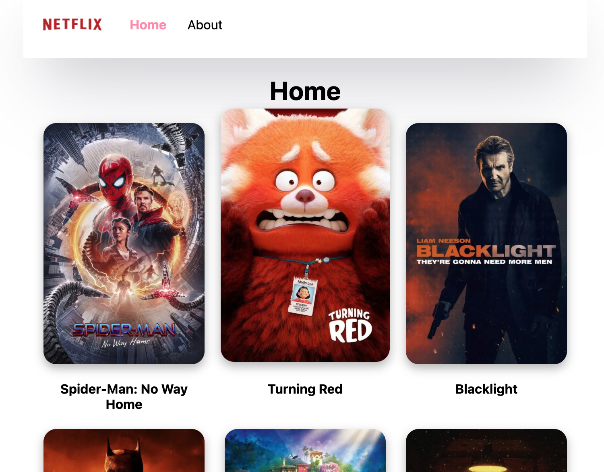
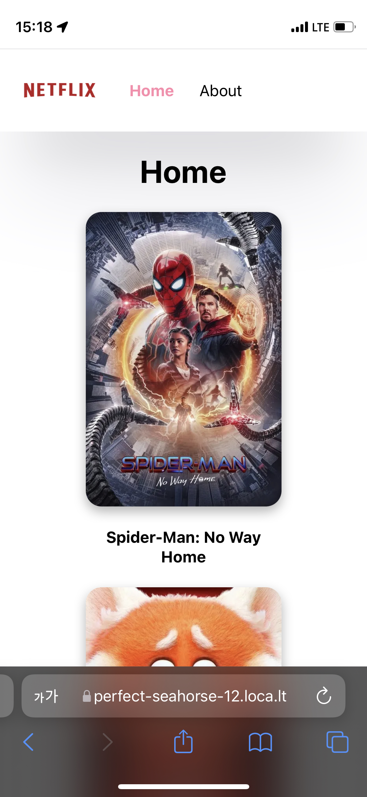

저번에 이어 Next js를 공부해보자! (공식사이트와 유튜브를 돌아다니며 공부했다) 오늘은 fetch하여 데이터 받아오기와 Next.js에서의 SSR에 대하여 공부해보려고 한다.

# 데이터 가져오기

저번에 공부한 내용으로는 간단하게 정적인 페이지를 만들어 보았는데, 오늘은 동적인 페이지를 만들어보자! index.js에서 영화 api를 가져와서 정보를 보여주도록 하자. useEffect hook을 사용하여 페이지가 로드될때 데이터를 fetch해올 수 있다. 

```jsx
import Image from "next/image";
import { useEffect, useState } from "react/cjs/react.development";
import SEO from "../components/SEO";

const API_KEY = "API_KEY"; //put personal api key

export default function Home() {
  const [movies, setMovies] = useState([]);
  useEffect(() => {
    (async () => {
      const response = await fetch(
        `https://api.themoviedb.org/3/movie/popular?api_key=${API_KEY}`
      );
      const { results } = await response.json();
      // console.log(results);
      setMovies(results);
    })();
  }, []);
  return (
    <div>
      <SEO title="home" />
      <h1 className="active title">Home</h1>
      <div className="container">
        {movies.map((movie) => (
          <div key={movie.id} className="item">
            <div className="image-wrapper">
              <Image
                alt={`${movie.poster_path}`}
                src={`https://image.tmdb.org/t/p/w500/${movie.poster_path}`}
                width="200px"
                height="300px"
              />
            </div>
            <h4>{movie.original_title}</h4>
          </div>
        ))}
      </div>
      <style jsx>{`
        .title {
          text-align: center;
        }
        .container {
          display: flex;
          flex-direction: row;
          flex-wrap: wrap;
          justify-content: space-evenly;
        }
        .item h4 {
          text-align: center;
          max-width: 200px;
        }
        .image-wrapper {
          max-height: 300px;
          overflow: hidden;
          box-shadow: rgba(0, 0, 0, 0.3) 0px 5px 12px;
          border-radius: 1rem;
          transition: transform 0.2s ease-in-out;
        }
        .image-wrapper:hover {
          transform: scale(1.05) translateY(-10px);
        }
      `}</style>
    </div>
  );
}

```

flex로 간단하게 이미지 배치를 하였다. 사진에 hover event도 달아주었고, 결과는 아래와 같다.



## 이미지 태그

그냥 img를 사용하면 Next.js에서 제공하는 next/Image가 권장된다는 경고 문구가 나온다. 이는 두가지 케이스로 나뉜다.

1. 로컬 이미지

2. url등으로 경로가 설정된 외부 이미지

   next.config.js를 건드려줘야 하는데 공식문서에 나온대로만 해놓자. 나는 도메인을 이렇게 적어주었다.

그럼 이미지 태그를 html이 아닌 자체 컴포넌트로 사용하는 이유가 무엇일까? Next.js는 사용자의 경험을 매우 중요하게 생각하는데, 이미지의 원본이 다운로드 될 필요가 없다고 판단한다. 이미지는 보면 Chrome의 Network 탭에서 보면 한번에 다운로드되지 않으며, 해당 이미지가 보여질 위치일때(스크롤 위치에 따라) 사전에 정의한 사이즈만큼만 다운로드 되어진다. 이는 로딩시간과 부하를 줄여주는데 큰 도움이 될 것이다.


Image 태그를 스타일하는 방법은 좀 찾아봐야겠지만, 일단 이미지를 가져옴 next.config.js에서 수정 필요

여기서 문제점(html 비어있음) React가 이미지 fetch해오거든... CSR로 패치해온다 이말이야. 이걸 서버사이드에서 해결할 수 있을까? api key도 완전히 숨기고... 


# 서버 사이드 렌더링 : getServersideProps 

적당히 타협을 해야함~ 다 서버에서 로딩해올 순 없잖아 이는 브라우저가 아닌 서버에서 렌더링하는 것이다. client가 요청이 오면, 서버에서 페이지를 렌더링하여 가는 것이다. 만약 정적 사이트라면 모든 것들이 만들어져 있고, 모든 유저에게 똑같은 정보를 보내주면 된다. 이는 SSR과 또 다른 의미이며, 다음에 자세히 알아보도록 하자.

# 로컬호스트를 오픈하여 테스트해보기 (localtunnel 이용) 

이거는 따로 나중에 자세히... production은 아니지만, 개발 단계에서 간단하게 외부 환경에서 테스트해볼 수 있는 오픈소스가 있다. 좀 느려도 해볼만 하지 않나...

설치 -> 배포 -> 테스트

 해당 서버가 켜져있다면 그 포트를 외부에 열어주는데 보안 등 어려운 설정들이 많이 필요하므로, 이거로 하자! 이거로 모바일 환경에서 테스트해보기도 편하다.

Next를 만든 vercel이라는 곳에서도 배포를 해볼 수 있으며 이것이 권장되지만, 아직 개발 레벨로 이것저것 해

[공식 사이트](https://localtunnel.github.io/www/)를 보면 아주 간단하게 로컬 서버를 외부에 공개할 수 있다. 우선, 글로벌로 `localtunnel`패키지를 설치하고, 해당 로컬 서버의 포트를 열어주면 url이 나오게 된다.

```shell
$ npm install -g localtunnel
$ lt --port 3000
your url is: https://perfect-seahorse-12.loca.lt	
```

이러한 식으로 url이 나오고, 3000번 포트에 서버가 실행되고 있다면, 어디서나 정상적인 접근이 가능할 것이다. (초기 화면이 있는데, 7일마다 버튼만 눌러주면 안나오는 것 같다)




오늘까지 한 코드는 깃허브에 올려놓았다. 다음에는 static generation(SSG), api, production mode, next config 속성등을 공부해보도록 하자!