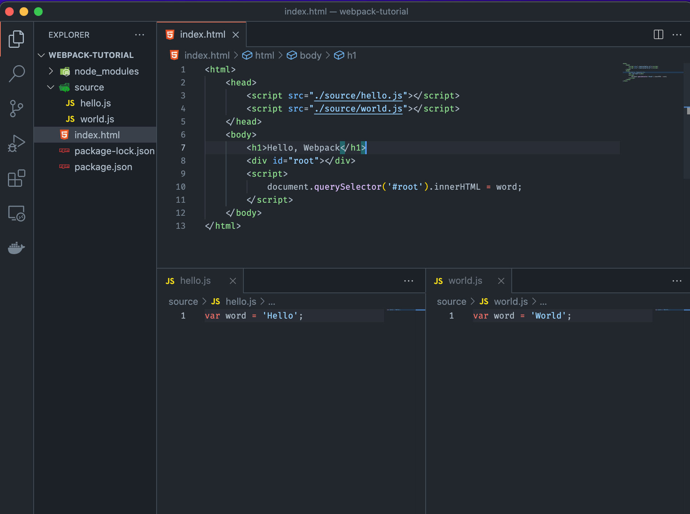
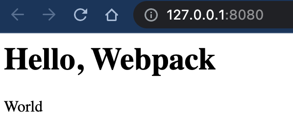
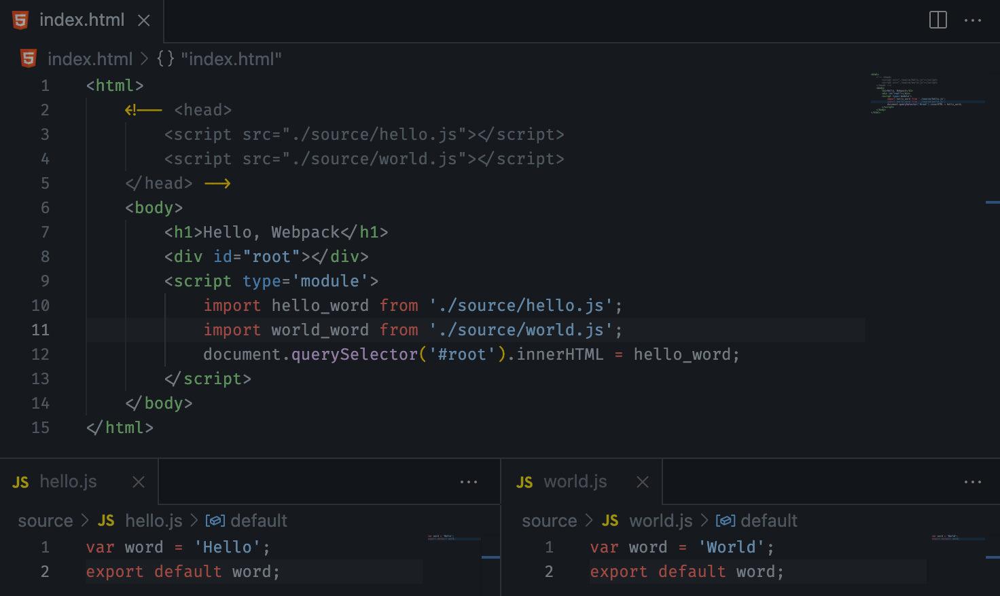
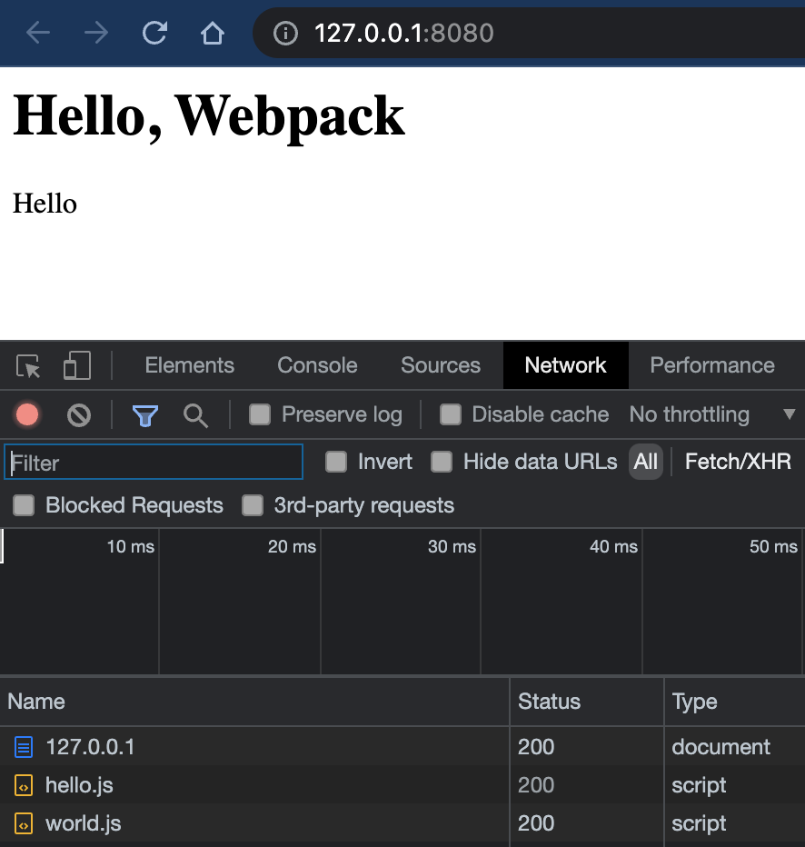
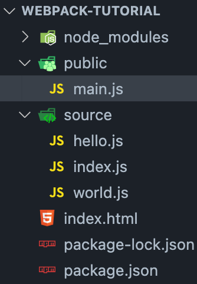

# Webpack (1) 웹팩 기본

본 포스팅의 내용은 생활코딩님의 강의를 들으면서 간단하게 정리한 것입니다.

- 아주 간단하게 로컬 웹서버를 띄우는 방법 : `http-server` 설치 후, `npx http-server ./`로 해당 디렉토리에서 웹서버 실행 가능!
- webpack-tutorial 폴더에 `npm init -y` 실행하여 노드 프로젝트로 세팅해주었다.

계기 : 리액트를 CRA없이 하려고 보니, 웹팩이라는 것이 있다는 것을 알게 되었다. 당연하게 생각하였던 과정들에 대한 이해를 통하여 발전할 수 있을 것이다!

## Why webpack? 

많은 파일들이 모여 하나의 웹사이트를 만드는데, 다양한 문제가 발생할 수 있다.

### 기존 웹서비스의 문제점 1. 다양한 파일에서 충돌에 대응하기 어렵다.



이러고 `http-server`를 통하여 로컬서버(localhost:8080)에 들어가보면 어떻게 보여질지 예상해보자.

word라는 전역 변수는 hello.js에도 있고 world.js에도 존재하므로(confict 발생) 더 뒤에 선언된 world.js의 word로 덮어씌우기 될 것이다.



여러 개발자가 작성한 파일들이 모이면 변수가 겹칠 가능성 또한 커지며, 이는 의도하지 않은 결과를 낳을 수 있다. 마치 폴더 기능이 없는 파일 시스템과 같이 많은 혼란을 불러 일으킬 수 있다.

### 문제점 1의 해결 방법 : ES6 [module](https://developer.mozilla.org/ko/docs/Web/JavaScript/Guide/Modules) 사용

위의 문제는 import, export 구문으로 모듈화하여 내보내고 가져오는 것으로 위의 문제를 해결할 수 있다. word를 불러올 때, `type=module`으로 스크립트를 불러와야 한다.



이렇게하면 root id에 hello_word에 해당하는 'Hello'문자열이 들어가게 됨을 예상할 수 있다.



모듈화를 통하여 변수는 한 파일안에서만 유효한 값이 되는 것이다!

*단 import와 export는 비교적 최신 문법이므로 모든 브라우저에서 지원되지는 않는 문제점이 아직 존재한다.*

### 기존 웹서비스의 문제점 2. 많은 파일들이 다운되면 사용성을 떨어뜨린다.

위의 사진에서 네트워크단을 보면 js파일이 일일이 다운로드가 되었는데 실제 웹서비스에서는 css, js, 이미지를 포함하여 수십, 수백개의 파일이 네트워크를 통해 전달 될 것이다. 이는 성능저하를 일으킬 것이다. 따라서, **이를 묶어서 최소한의 파일로 서비스를 제공하기 위해 만들어진 것**이 `bundler`이다. 이의 대표가 `webpack`이다.

위의 문제점들을 웹팩으로 어떻게 해결할 수 있는지 보도록 하자.

## 웹팩의 도입

node js 프로젝트에서, 웹팩을 설치해보자. `npm install -D webpack webpack-cli`로 설치한다. -D는 개발모드로 웹팩을 설치한다는 말이다. 

이제 우리는 각 js파일들을 번들링하여 묶어줄 `entry file`이 필요하다. 보통 index.js를 두고 이를 이용한다.

```javascript
//index.js
import hello_word from "./hello.js";
import world_word from "./world.js";
document.querySelector("#root").innerHTML = hello_word;
```

` npx webpack --entry ./source/index.js --output-path ./public` 를 실행하여 webpack에게 entry 파일을 통하여 public 디렉토리안에 main.js로 묶어주도록 한다. 이를 실행하면 아래와 같이 main.js가 생기는 것을 확인할 수 있다.



```javascript
//public/main.js
(()=>{"use strict";document.querySelector("#root").innerHTML="Hello"})();
```

번들링된 파일은 다양한 웹 브라우저에서 실행되도록 하나의 파일로 묶어준다. 

또한, index.html의 script부분을 하단에 추가하여 bundled file을 연결해주면 된다.

```html
<html>
    <!-- <head>
        <script src="./source/hello.js"></script>
        <script src="./source/world.js"></script>
    </head> -->
    <body>
        <h1>Hello, Webpack</h1>
        <div id="root"></div>
        <script src="./public/main.js/"></script>
    </body>
</html>
```

이렇게 하면, 이전과 같은 결과지만 하나의 파일로 넘어오는 것을 확인할 수 있다. 여기에 babel을 사용하면 오래된 브라우저에서도 사용할 수 있도록 번들러를 사용할 수 있다.

다음에는 터미널에 명령어를 작성하는 등의 과정을 좀 더 간편하게 하기 위한 웹팩 설정 파일, 로더 등을 공부해보도록 하자!

