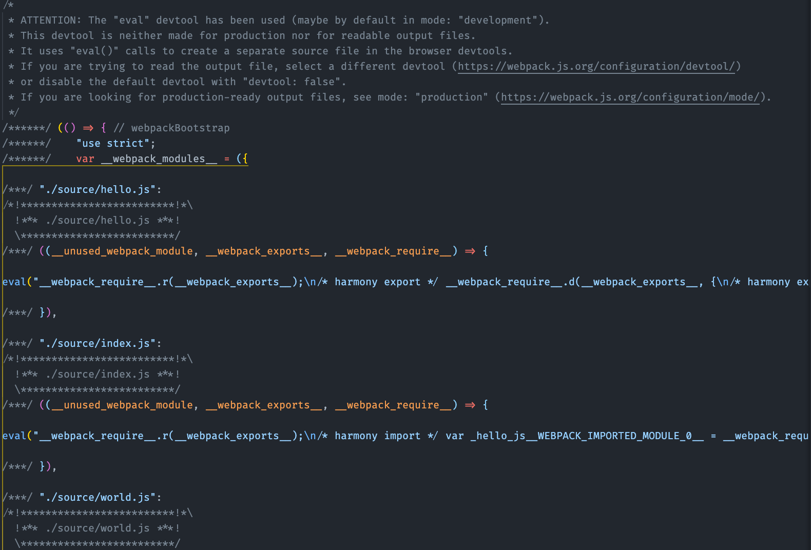
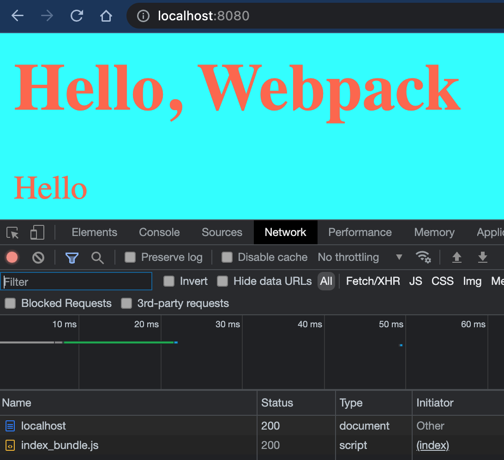

# Webpack (2) config, mode와 loader

본 포스팅의 내용은 생활코딩님의 강의를 들으면서 간단하게 정리한 것입니다.

## webpack.config.js (웹팩 설정 파일) 만들어 설정해주기

웹팩에게 어떻게 번들링하는지 시키는 방법에 대한 것은 크게 두가지가 있다.

1. `webpack-cli`를 이용하여 명령어로 입력을 한다.

   이전의 방법과 같이 `npx webpack --entry ./source/index.js --output-path ./public --output-filename index_bundle.js`등과 같이 명령어를 입력할 수도 있다. 하지만, 이는 번들링을 할때마다 어딘가에 명령어를 저장해놓거나 기억하고 있어야 한다.

2. 설정 파일을 만든다.

   [웹팩 공식 document](webpack.js.org/configuration/)을 참고하여 `webpack.config.js`파일을 작성하고 `npx webpack`으로 번들링을 진행해줄 수도 있다. 간단하게 위의 내용을 설정 파일에다가 만들어보자.

   ``` javascript
   //webpack.config.js
   const path = require('path');   //nodejs 의 path로 경로 resolve해주도록 함
   module.exports = {
       entry: "./source/index.js",
       output : {
           path: path.resolve(__dirname,"public"),
           filename : 'index_bundle.js'
       }
   }
   ```

   파일이름을 `webpack.config.js`라고 지었다면 간단하게 `npx webpack`만으로 번들링이 된다. cli를 통하여 했을때랑 같은 결과가 나오게 되는 것을 확인할 수 있다. 

   

   ## mode 설정하기

   이전에는 아주 간단하게 웹팩설정을 해주었지만, `'mode' option has not been set`이라는 경고문구가 뜨는 것을 확인할 수 있다. 모드는 크게 development와 production으로 나뉘며 이에 따라 다르게 설정을 가져갈 수 있다. 예를 들어, 개발할 때에는 `webpack.config.js`에 개발시 번들링에 대한 설정을 정리하고, 배포시에는 `webpack.config.prod.js` 와 같이 별도의 파일에 작성하면 된다. 이는 `npx webpack --config webpack.config.prod.js` 로 번들링이 가능하다.

   한번 위의 파일에 `mode : 'development',`를 추가하여 실행해보자.

   

production mode에 비해 나름 포매팅도 되어있고, 이것저것 옵션을 줄 수 있는 주석들이 있는 것을 확인할 수 있다. (production 모드로는 파일을 최소화하고 가독성이 떨어지게 번들링되었다)

## 로더(Loader)를 통하여 다양한 파일들 함께 번들링해주기

웹팩의 로더를 통하여 다양한 방법으로 번들링을 해줄 수 있다.  [공식 문서](https://webpack.js.org/guides/asset-management/)에 나와있듯이, css를 번들링해보도록 하자. 패키지 설치, css 작성, webpack.config.js 수정, 실행의 순서로 진행하였다.

1. `npm install --save-dev style-loader css-loader`  두개의 패키지를 설치하였다. 

2. source/style.css를 다음과 같이 간단하게 작성하였다.

   ```css
   body{
       background-color: aqua;
       color: tomato;
   }
   ```

3. `webpack.config.js`로 가서 css와 관련된 module을 추가하였다. use 배열은 끝에서부터 실행되므로 순서 또한 지켜줘야한다.

   ```javascript
   const path = require('path');   //nodejs 의 path로 경로 resolve해주도록 함
   module.exports = {
       mode : 'development',
       entry: "./source/index.js", //하나로 모아주는 entry파일
       output : {
           path: path.resolve(__dirname,"public"), //bundled 파일의 위치
           filename : 'index_bundle.js'    //파일명
       },
       module: {
           rules: [
               {
                   test: /\.css$/i, //웹팩을 통하여.css를 가공하는 방법을 설정 (정규표현식 이용)
                   use : [
                       'style-loader',  //실제 스타일 태그로 주입시켜주는 것
                       'css-loader'    //css 파일 읽어와서 웹팩(js)으로 가져오는 것, 얘가 더 먼저 실행이 됨
                   ]
               }
           ]
       }
   }
   ```

4. entry file인 index.js에서 css모듈을 가져와서 적용하도록 바꿔주었다.

   ```javascript
   import hello_word from "./hello.js";
   import world_word from "./world.js";
   import css from './style.css';	//웹팩으로 html link없이 엔트리파일에서 import를 해줘도 css를 적용시킬 수 있다!
   document.querySelector("#root").innerHTML = hello_word;
   console.log(css);
   ```

5. `npx webpack` 으로 실행하면 css가 적용되어있는 것을 확인 할 수 있다.



이렇게 되면 하나의 js파일로 묶어져서 전달되는 것을 확인할 수 있다.

여기서 든 의문, 실제 배포 단계에서는 수많은 모듈들이 사용될텐데 그렇게 되면 파일 하나의 부하가 너무 커지진 않을까? 했지만, 다양한 번들링 서비스들은 이를 다양한 방법으로 개선하였다고 한다... 지만 자세히는 공부해봐야겠다.

다음에는 output과 plugin등에 대하여 알아보자.

