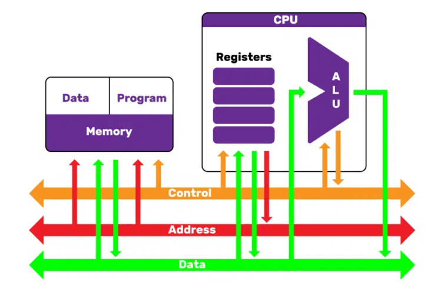

운영체제에 앞서 컴퓨터 구조를 한번 복습하고 가보자! 

# Von Neumann Architecture

>폰 노이만 구조

컴퓨터 프로그램은 많은 명령어들로 구성되어 있으며, 명령어들은 각각 `CPU`로부터 **fetch, decode, execute, writeback의 과정**을 거치며, 이는 프로그램이 종료될 때까지 수행된다. 명령어들은 `Memory`에 올라가(load)있어야하며, CPU는 `Program Counter` 레지스터를 통해 명령어를 가져오고, 그 뒤의 과정을 거치게 된다. CPU, memory와 같은 device들은 서로 bus(역할에 따라 data, control, address bus 존재)를 통해서 연결되어 있다.

이러한 형식으로 프로그램만 바꾸어가며 메모리에 (버스를 통해) 적재된 후 실행할 수 있는 구조를 `폰 노이만 구조`라고 한다. 이는 현대의 컴퓨터 구조의 기반이 된다. 프로그램은 실행되기 위해 '파일'의 형태로 저장장치에 저장되지만, 이를 실제 <u>실행하기 위해서는 메모리에 로드가 되어야 한다</u>는 것을 알 필요가 있다.

# CPU

>Central Processing Unit
>
>중앙 처리 장치

CPU는 명령어를 해석하고 실행하는 장치이며, 이를 수행하기 위해 많은 Unit들이 존재한다. 주요 구성은 다음과 같다.

- Control Unit

  decoder를 통해 binary코드의 명령어를 해석하고, 이에 적절한 제어 신호(메모리에서 레지스터로 가져오기, 연산, 쓰기)를 발생시킨다. 또한, 명령어의 실행 순서를 결정한다.

- Arithmetic & Logic Unit(ALU)

  연산 명령에 대하여 연산을 수행한다. 모든 연산은 atomic하며, 산술연산(ex 덧셈)과 논리연산(ex AND)으로 구분되어 수행된다.

- Register

  CPU가 갖는 <u>임시 저장소</u>. 연산을 수행하거나, 명령어를 fetch하는 것들이 각각의 레지스터에서 일어난다. 다음 명령어의 위치를 가리키고 있는 `Program Counter`(PC), 데이터를 보관하기 위한 `Data Register`와 주소를 저장하기 위한 `Address Register`, 실행 중인 명령어를 가져오는 `Instruction Register`, 메모리에 저장하거나 가져올 때 사용하는 `Memory Address Register`, `Memory Buffer Register` 등이 있다.

CPU가 다른 기기들과 주고 받는 정보는 크게 3가지로 나눌 수 있다.

- Control
- Address
- Data

따라서 이는 위의 그림처럼 각각의 역할을 수행하는 버스를 통하여 주변 장치와 연결을 한다.

CPU는 한번에 처리할 수 있는 데이터의 크기에 따라 오늘날 32bit, 64bit 컴퓨터로 나뉜다. 32비트 주소 체계는 2^32개의 주소를 담을 수 있다. 메모리는 한 주소당 1Byte를 갖으므로 2^32Byte = 4GB 정도의 데이터를 가리킬 수 있는 것이다. 따라서 32비트 컴퓨터는 최근에 사용되지 않는다.

## Interrupt

CPU는 매우 빠르다.! 하지만, 주변 장치의 증가로 매우 느린 I/O 작업이 늘어나게 되면서 기존의 polling 방식은 성능이 낮아졌다. 이는 CPU가 IO device의 상태를 주기적으로 검사하여 데이터를 처리하는 방식으로, CPU의 본래 역할(fetch, decode, execute)에 I/O까지 수행하게 되어 매우 느리다. I/O가 수행될때까지 기다려야하기 때문이다.

Interrupt 방식은 IO작업을  CPU가 기다리지 않고 다른 곳(입출력 관리자)에 위임하고, 완료되면 Interrupt 신호를 발생시키는 것이다. CPU는 I/O가 수행되는 동안 다른 작업들을 수행하면 되고, interrupt가 발생하면 지금 하던 작업을 멈추고 가져와진 데이터로 작업을 이어가면 된다. 

### Direct Memory Access(DMA)

기본적으로 Memory에 대한 접근 권한은 CPU만 갖고 있다. 따라서 장치들이 interrupt를 발생시켜 CPU가 메모리에 작업을 하도록 전송할 것이지만, 이것은 느리다. 따라서 I/O 수행시 **장치들이 직접 메모리에 접근할 수 있다면 CPU를 더 효율적으로 사용할 수 있을 것**이다. `DMA Controller`에게 CPU가 메모리에 대한 정보를 제공하고, 입출력 장치와 메모리 간의 직접적인 연결을 수행할 수 있도록 한다.

DMA를 통해 메모리를 관리한다면, 메모리 구조가 복잡해질 수 있다.(CPU가 사용하는 영역과 입출력 장치가 사용하는 영역들의 혼재) 따라서 메모리를 OS 영역, CPU 영역, 입출력 작업 영역 등으로 분리하여 관리하는 방법을 `MMIO` (Memory Mapped I/O) 기법이라고 한다.

DMA를 통해 메모리에 접근하면 여러 장치들(CPU 포함)이 동시에 메모리에 접근하려는 순간이 생긴다. 이때, CPU의 작업속도가 훨씬 빠르므로 CPU가 메모리 접근 순서를 양보하는데, 이를 `cycle stealing` 이라고 한다.

## Parallel Processing

CPU의 성능을 향상시키기 위해 CPU의 클럭을 높이거나, 캐시의 크기를 늘리는 방법이 가장 대표적이다. 하지만, 클럭을 높이면 저항이 많아져 발열이 증가하게 되므로 이러한 하드웨어적인 향상에는 비용등의 현실적인 제약이 있다. 따라서, **CPU 코어를 여러개 두어 병렬적으로 처리**하는 기법들이 소프트웨어적으로 고려되고 있다. 

CPU가 명령어를 실행하는 작업은 크게 (Fetch, Decode, Execute, Write)의 4개의 순서대로 별도의 위치에서 이루어진다. 이때, 한 코어에서 작업을 나누어 병렬로 처리하는 `Pipeline`기법이라고 하고, 여러 코어에서 동시에 작업을 수행하는 것을 `Super-scalar`기법이라고 한다.

# Memory

> 저장 장치

폰노이만 구조에서, CPU는 명령어를 메모리에서부터 가져와서 실행한다. 메모리는 프로그램과 데이터를 저장하는 공간으로, R/W가 모두 가능한 RAM과 Read Only Memory인 ROM으로 구분된다.

- RAM (Random Access Memory)

  주소를 통하여 메모리 공간에 접근하므로, 모든 공간에의 접근 시간이 동일하다. 램은 전력이 끊겼을 때 데이터가 지워지냐 여부에 따라, 휘발성과 비휘발성으로 나뉜다.

  - 휘발성

    DRAM(일정 시간이 지나면 데이터가 사라져 주기적 재생 필요. 보통 우리가 **주기억장치로 사용**함. 시금치 램 같은 것들), SRAM(빠르고 안정적이지만 비싸서 **캐시, 레지스터** 등에 사용됨)

  - 비휘발성

    전원이 해제되어도 데이터가 사라지지 않지만, 속도가 느리고 비용이 비싸다. flash memory는 usb처럼 주변 장치로 사용되기도 하지만, 어느정도 사용횟수가 제한되어 있다. HDD와 SSD는 보조 기억장치로 많이 활용 된다. <u>보조 기억장치에는 OS를 포함한 프로그램, 각종 파일들을 저장</u>할 수 있다.

- ROM (Read Only Memory)

  데이터를 보관할 수 있지만, 한번 저장하면 바꿀 수 없다. (CD-ROM 이라고 하는 이유!) 하지만 전력과 무관하게 데이터가 저장되므로, 메인보드의 BIOS(부팅시 초기화를 담당하는 프로그램) 등이 ROM으로 저장되어 있다. ROM은 보통 제조 과정에서 프로그래밍되어 고정되지만, 지우거나 쓸 수 있는 EPROM등도 존재하긴 하지만 많이 쓰이진 않는다.

## 저장장치 계층 구조

돈이 많다면 모든 저장장치를 속도가 빠른 캐시 메모리나 레지스터로 구성하겠지만, 현실적으로 불가능하다. 이에 컴퓨터는 보통 속도와 용량의 trade-off에 따라 적절하게 계층구조를 두고 구성되어 있다.

- register
- cache
- memory
- ssd/hdd

계층을 두고 데이터를 관리하면 데이터가 중복되어 저장될텐데, **일관성을 유지하는 것이 핵심** 이라고 볼 수 있다. 따라서, 각 계층 간 데이터 이동에는 전략이 있으므로 참고한다. 보통 memory와 보조기억장치 간의 이동을 제외하고는 개발자가 관여할 수 없을 것이다.

## 부팅

application은 운영체제에 의하여 메모리에 적재되어 실행된다. 운영체제도 프로그램인데, 어떻게 메모리에 올라갈까? 이는 `부팅`의 과정과 관련있다. 컴퓨터의 전원을 켜면 BIOS-ROM에 저장된 BIOS(Basic I/O System)프로그램이 실행된다.

바이오스는 하드웨어를 점검하고(POST라고 함), 이상이 없다면 미리 설정된 부팅 순서에 따라 부트 장치(flash memory, HDD, SSD 등)를 선택한다.

해당 부팅 장치에서 MBR(Master Boot Record) 또는 UEFI(Unified Extensible Firmware Interface) 로더가 로드된다. 이를 통하여 부팅 가능한 부트로더의 위치를 찾아서 실행된다. 

부트로더는 운영체제의 위치를 찾아 초기화하여 메모리에 올려서 실행되게 된다! 부팅 끝

