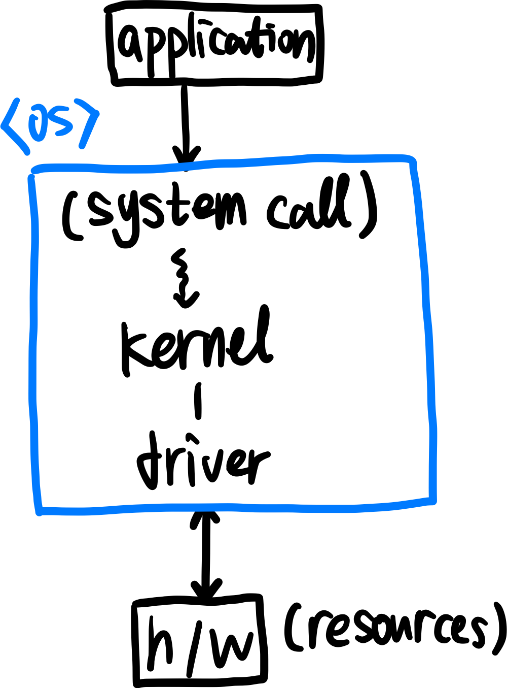

# 운영체제란?

>OS
>
>Operating System

운영체제가 없는 컴퓨터도 존재할 수 있지만, 문구점에서 살 수 있는 계산기와 같이 고정된 기능만 수행할 수 있을 것이다. Programmable한 기계에는 운영체제가 필요할 것이다..!

**운영체제는 프로그램들이 실행되고, 사용자와 상호작용하기 위해 자원을 효율적으로 관리하거나, 자원을 보호하는 역할을 수행하는 소프트웨어**이다.

### 운영체제는 자원을 어떻게 관리하고 보호할까?

OS는 physical(cpu, memory, HDD 등 모든 장치)에 대하여 사용자가 **직접 접근할 수 없도록** 한다. 이러한 자원에 접근할 수 있는 `interface`를 통하여 사용자가 자원에 정해진 방법으로 접근할 수 있도록 제공한다. 이러한 역할을 `Virtualization`(가상화)라고 하며, OS를 virtural machine으로 보는 견해도 존재한다.

자동차를 보면, 사용자가 엔진을 직접 제어한다기 보다는 엑셀과 기어 등으로(정해진 방법을 통해서) 엔진을 컨트롤하고 엔진을 직접 보는 것이 아닌 계기판을 통해 엔진의 상태를 보는 것과 유사하다.

따라서, 운영체제는 **사용자에게 편리한 인터페이스 환경을 제공하고 컴퓨터 시스템의 자원을 효율적으로 관리하는 소프트웨어**라고 정의할 수 있다. OS의 목적이 이것이므로, 이를 위해 자원을 가상화하고, 인터페이스를 통하여 접근하도록 하고... 등으로 구성된 것이라고 보면 될 것 같다.

# 운영체제의 구성

운영체제에서 자원을 관리하는 핵심은 `kernel`(커널)에서 담당한다. application(응용 프로그램)에서는 resource에 접근하기 위해 kernel을 통해야(커널 모드) 하며, 이는 `system call`을 호출하여 가능한 것이다. 예를 들어, C언어에서 표준 쉘 입출력에 사용되는 `printf`함수는 OS의 입출력을 담당하는 어떠한 시스템 콜을 호출할 것이다. 

커널은 자원(장치)을 driver를 통해 장치를 독점하는 것처럼 가상화하여 접근한다. driver는 하드웨어마다 달라 이미 OS에 구현이 되어있을수도 있고, 추가적으로 설치하거나 업데이트해야할 수도 있다. 또한, 드라이버는 커널 내부에 구현이 되어 있어 커널에서 바로 접근할 수도 있다.

# 운영체제의 3가지 개념

`OSTEP`이라는 책에서는 OS에서 가장 중요한 개념으로 `Virtualization`, `Concurrency`, `Persistence`를 언급한다. 간단하게 의미를 생각해보면서 운영체제 복습을 본격적으로 시작해보자.

1. Virtualization(가상화)

   1. CPU 가상화

      Processor(CPU)가 하나여도 동시에 여러 프로그램을 실행할 수 있다! CPU는 한번에 한가지 일만 처리한다고 배웠는데, 마치 많은 수의 가상의 CPU가 존재하는 듯한 illusion이 보인다. 이를 CPU 가상화라고 하며, 프로세스를 실행하고 멈추고 어떤 프로세스를 선택할 지 등을 OS가 선택하기 위해서는 많은 규칙들이 존재하며 이것을 배울 필요가 있다.

   2. 메모리 가상화

      메모리 역시 process가 하나의 독립적인 메모리 주소를 보장받아서 사용하는 것처럼  보이는데, 이는 Memory virtualization이 되어있기 때문이다. 이러한 가상화를 통하여 OS는 목표(편리하고 안전하고 효율적으로 자원을 관리)를 달성할 수 있게 된다.

2. Concurrency(동시성)

   Process는 동시에 많은 일들을 처리하기 위해 `Thread`를 만들어서 처리한다. 이러한 multi thread환경에서는 공유되는 데이터를 정말 잘 공유하는 것처럼 보여야 동시성이 만족되는 것으로 보인다. 동시성을 활용하여 작업단위를 분할하고 병렬로 처리할 수 있게 된다.

3. Persistence(영속성)

   메모리와 달리 보조 기억 장치는 컴퓨터가 종료되더라도 데이터가 남아있는다. 이는 `file system`으로 디스크 등의 저장장치가 추상화되어 구현되어있기 때문이다. 하지만 저장장치와의 I/O는 별도의 가상화를 거치지 않으며 영속적으로 데이터를 관리할 필요가 있다.

### 출처

[OSTEP](https://pages.cs.wisc.edu/~remzi/OSTEP/)

쉽게 배우는 운영체제 '조성호'