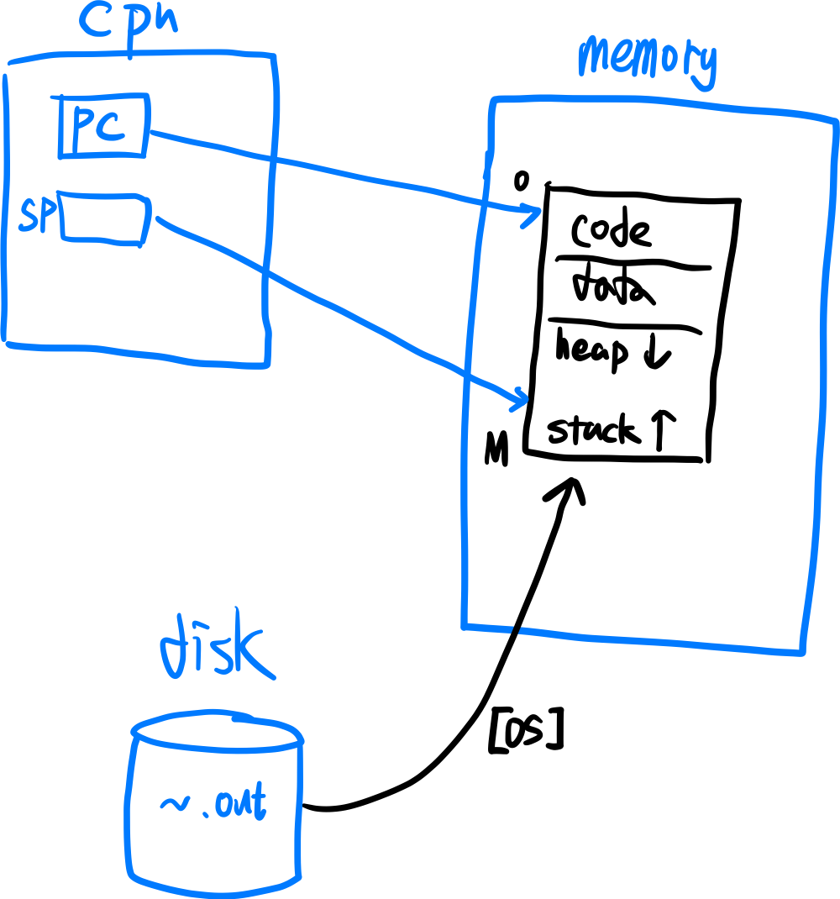
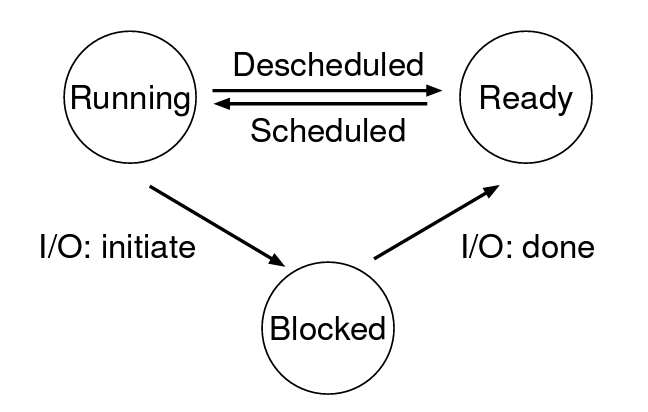
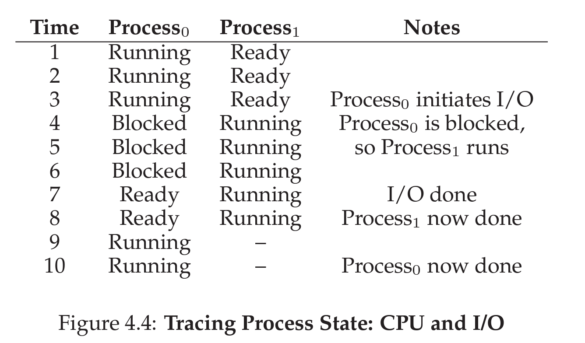

# Process

Process는 **실행중인 프로그램**(running program)으로 정의할 수 있다. 반면에 프로그램은 디스크 상에 존재하며 실행을 위한 명령어와 정적 데이터의 묶음이다. 운영체제는 하나의 프로세스가 하나의 CPU를 점유하는 것처럼 보이도록 `CPU virtualization`을 해서, **여러 프로그램이 동시에 실행되는 illusion을 만들어준다**. 여기서 시간을 잘게 나누어 여러 Process를 수행하도록 하는 방법을 `time sharing`이라고 하며, 이를 구현하기 위해 운영체제는 저수준의 메커니즘인 `context switching`부터, 고수준의 scheduling과 같은 `policy`까지 포함한다. 그렇다면 운영체제는 process를 어떻게 표현할 수 있을까?

## 프로세스 표현하기(Process Abstraction)

프로세스를 표현하기 위해서는 실행되는 동안 필요한 자원(하드웨어)의 목록이 있어야 할 것이다. 프로세스는 실행동안에 하드웨어의 상태(`machine state`)를 읽거나, 업데이트하거나 할 것이기 때문에 다음과 같은 정보들이 필요하다.

- PID (프로세스를 구분하기 위해 프로세스마다 갖는 identifier)

- memory image(address space, 주소공간)
  - code & static data(상수)
  - stack(변수) and heap(동적할당된 변수)
- 레지스터 (CPU context)
  - PC(=Instruction Pointer, 현재 실행중임 명령어의 위치를 파악하는데 쓰임)
  - stack pointer, frame pointer (함수의 변수와 리턴주소를 저장하는 스택을 관리할 때 쓰임)
  - 레지스터는 해당 프로세스의 명령어나 데이터가 위치한 어떤 영역을 가리키고 있을 것이다. 하지만, CPU는 담당하는 프로세스를 수시로 바꾸므로(context switching) **실행에 필요한 CPU 레지스터가 가져야할 값을 process에서도 가져야 할 것**이다.
  - 예를 들어, 100번 명령어까지 A 프로세스가 진행되고 101번이 진행될 차례에서 CPU가 B 프로세스로 넘어갔다고 가정하자. 다시 A 프로세스로 돌아와서 1번 명령어부터 시작하면 안될 것이다. 따라서, 레지스터의 값을 어떠한 형태로 저장해놔야 한다.
- 입출력 정보
  - 프로세스에서 사용하는 입출력 정보(파일)를 갖고 있어야 한다. 여기에는 표준 입출력(STDIO/Error)과 관련된 파일들도 포함된다.

이렇게 실행중인 프로그램이 갖고 있어야하는 값들을 저장해놓은 자료구조가 `PCB`(Process Control Block)이다. 위에 다룬 내용 이외에도 실행을 위한 프로세스의 정보들이 포함되어 있다.

즉, Program을 PCB로 추상화하여 관리가 되는 것을 Process라고 볼 수 있다. PCB는 실행중에만 유효하므로, 프로세스를 **실행중인 프로그램**이라고 봐도 무방할 것 같다.

## 프로그램이 프로세스가 되는 과정

저장공간에 존재하던 프로그램이 더블클릭등으로 실행되면 **OS는 몇가지 작업을 수행**한다. 우선, 내부적으로 프로그램의 실행 파일(`a.out`과 같은)이 실행될 것이다.

1. 메모리를 할당하고, Memory image를 생성한다.
   - code와 정적인 데이터를 메모리에 로드한다
   - stack, heap 영역을 만든다
2. Basic files(STDIN, OUT, ERR)를 open한다.
3. 실행을 위한 CPU register들을 초기화한다.
   - PC는 code의 첫번째 위치를 가리키고 있을 것

그림으로 프로그램이 실행되는 과정을 간단하게 그려보면 아래와 같다.

## 프로세스의 상태

**CPU 가상화를 위해 OS는 Process를 상태에 따라 관리하도록 하며 상태는 지속적으로 변이(transition)된다.** 프로세스의 상태 역시 PCB에 저장될 것이며, 크게 3개로 나눠볼 수 있다.

- **Running** : CPU에서 해당 프로세스를 실행중에 있는 상태
  - Process는 많지만 한 CPU에서는 하나의 Process만 수행할 수 있다. Running Process로 가는 과정을 `Scheduling`이라고 하며, 이에 대하여 OS의 스케줄링 정책 등이 관여한다.
- **Ready** : scheduled 되기 위해서 기다리고 있는 상태 
  - 나머지 프로세스들은 Ready 상태로 `Ready Queue`에 들어가 있다. ready queue는 단순하게 하나만 존재하진 않으며 이는 뒤의 스케쥴링에서 자세히 다루도록 한다.
- **Blocked** : Running이였다가 인터럽트가 발생하여 잠시 CPU가 해당 프로세스에 대한 작업을 중지한 상태
  - File IO 등은 CPU 입장에서 매우 매우 시간이 오래 걸리는 작업이다. 따라서 운영체제는 cpu를 효율적으로 사용하기 위해 IO interrupt가 발생하면 이를 catch하여 해당 io작업이 완료될때까지 프로세스를 `block`시킨다.
  - io작업이 완료되면 ready queue로 다시 돌아가게 될 것이다.

다음은 OSTEP 책에 나와있는 Process state transition의 예시이다.

Time 3에서 P0에서 I/O interrupt가 발생하였을 때, Blocked 상태가 되며 Ready Queue에서 가장 먼저 있던 P1이 CPU의 점유를 가져가게 된다. 이후, P0의 IO작업이 끝나게 되고 ready queue로 들어가게 되며, P1이 끝나서 다시 CPU의 점유를 P0이 가져오게 된다. 만약 P1이 종료되지 않았더라도, P1의 I/O 작업이나 스케쥴링 정책에 의하여 P0으로 언젠가는 다시 돌아갔을 것이다.

### (세분화) 프로세스의 5가지 상태

위에 상태에 추가적으로 생성되고 아직 ready queue에 들어가지 않은 **New** 상태와, 프로세스가 종료된 **Dead** 상태도 존재한다. 이러한 Process의 상태 역시 운영체제 마다 조금씩 다르니 참고하자.

## PCB

OS는 PCB(Process Control Block)이라는 자료구조를 리스트로 관리하여 프로세스에 대한 정보를 갖는다. 운영체제에 따라 PCB의 구현 방법이나 구체적인 이름은 다르지만 공통적으로 갖는 값들은 모두 프로그램의 실행과 프로세스의 관리를 위한 것이다. PCB는 보통 아래의 값들을 갖는다.

- PID
- Process state (Running, Blocked, Ready, ...)
- Pointers to other related processes : 부모 프로세스의 정보
- CPU context of the process : running에서 다른 상태로 넘어갈 때, register값들(PC, SP ...)을 PCB에 저장해놔야 스케줄링될때 복원할 수 있음
- pointers to memory locations
- pointers to open files

추가적으로 스케줄링을 위한 Process의 우선순위 등도 PCB에 저장되어야 할 것이다.

# 정리

운영체제는 CPU를 `가상화`하여 multiple process를 동시에 실행하는 착각을 갖게 해준다. 시간을 잘게 쪼개서 여러 프로세스들을 돌아가며 실행하여(time sharing) 여러 프로그램들이 동시에 실행되는 것 처럼 보이는 것이다. 

따라서 개발자들은 한 프로그램을 운영체제가 어떻게 지원해주는지만 알면 될 것이다. OS는 `PCB`와 같은 자료구조를 통해 Process를 추상화하여 제공하며, Process는 CPU가 해당 Process를 어떻게 관리 하고 있는지에 따라 `state`가 바뀌게 된다. 실행중인 process는 OS의 `scheduler`에 의하여 관리된다. 

 다음 포스트에서는 OS에서 Process를 다루기 위해 제공해주는 Process API(주로 system call)와 Process가 실행되는 과정에 대하여 구체적으로 공부해보도록 하자!

[참고 강의](https://www.youtube.com/watch?v=8ad4DzlZwgI&list=PLDW872573QAb4bj0URobvQTD41IV6gRkx&index=3)

[참고 책](https://pages.cs.wisc.edu/~remzi/OSTEP/)

