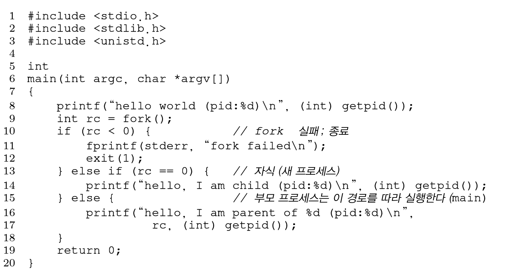
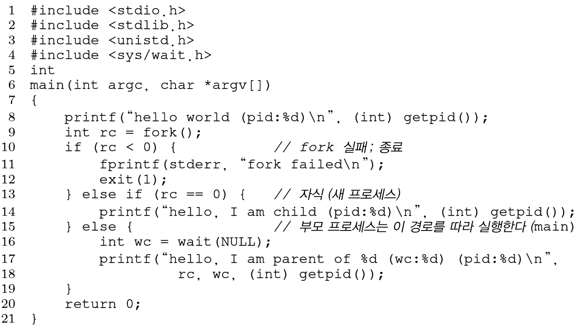

OS는 `system call`이라는 함수들로 Process를 생성/제어할 수 있는 API(Application Programming Interface)를 제공한다. 시스템 콜을 통하여 우리는 하드웨어에 대한 권한을 일부 부여받을 수 있게 된다.

## System call

- OS에서 `kernel mode`에 들어왔을 때 사용할 수 있는 함수. 즉, system call은 일반 함수와 다른 높은 권한을 갖는 함수라고 볼 수 있다.
- H/W에 직접 접근하는 등의 민감한 작업들은 오직 `privilege level`에서만 가능하므로 system call을 사용해야 한다.
- IO 작업과 같은`blocking`해주는 system call들은 process를 blocked상태로 descheduled 시키게 될 것이다. 즉, 하드웨어의 동작에 긴밀하게 연관되어 있다고 볼 수 있다.

### Should we rewrite programs for each OS?

시스템 콜은 운영체제마다 조금씩 다르다. 하지만, 거의 모든 현대의 운영체제는 `POSIX API`라는 **시스템 콜의 표준이 존재하므로, OS마다 다른 프로그램을 작성할 필요는 없을 것**이다.

또한, 시스템 개발자를 제외한 대부분의 application 개발자들은 programming langauge 안에서 개발하게 되는데, 이 경우에 내부적으로 각 언어별로 system call들을 추상화하여 제공하므로 대부분의 상황에서는 system call을 직접 사용할 일이 없다.

예를 들어, C언어의 `printf` 역시 STDOUT이라는 특정 file을 열어서 I/O를 수행하는 것이므로 `write`이라는 system call을 호출될 것이지만 **C언어 내부적으로 시스템 콜을 호출하도록 구현되어 있으므로 시스템 콜을 직접 다루는 일은 많지 않을 것**이다.

## Process related system calls

unix 계열에서 사용하는 프로세스의 생성과 관리와 관련된 system call들을 알아보자.

### fork()

새로운 child process를 생성하는 시스템 함수이다. 프로세스와 관련된 가장 중요한 시스템 함수이다.

- **모든 프로세스는 parent에서 fork되어 생성된다**.
- fork()의 리턴값에 따라 부모 프로세스와 자식 프로세스를 구분할 수 있다. (자식 : 0, 부모 : 자식 프로세스의 PID)
- 운영체제는 시작될 때, init process를 만들고, 이는 모든 프로세스의 조상(ancestor)프로세스이다.

`fork` 함수가 불리면, **부모 프로세스의 memory image를 복사하여 새로운 프로세스(부모와 다른 PID할당)가 생성**된다. 또한, 새로 생성된 PCB는 OS의 process list에 append될 것이다. 이때 <u>자식 프로세스의 메모리 이미지는 부모와 같으므로 `fork()` 이후부터 각자 독립적으로 실행될 것</u>이다. 

보통, fork()의 리턴값으로 부모와 자식을 구분하여 독립적인 프로세스가 분기적으로 실행할 수 있도록 구현한다. 예시를 보자!



위의 코드를 실행하면 다음과 같은 상황이 벌어질 것이다. 동그라미친 번호는 위 코드의 line을 의미한다.


fork의 리턴 값을 이용하여 부모/자식 프로세스의 실행 분기를 결정할 수 있다. 하지만 자식 프로세스 역시 생성 이후에 OS의 process list에 들어가 **scheduling되므로, 두 프로세스의 실행 순서는 알 수 없다**. 따라서 실행 순서를 보장하고 싶을 경우에 사용할 수 있는 시스템 함수가 있는데...

### wait()

부모 프로세스에서 자식 프로세스가 종료될 때까지 기다리도록 하는 시스템 함수이다. 프로세스는 명시적으로 `exit()`을 통하여 종료하거나, 메인 함수가 종료시 암묵적으로 exit() 시스템 함수가 실행된다. 하지만, exit()가 실행된다고 해서 process list에서 없어지는 것은 아니고 zombie process로 남게 된다. 따라서, `wait()` 시스템콜을 통하여 exit된 child process를 정리해주는 작업을 수행한다. (wait을 통하여 cleanup을 부모 프로세스가 해줘야 함)

#### 부모 프로세스가 먼저 종료된다면?

위의 경우에서 부모인 100번 프로세스가 먼저 종료된다면 어떻게 될까? 위에서 언급했다시피 모든 프로세스의 조상은 `init` process이고, **init 프로세스가 고아가 된 child process를 정리**해줄 것이다. 

그렇다면 wait은 왜 필요한가? 자식이 종료될때까지 기다리므로 **실행 순서를 보장**해주게 된다. 또한, zombie process는 언젠가 없어지겠지만 남아있다면 메모리 낭비가 되므로 제때 치워주는 것이 좋다.



위의 코드에서, 부모 프로세스는 16번째줄에서 자식이 종료될 때까지 기다리게 된다. 이후, 자식이 종료되면 wait에서 리턴을 받아 실행되고, 부모 프로세스 역시 종료될 것이다. 결과는 아래와 같이 **두 프로세스 간의 실행 순서가 보장될 것**이다.

```shell
hello world(pid:29266) 
hello, I am child (pid:29267) 
hello, I am parent of 29267 (wc:29267) (pid:29266)
```

### exec()

fork된 프로세스를 **다르게 실행하기 위하여 사용**하는 시스템 함수이다. fork된 코드를 항상 분기에 따라서 나눈다면 프로세스 구조가 복잡해질 수록 관리가 어려울 것이다. 따라서, 기존 실행되던 환경을 손쉽게 가져오되 전혀 다른 내용을 수행할 수 있도록 하기 위해 `exec()`함수가 필요하다. exec 함수를 통하여 자식은 새로운 메모리 이미지를 갖고 수행된다.

#### why exec()?

fork()만으로는 관리가 어렵다는 것을 깨달았을 것이다. 그치만, fork()이후에 굳이 exec()으로 프로세스를 실행하는 이유는, 프로세스의 계층 구조를 만들어 서 자식 프로세스의 종료 이후 memory cleanup 등에 있어 용이하여 관리가 편하기 때문이다. 또한, **fork를 통하여 Process를 단순하게 복사하므로 새로 만드는 것보다 비용이 저렴**하다. (fork는 프로세스를 로드하고 초기화하여 실행하는 것보다 훨씬 빠르다)

exec() 함수는 수행되는 방법에 따라 다양한 함수가 제공되며 인자도 다양하니, 궁금하면 [찾아보도록](https://man7.org/linux/man-pages/man3/exec.3.html) 하자.

### exit()

프로세스를 종료하기 위한 시스템 함수이다. 보통 메인 함수가 끝나면 암묵적으로 수행되며, 인자에 따라서 종료 상태 여부를 결정할 수 있다.


## How does a shell work?

system calls를 이해했다면, 우리가 자주 사용하는 shell(terminal, bash, zshrc ...)프로그램이 어떤 원리로 돌아가는지 알아볼 수 있다.

1. OS는 시작시 init 프로세스를 만든다.
2. init 프로세스는 `bash`와 같은 shell 프로세스를 만든다.
3. shell process는 명령어를 입력받는다. 
4. 입력받은 명령어를 실행하기 위해 **fork()**를 하고, 해당 명령어의 코드를 **exec()**한다. 그 동안, 부모 프로세스인 shell은 자식 프로세스가 종료될 때까지 **wait**한다.
5. 자식 프로세스의 종료 상태에 따라 상태를 출력하고, 다음 입력을 받는다.

 `ls` 명령어를 입력받는다고 해보자. shell은 child process를 fork하고, ls 프로그램을 exec한다. ls가 종료될때까지 shell은 기다리고, 수행이 완료되면 ls는 종료되고 부모인 shell은 다시 입력을 받게 될 것이다.

`ls > output.txt`와 같은 pipelining의 경우에는 `ls`를 수행하기 전, `STDOUT`을 사용자의 화면이 아닌 output.txt로 바꿔준 이후에 exec을 수행하도록 할 것이다. 이와 같이 shell에는 많은 system call들이 내부적으로 구현되어 있다.

> 와 재밌다!


시스템 콜은 OS를 통하여 H/W에 좀 더 직접적으로 접근할 수 있게 해주고, 그 결과 프로세스를 어느정도 제어할 수 있다. 하지만, 모든 프로세스가 시스템 콜을 남발하여 CPU를 독점하도록 하면 안될 것이다. 

위의 지적을 생각해보면서 다음에는 OS가 프로세스를 실행하는 구체적인 과정과, system call이 수행될 때의 과정을 좀 더 자세히 알아보도록 하자. 


[참고 강의](https://www.youtube.com/watch?v=8ad4DzlZwgI&list=PLDW872573QAb4bj0URobvQTD41IV6gRkx&index=3)

[참고 책](https://pages.cs.wisc.edu/~remzi/OSTEP/)