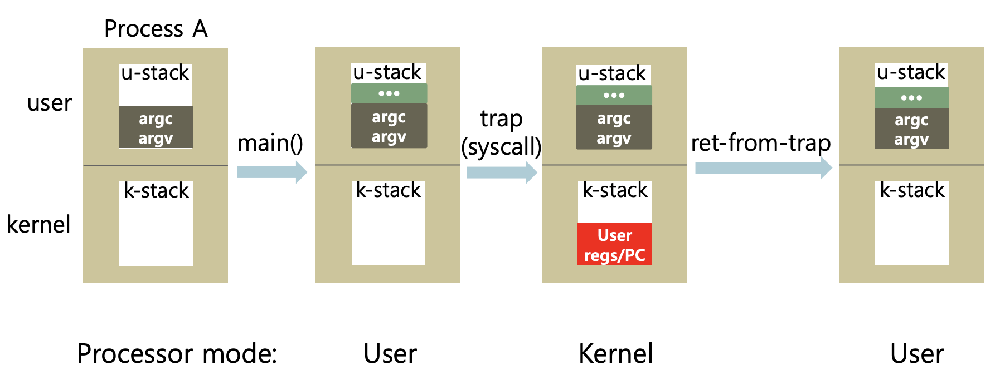

이번에는 실제 프로세스가 실행되는 과정을 운영체제의 역할에 초점을 맞추어 공부해보도록 하자.

# Process Execution (Direct Execution)

Process를 실행할 때 **단순한 운영체제**가 하는 일들을 순서대로 알아보자. 간단하게 하나의 CPU에서 하나의 Process가 실행된다고 가정하자.

1. OS는 메모리를 할당하고 memory image를 만든다.

   메모리 이미지는 저번에도 언급했듯 code, data, stack, heap 영역을 포함한다.

2. CPU의 Program Counter, 그리고 기타 레지스터(Stack Pointer)들이 초기화된다.

3. 위의 세팅 과정이 끝나고, Process는 CPU를 점유하고 명령어들을 실행하게 된다 (명령어 실행 과정에서 OS는 개입하지 않음)

## 일반 함수의 실행 과정

예를 들어, 어떠한 함수를 실행한다고 하자. 

함수 실행시, 메모리에서는 함수의 내용이 존재하는 위치로 `JUMP`하게 된다. 이때, 함수 종료 이후의 실행을 위해 기존의 메모리 위치(기존 PC의 값)를 갖고 점프해줘야 한다. 함수의 실행은 stack영역에서 이루어지므로 함수가 stack에 push되며, SP(Stack Pointer)가 업데이트 될 것이다. 함수가 종료되면, stack frame을 pop하고(SP도 업데이트) 저장해놓았던 기존의 메모리 위치로 PC값을 다시 업데이트해준다.

하지만, 이처럼 프로세스의 초기화 이후의 <u>실행을 전적으로 OS가 관여하지 않는 것은 몇가지 문제가 존재</u>한다.

1. 운영체제는 프로세스가 어떤 나쁜 짓들을 하는지 알 수 없다. 메모리를 할당받거나, 파일 입출력을 하는 등의 하드웨어 자원을 사용하는 것은 특수한 연산이고 **프로세스 맘대로 하게 해선 안된다**.
2. 프로세스가 독립적으로 실행되므로, 운영체제가 개입하여 프로세스의 상태를 바꿀 수 없다. 즉, **time sharing이 불가능**하다!

따라서, 우리는 `Limited Direct Execution`(제한적 직접 실행)이라는 이름으로 프로세스를 실행하도록 하며, 이를 위해 `system call`이 존재한다!

## System Call의 실행 과정 - H/W privilege level

H/W자원에 접근하기 위해서는 system call을 이용하는 것이 Limited Direct Execution의 핵심인데, 먼저 CPU의 `privilege level`을 알 필요가 있다.

CPU와 같은 하드웨어는 자원에 접근하기 위한 권한에 대한 mode가 존재한다. 크게 기본적인 `user mode`와 위험한 작업을 수행할 수 있는 `kernel mode`가 있으며, **시스템콜과 같은 작업들은 오직 커널 모드에서만 실행가능하다**. 

kernel은 하드웨어를 연결되는 핵심 공간으로, 소중하고 중요하다(?) 따라서 커널은 user stack을 신뢰하지 않으므로 별도의 kernel stack을 사용한다. 또한, user mode에서 kernel 영역으로의 주소를 이동하지 못하게 한다. 악성 코드가 user mode에서 kernel의 기능을 사용하지 못하게 하기 위함이다. 대신에, 커널은 부트될 때 `Interrupt Descriptor Table(IDT)`를 초기화하고 여기에 시스템 콜과 같은 커널 기능들을 사용하기 위한 `trap_handler`의 주소를 넣어둔다. (IDT를 통해서만 커널 기능의 주소를 얻을 수 있다는 말이지, *IDT에 커널의 코드가 존재한다는 것은 아니다*)

즉, user mode에서는 시스템 콜에 접근하거나 실행할 수 없으며 **커널의 기능들을 사용하기 위해서는 CPU를 커널 모드로 바꿔야 한다**!

## Mechanism of system call (trap instruction)

위의 함수 실행과 다르게, system call은 호출시 `trap`이라는 instruction이 수행된다. 역으로 user mode로 돌아오려면 `return-from-trap` 명령어가 존재한다. trap 명령어는 다음의 일들을 수행한다.

- <u>CPU를 커널 모드로</u> 바꾼다 (커널모드는 CPU가 바뀌는 것이다. CPU가 수행가능한 작업의 권한을 높여주는 것이라고 생각하자)
- kernel stack으로 SP를 옮긴다. (해당 작업은 커널 모드에서만 가능!) **커널 스택은 사용자 스택과는 물리적으로 다른 곳에 위치하며, 프로세스마다 갖는다.**
- 기존의 값(PC, registers 등... 이를 `context`라고도 함)을 *kernel stack에 저장*한다. → 이는 `return-from-tap`시, user context를 복원하기 위함임
- 수행될 일에 따라, IDT에 있는 주소를 보고 trap handler function이 있는 곳으로 JUMP하여 system call이 수행된다.

추가적으로 Trap 명령어는 시스템 콜 호출을 포함하여 다양한 상황에서 수행된다.

- System call (Program이 OS의 기능에 접근하려 할 때)
- Program fault 발생 시(ex. segmentation fault 발생!)
- interrupt 발생시

### return-from-trap

system call, 또는 interrupt가 종료되면 trap모드가 종료되는데, 이때 `return-from-trap` 명령어가 수행된다. 이는 trap 명령어에서 커널스택에 놓았던 것들을 user stack으로 다시 옮기는 작업이 포함된다.

- 해당 프로세스의 kernel stack에 있던 context들을 다시 user stack으로 restore(복원)한다.
- CPU를 user mode로 조정한다.
- trap 실행 이후의 user code로 PC를 조정하고 코드를 실행한다.

trap 명령어와 return-from-trap을 간단하게 그림으로 보면 아래와 같다.

정리하면, CPU의 권한 모드에 따라 자원에 접근할 수 있는 기능을 제공하는 kernel을 이용할 수 있도록 `trap`명령어가 존재하며, 해당 작업이 끝난 이후에는 user stack으로 돌아오게 된다.

### Context Swtiching을 고려한 trap & return-from-trap

사실 return-from-trap을 한다고 해서 trap이 실행되었던 그 프로세스가 바로 다시 schedule되어 실행되는 것은 아니다. 상황에 따라 다를 수 있는데 그 이유는 다음과 같다.

- 해당 trap이 program fault 등으로 인하여 발생한 경우 → 프로세스가 종료되어야 한다
- 해당 trap이 blocking syscall에 의하여 발생한 경우 → 해당 작업이 끝날때까지 block해야한다.
- 추가적으로, 해당 프로세스가 그동안 너무 오래 실행되었거나 다른 process가 더 높은 실행의 우선순위에 있을 수 있다.

이러한 경우에 <u>실행중인 프로세스가 바뀌</u>게 되는 `context switching`이 발생하게 된다!! 이제 운영체제의 Scheduler에 대하여 알 필요가 있다.

## OS scheduler

운영체제의 스케줄러는 프로세스의 상태를 관리하는데, 크게 두가지 부분으로 나뉜다.

1. Policy : 어떤 프로세스에 우선순위를 둘지
2. Mechanism : 어떻게 해당 프로세스로 context switching을 할지

Policy에 대하여는 다음 글에 알아보고, 오늘은 trap과 관련하여 일어나는 context switching을 어떻게 처리하는지의 mechanism에 대하여 알아보자.

scheduler는 개입하는 시점을 누가 결정하냐에 따라서 non-preemptive(cooperative 협조)방식과 preemptive(or 비협조 방식)으로 나뉜다. 전자는 process에서 interrupt가 발생할 때마다 스케줄링을 하는 방식인데, 이는 프로세스가 무한루프에 빠지거나 시스템 콜 등을 호출하지 않는 경우 (즉 return-from-trap이 호출되지 않는 경우)에는 스케줄링이 어렵다(*특정 프로세스가 CPU를 독점하게 된다*). 따라서 오늘날의 운영체제는 **특정 프로세스의 독점을 막기위해 주기적으로 timer interrupt를 호출시켜 스케줄링을 수행**하도록 하는데 후자의 방식이 이와 같다.

### mechanism - context switch

그렇다면, 운영체제에서 어떻게 process간 전환을 수행할까? 

A 프로세스가 실행중이고, B 프로세스로 넘어가는 과정을 생각해보자.

- kernel stack에 A의 context(PC, SP, 레지스터값들)를 저장한다.
- B의 커널스택에서부터 context(PC, SP 등)를 HW로 복원한다. 이때, stack pointer도 A의 커널스택에서 B의 커널 스택을 가리키도록 바뀔 것이다.

B의 커널스택에는 이전에 descheduled될 때, B의 context가 저장되어 있었을 것이다. 위의 과정 이후에는 <u>B가 kernel mode로 실행될 것이고, return-from-trap 연산으로 user mode로 실행될 것</u>이다. 

## 정리

시스템 콜, 인터럽트, 폴트 등으로 인하여 한 process에 `trap` 명령어가 실행되고, 이를 통해서 CPU를 user mode에서 kernel mode로 바꿀 수 있다. kernel mode로 전환하면 프로세스마다 존재하는 `kernel stack`에 기존 context를 저장하고, 종료 이후의 `return-from-trap`에서 다시 user stack으로 context가 복원된다. 또한, trap 발생시에 Process를 전환할 수 있는데, 비협조적 방식에서는 OS가 주기적으로 발생시키는 timer interrupt를 이용하여 scheduling을 수행한다. 다른 Process로 `context switching`이 일어날 때에는, deschedule되는 프로세스의 context를 그것의 kernel stack에 저장해놓고, schedule될 프로세스의 커널스택으로부터 PC, SP 등의 context를 복원하여 다른 프로세스를 실행할 준비를 마치게 된다!

다음에는 OS가 실행할 프로세스를 결정하는 원리인 scheduling policy에 대하여 공부해보도록 하자.

[참고 강의](https://www.youtube.com/watch?v=8ad4DzlZwgI&list=PLDW872573QAb4bj0URobvQTD41IV6gRkx&index=3)

[참고 책](https://pages.cs.wisc.edu/~remzi/OSTEP/)

