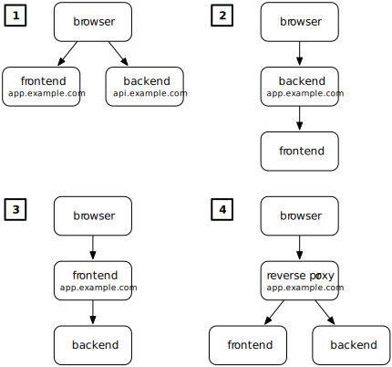

## 목표

CRA를 이용한 `React.js` 프론트 개발, `node js`와 `MySQL`을 이용한 api 서버 개발 모두 할 줄 안다면, 이제 배포를 해볼 차례이다.! 배포까지 해보아야 웹 서비스가 어떤 식으로 구성되는지 알 수 있을 것 같아서 공부해보았고, 그 기록을 남기고자 한다.

목표는 다음과 같다.

- 클라우드 환경을 이용하여 웹서비스(풀스택) 배포하기
- docker 이용하여 배포 환경 구축하기
- (optional) 도메인 구입해서 쉽게 접속하기

## Web Service Architecture

출처: https://fractalideas.com/blog/making-react-and-django-play-well-together/




크게 4가지 방법이 있고, 각각에 대하여 이해해보자.

1. 두개(front, api)의 서버를 두는 구조이다. client가 브라우저를 통하여 url(app.example.com)을 입력하면, front-server에서 이를 처리하여 html, css, js 파일을 리턴해준다. 그리고, 해당 사이트에서 클릭 등의 이벤트로 인하여 api가 호출이 될 때에는 다른 url(api.example.com)을 통하여 요청과 응답이 이루어지는 구조이다. 이는 front와 backend가 각각의 서버 프로그램으로 구분되어 있으므로, backend 서버에서는 프론트로부터 오는 cross origin request에 대한 CORS 허용이 되어 있어야 할 것이다.

   대부분의 SPA(리액트도 포함)가 이러한 구조를 이용한다고 한다. React js의 경우에는 front server에서 url요청에 따라 정적인 html, js, css를 (번들링된 상태로 주겠지만 아무튼)리턴할 것이다. 그리고, `react-router-dom`과 같은 라이브러리를 통하여 root를 공유하는 다른 url요청(예를 들어 app.example.com/rank)을 추가적인 프론트서버에 요청보내지 않고 처리할 수 있다.

2. 백엔드 서버에서 프론트엔드를 리턴하는 구조이다. 아마, node js에서 express 미들웨어로 hello world를 찍어보려고 할 때,

   ```javascript
   app.get('/', (req,res)=>{
   	res.send('<h1>Hello World</h1>');
   })
   ```

   라던가, sendFile을 이용하여 정적인 html파일을 리턴하도록 한 경험이 있을 것이다. 이러한 방법이라고 보면 될 것 같다.

3. 브라우저의 요청에 대하여, 프론트 엔드 서버가 처음으로 받고, 해당하는 내용이 없다면 proxy등을 통하여 백엔드 서버로 넘겨줘 요청을 처리하도록 한다. CRA와 `npm start`를 통하여 개발서버를 연 이후, `package.json`에서 proxy를 api server주소로 설정하여, api 요청에 대하여 백엔드로 넘겨주는 방법을 사용할 수 있다. [나도 과거에 이러한 방법을](https://choieastsea.github.io/full-stack-in-js/) 이용한 적이 있으니 참고하면 될 것 같다.

4. 이 방법은 리버스 프록시를 이용하는 방법인데, 나도 해본 적은 없어 원문 링크를 참고하여 보면 될 것 같다.

## + CRA를 이용한 리액트 웹서버? 웹서버 이해하기

CRA(Create React App)을 이용하여 리액트 개발 공부를 한 나는, React는 분명 front-end library인데, 왜 npm start만 하면 `localhost:3000`과 같이 접속할 수 있지?? 라는 의문을 품었었다. 이는 CRA의 개발모드에서 지원해주는 로컬 웹서버 환경으로 디버깅 등을 편하게 해주기 위해 웹서버를 제공해주는 것이였다. 하지만, 이는 용량이 크고 필요 없는 코드가 존재하여 실제 배포되서 운영되기에는 무리가 있다. 따라서, 우리는 `npm run build`를 이용한다.! 빌드하여 컴팩트해진 정적 파일들을 웹서버(CRA dev server와 거의 같은 일을 하는) 에 올려놓으면 되는 것이다.

결론은, 1번방법으로 리액트를 배포하려면 웹서버를 구축해놔야한다는 것이다. 이 웹서버는 app.example.com과 같은 url 요청에 대하여 **빌드된 정적 파일들을 제공**하면 되는 것이다. 

자 그러면, 웹서버는 뭐를 사용하면 될까? 우리는 `nginx` 를 이용해보도록 하자. node.js를 이용하여 웹서버의 역할을 구현해 볼 수도 있지만, 엔진엑스가 웹서버의 의미에 더 부합한다고 볼 수 있다. 또한 세팅(configuration)만 하고, nginx server를 켜 놓으면 완성되므로 매우 쉽다~ 이거에 관하여 [매우 정리가 잘 되어있는 유튜브](youtube.com/watch?v=Zimhvf2B7Es)를 보면 도움이 될 것이다. 


## 정리

- 우리가 사용할 웹 서비스 아키텍쳐(이것이 뭐라고 통용되는지는 찾아볼 필요가 있음) : 프론트 엔드 서버 / api (백엔드)서버를 분리하여 사용할 예정

- 프론트엔드 서버의 구조 : `nginx` + `builded react file`

  모든 http(s) 요청에 대하여, 해당 url에 정적인 내용을 browser에게 리턴한다.

- 백엔드 서버의 구조 : `nest js` (혹은 `django rest framework`) ~ `MySQL server`가 연결되어 있는 구조

  프론트엔드에서 불려지는 api 요청에 대하여, browser에게 응답한다. 필요하다면, db server를 사용할 수도 있다.


## + CRA를 이용한 리액트 웹서버는 무엇일까?


