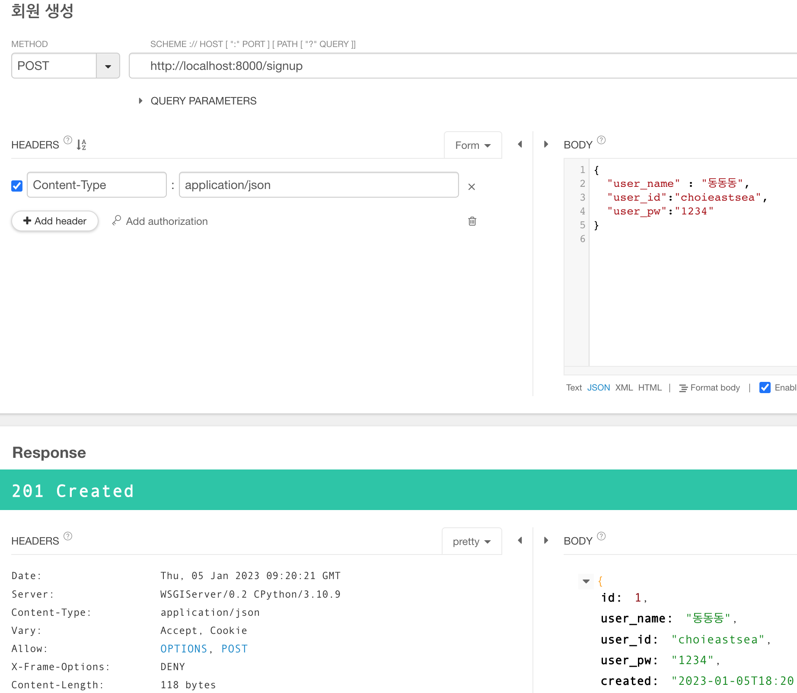

웹서비스의 기본인 회원가입부터 해보자. nest js로 하려다가 db 구축이 매우 쉽다고 판단되는 `DRF`(Django Rest Framework)를 이용하여 만들어보려고 한다.

회원가입 시, 서버의 요구사항은 회원들의 정보를 구분되도록, 추가적으로 안전하게 저장하는 것이다.

# 장고 세팅

장고에 대하여는 [이전글](https://choieastsea.github.io/DRF_serializer/)을 참고해보자. 나도 생활코딩님의 [강의](https://www.youtube.com/playlist?list=PLuHgQVnccGMDLp4GH-rgQhVKqqZawlNwG)를 보고 약간의 블로그와 공식문서를 읽은 정도의 수준이니 따라올 수 있을 것이다.

```shell
mkdir server 
cd server
python -m venv project_env
source project_env/bin/activate
pip install djangorestframework mysqlclient
django-admin startproject auth_project
```

auth_project/settings.py에서 config(db 세팅) 해준다.

```python
DATABASES = {
    'default': {
        'ENGINE': 'django.db.backends.mysql',
        'NAME': 'member_auth',
        'USER' : 'db_konkuk',
        'PASSWORD' : '6812',
        'HOST' : 'localhost',
        'PORT' : '3306'
    }
}
```
`django-admin startapp member` 로 member app을 생성해준다.(회원에 대한 모듈)
ls >> auth_project   member  project_env
settings.py의 INSTALLED_APPS에 'member' 추가해줘야 이후 만들 model을 인식할 수 있다.

auth_project/urls.py 수정 (`path('', include('member.urls'))` 추가)
member/urls.py 생성하여 아래와 같이 작성해준다.

```python
urlpatterns = [
    path('', views.index),
]
```
member/views.py 추가
```python
def index(request):
    return HttpResponse('Hello Django')
```
`python manage.py runserver`로 서버 실행할 수 있다.

localhost:8000 접속시 나오는 Hello Django 확인
이러면 장고 기본은 세팅 완료.!

# DB 세팅
settings.py에서 db_config 적어놓고, 해당 db에서 db를 생성해준다.
`create database member_auth;`
스키마를 만들어주기 위해, drf의 migration을 사용하자.

우선, member app의 models.py에서 회원가입을 위한 사용자 모델을 만들어주자. user_id는 겹치지 않게 unique로 해준다. PK는 따로 지정하지 않으면 장고에서 `auto increment id`로 만들어 줄 것이다.

```python
from django.db import models

class User(models.Model):
    user_name = models.CharField(max_length=10)
    user_id = models.CharField(max_length=20, unique=True)
    user_pw = models.CharField(max_length=100)
    created = models.DateTimeField(auto_now_add=True)

```

그러고, migration file을 만들어준다. 해당 migration을 db에 apply시켜주면 스키마가 만들어 질 것이다.

```shell
>>python manage.py makemigrations member
Migrations for 'member':
  member/migrations/0001_initial.py
    - Create model User
>>python manage.py migrate member
Operations to perform:
  Apply all migrations: member
Running migrations:
  Applying member.0001_initial... OK
```

db에 member_user 테이블의 스키마가 만들어져있음을 확인할 수 있다.

## Serializer 구현

간단하게, serializer를 만들어보자. ModelSeriallizer를 이용한다.

serializer.py

```python
from rest_framework import serializers
from member import models

class UserSerializer(serializers.ModelSerializer):
    class Meta:
        model = models.User
        fields = '__all__'

```

이제 회원가입을 처리하는 기본 메소드를 만들어보자.

# 회원가입-basic

우선, member의 urls.py에서 signup url과 views를 매핑해준다.

```python
urlpatterns = [
    path('', views.index),
    path('signup',views.signup)
]
```

그리고, views에서 signup 함수를 만들어주자.

(POST method를 받아서 처리해야하므로, **settings.py에 'rest_framework'를 추가해줘야한다**)

member > views.py

```python
from django.shortcuts import HttpResponse
from rest_framework import status
from rest_framework.decorators import api_view
from rest_framework.response import Response
from member.serializer import UserSerializer
# Create your views here.

def index(request):
    return HttpResponse('Hello Django')

@api_view(['POST'])
def signup(request):
    user_info = request.data
    serializer = UserSerializer(data = user_info)
    if serializer.is_valid():
        serializer.save()
        return Response(serializer.data, status = status.HTTP_201_CREATED)
    return Response(serializer.errors, status=status.HTTP_400_BAD_REQUEST) 
```



db에도 잘 생성되어있지만, pw가 그대로 저장되어 있어 db가 노출되면 문제가 생길 수 있다.!(사용자는 보통 같은 아이디와 비밀번호를 사용하기 때문이다) 이제 비밀번호를 암호화하여 저장하도록 하자.

# 회원가입 - 암호화

장고에서 User모델을 이용하여 비밀번호를 암호화하여 관리하는 방법도 있지만, `bcrypt` 라이브러리를 이용하여 비밀번호를 암호화하여 저장해보도록 하자. 추가적으로, 암호학에 정통한 사람이 아니라면 직접 암호화 알고리즘을 만드는 것은 권장되지 않고, 잘 알려진 최신까지 잘 쓰이는 라이브러리를 사용하는 것이 권장된다.

## bcrypt 간단한 사용법

`pip install bcrypt`로 설치할 수 있다.

bcrypt를 이용하여 우리가 해볼 것은 크게 1. 회원가입시 비밀번호를 암호화하기 2. 로그인시 입력과 암호화한 비밀번호 비교하기 가 있다.

1. 비밀번호 암호화

   `bcrypt.hashpw(bytes, salt)`로 암호화할 수 있다.

   bytes에는 비밀번호를 bytes array로 인코딩하여 넘겨주면 되고, salt에는 추가할 salt값을 넘겨주면 된다. bytes는 python string의 내장함수를 이용하여 `${string}.encode('utf-8')`와 같이 바꿔줄 수 있고, salting값은 `bcyrpt.gensalt()`함수를 이용하여 생성할 수 있다. (default parm=10)

   추가적으로 생성된 암호는 bytes 타입이므로, DB에 저장할 때에는 다시 `decode('utf-8')`함수를 이용하여 문자열로 변환한 후 저장해줘야한다.

   views.py의 signup 함수는 아래와 같이 수정해볼 수 있다.

   ```python
   @api_view(['POST'])
   def signup(request):
       user_info = request.data
       pw = user_info['user_pw']
       print(f'원래 비밀번호: ',pw)
       mod_pw = bcrypt.hashpw(pw.encode('utf-8'), bcrypt.gensalt())
       print(f'암호화 후 비밀번호: ',mod_pw)
       user_info['user_pw'] = mod_pw.decode('utf-8')
       serializer = UserSerializer(data = user_info)
       if serializer.is_valid():
           serializer.save()
           return Response(serializer.data, status = status.HTTP_201_CREATED)
       return Response(serializer.errors, status=status.HTTP_400_BAD_REQUEST) 
   
   ```

   실행해보면 같은 비밀번호에 대하여도 다른 암호화값으로 저장됨을 확인할 수 있다.

   ```shell
   원래 비밀번호:  1234
   암호화 후 비밀번호:  b'$2b$12$Tp9RA7gOCYyXkL4tAcWRAOtiaTl5dlpIM6H8FsDSEnwfGmJzvent6'
   ...
   원래 비밀번호:  1234
   암호화 후 비밀번호:  b'$2b$12$g7H0uBrroFgqkMSgkikkVeEfOO.GVn06XksAfURraBiV3KFo9WtQS'
   ```

   이제 로그인을 처리해보자.

2. 로그인

   `bcrypt.checkpw(bytes, 암호화된 bytes)`로 로그인을 처리할 수 있다. 간단하게 성공시 hello, 실패시 bye를 출력해보도록 하자.

   views.py에서 login함수를 아래처럼 추가해주고, urls.py에도 `path('login', views.login)`를 추가해주도록 하자.

   ```python
   @api_view(['POST'])
   def login(request):
       idpw = request.data
       id_input = idpw['id']
       pw_input = idpw['pw']
       user_with_id = User.objects.filter(user_id=id_input)
       serializer = UserSerializer(user_with_id, many=True)
       user_pw = serializer.data[0]['user_pw'].encode('utf-8')
       print(type(user_pw)) #암호화된 string
       if bcrypt.checkpw(pw_input.encode('utf-8'), user_pw) == True:
           return Response('hello') 
       return Response('bye')     
   ```

   실행해보고 로그인이 되는지 postman 등에서 확인해볼 수 있다.

   ```shell
   입력 비밀번호: 1234
   암호화 후 비밀번호: $b'$2b$12$Nm22Ckx4vMVbZlckUyoodeBdDR2v3ANU8MJs98XJ3jtoJsXZG8sCm'
   ```

   같은 비밀번호(1234)에 대하여 다른 해싱값이 생성됨을 확인할 수 있으며, 각각의 로그인도 잘 수행됨을 확인할 수 있다.

### bcrypt의 원리

추가적으로, bcrypt와 같은 단방향 해싱을 이용한 암호화의 원리를 내가 이해한 만큼만 정리해보겠다. 단방향 해싱함수라는 것은 특정 input에 대하여 유일한 output이 나오지만, 역으로는 유추가 불가하도록 설계된 (역함수가 존재하지 않는.?) 함수이다. 따라서, 해시값으로 원본 비밀번호를 알 수 없으며 로그인 과정에서도 checkpw함수는 해시값과 input을 암호화한 값을 비교하여 일치하는지만 알 수 있는 것이다. 이러한 단방향 해싱에도 허점이 없는 건 아닌데, 바로 input 과 해시값을 매칭시켜놓은 표(ranbow table)를 아주 힘들게 만들어 놓고, 해시값으로 비밀번호 원본을 유추하는 방법(brute force로 일일이 대조)도 있긴 하다. 따라서 우리는 소금을 친다(?) gensalt()함수로 솔팅값을 주고 해싱을 돌리고, 이를 반복하여 원본을 유추하기 매우 힘들게 할 수 있다.

또한, 위의 보면 생성된 비밀번호의 앞부분이 일치함을 알 수 있는데, bcrypt에서 암호화를 어떻게 수행하나를 보면 알 수 있다. `$<used_algorithm>$<cost_factor>$<generated_salt><hash>$`의 꼴로 생성되므로 암호화된 bytes배열에서 알고리즘과 salt값을 이용하여 checkpw를 수행할 수 있게 되는 것이다.! (따라서, 암호화 생성 알고리즘이 같으므로 앞부분이 같은 것이다) [출처](https://stackoverflow.com/questions/69175990/how-does-password-checking-in-bcrypt-work)


회원제 사이트를 만들기 위해 기본적인 회원가입은 끝났다. 이제 해야할 것은, 로그인을 할 때 session이나 token을 만들어 사용자에게 권한에 맞는 요청만 허용하도록 하는 것이다! 


